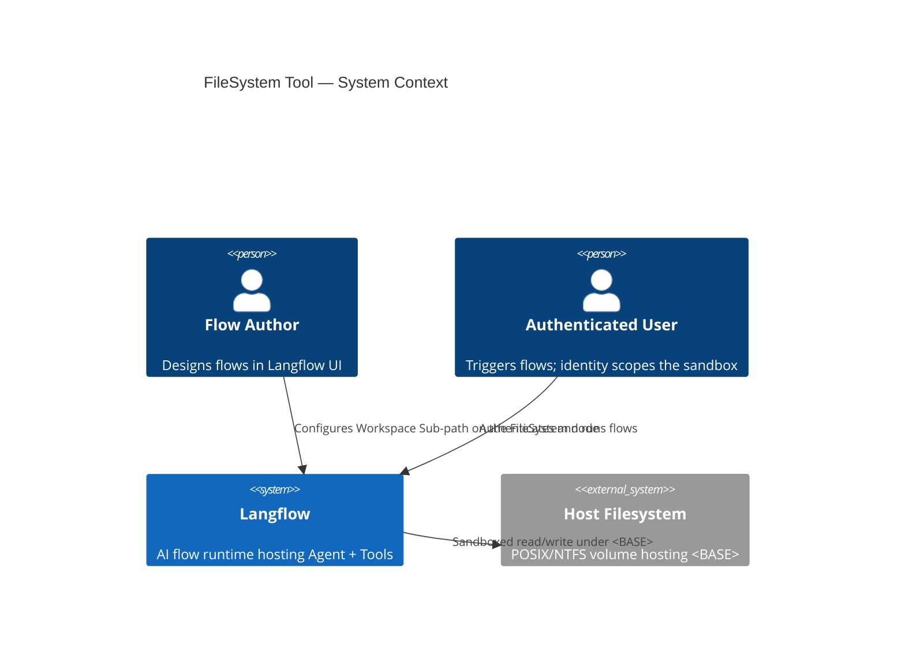
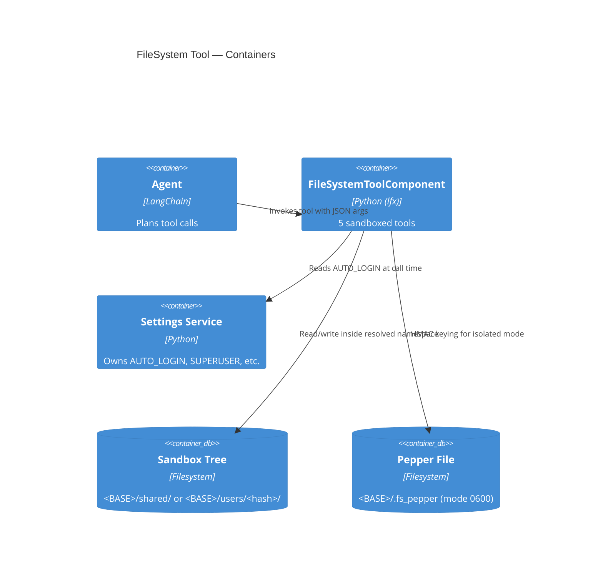
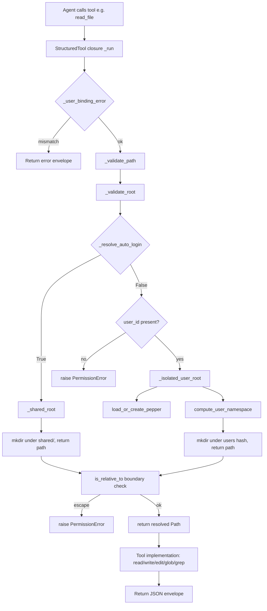

# Feature: FileSystem Tool — User Isolation

> Generated on: 2026-05-07
> Status: Draft
> Owner: Platform / Tools

---

## Table of Contents
1. [Overview](#1-overview)
2. [Ubiquitous Language Glossary](#2-ubiquitous-language-glossary)
3. [Domain Model](#3-domain-model)
4. [Behavior Specifications](#4-behavior-specifications)
5. [Architecture Decision Records](#5-architecture-decision-records)
6. [Technical Specification](#6-technical-specification)
7. [Observability](#7-observability)
8. [Deployment & Rollback](#8-deployment--rollback)
9. [Architecture Diagrams](#9-architecture-diagrams)
10. [Platform Compatibility](#10-platform-compatibility)

---

## 1. Overview

### Summary

`FileSystemToolComponent` exposes five sandboxed file operations (`read_file`,
`write_file`, `edit_file`, `glob_search`, `grep_search`) to LLM agents. This
feature scopes those operations to a **per-user** workspace whenever Langflow
runs in multi-user mode, and to a **shared** workspace when Langflow runs in
single-user (auto-login) mode. The dispatch is implicit, driven by the
existing `AUTO_LOGIN` setting; the only operator knob is the on-disk root
directory.

### Business Context

Before this feature, the FileSystem tool had a single sandbox configured by
the flow author. In a shared Langflow deployment two distinct authenticated
users running the same flow saw each other's files — a cross-tenant data
leak that blocked the component from being enabled in any multi-user
environment.

Earlier hardening attempts (PR #12901 + the `LANGFLOW_FS_TOOL_USER_ISOLATION`
follow-up) introduced three modes (`off`/`auto`/`on`) and four environment
variables. That model never reached production, was hard for operators to
reason about, and required documentation to disambiguate. This feature
collapses all of it to a single binary decision: shared if AUTO_LOGIN is on,
isolated otherwise.

### Bounded Context

**Context**: `Tools` — sandboxed integrations exposed to LLM agents.

This context owns:
- Sandboxed filesystem access for agents (this feature).
- Path validation, boundary enforcement, ReDoS protection.
- Per-user namespace derivation via opaque HMAC hashing.
- L2 tool binding (refusing cross-session reuse of captured tool closures).

### Related Contexts

| Context | Relationship | Notes |
|---|---|---|
| `Auth` | **Conformist** | Reads `settings_service.auth_settings.AUTO_LOGIN` as authoritative. The Tools context never decides what AUTO_LOGIN means; it only adapts to it. |
| `Components` | **Customer-Supplier** | `FileSystemToolComponent` extends the `Component` base class and consumes `self._user_id` populated by the runtime during `instantiate_class()`. |
| `Agent` | **Customer-Supplier** | The Agent invokes the StructuredTool closures returned by `_get_tools()`. The contract is "JSON-serializable result envelope, never raise". |

---

## 2. Ubiquitous Language Glossary

| Term | Definition | Code Reference |
|---|---|---|
| **Sandbox** | The on-disk directory subtree all FileSystem tool calls are confined to. | `FileSystemToolComponent._validate_root` |
| **Base Directory** (BASE) | The operator-controlled root under which every workspace lives. | `IsolationConfig.base_dir`, env `LANGFLOW_FS_TOOL_BASE_DIR` |
| **Workspace Sub-path** | The flow-author-controlled sub-directory inside the resolved namespace. Optional; empty means "namespace root". | `FileSystemToolComponent.root_path` (UI: "Workspace Sub-path") |
| **Shared Mode** | Layout used when AUTO_LOGIN=True. Single workspace under `<BASE>/shared/`. | `FileSystemToolComponent._shared_root`, constant `SHARED_NAMESPACE = "shared"` |
| **Isolated Mode** | Layout used when AUTO_LOGIN=False with an authenticated user. Per-user workspace under `<BASE>/users/<hash>/`. | `FileSystemToolComponent._isolated_user_root` |
| **Refused Mode** | Conceptual third state: AUTO_LOGIN=False without a user_id. No filesystem access; structured error returned. | `FileSystemToolComponent._validate_root` (raise branch) |
| **Namespace** | The opaque per-user directory name in isolated mode. Derived from `user_id` via HMAC-SHA256 with a server-side pepper, truncated to 32 hex chars (128 bits). | `compute_user_namespace`, file `_filesystem_namespace.py` |
| **Pepper** | Per-instance secret used to key the user_id → namespace HMAC. Auto-generated 32 random bytes on first call, persisted at `<BASE>/.fs_pepper` with mode 0600. | `load_or_create_pepper` |
| **Reserved Segment** | The directory name `.lfsig`, blocked at `_validate_path` in every mode. Holds the integrity hook for a future content-signing layer; agents and users must never see or write to it. | `RESERVED_SEGMENT = ".lfsig"` |
| **Tool Binding (L2)** | The check that captures `user_id` at `_get_tools()` time and refuses tool calls where the live user_id has shifted. Active only in isolated mode. | `_user_binding_error` |
| **Boundary Check** | The `is_relative_to` test that rejects any candidate path resolving outside the namespace root after `..`/symlink expansion. | `_validate_path`, `_isolated_user_root`, `_shared_root` |
| **Resolution Error** | Structured error string surfaced in `build_metadata.resolution_error` when `_validate_root` cannot resolve (e.g., unwritable BASE). Never leaks to a raw exception. | `FileSystemToolComponent.build_metadata` |

---

## 3. Domain Model

### 3.1 Aggregates

#### FileSystemSandbox (transient, per call)

- **Root Entity**: `FileSystemToolComponent`
- **Value Objects**:
  - `IsolationConfig` (frozen dataclass: `base_dir`, `pepper_path`)
  - `Namespace` (`Path("users/<hash>")` or `Path("shared")`)
- **Invariants**:
  - I1: Every resolved path MUST be `is_relative_to(namespace_root)`.
  - I2: The `.lfsig` segment MUST never appear in any path the agent supplies.
  - I3: When `AUTO_LOGIN=False` and `user_id` is empty, no I/O may occur.
  - I4: `IsolationConfig` is immutable — re-read from env on every call.
  - I5: The pepper file is created once and never overwritten; its size MUST equal `PEPPER_SIZE_BYTES` (32) on every read.
  - I6: A captured tool closure binds the user_id at construction; in isolated mode, mismatching live user_id MUST refuse the call without filesystem access.

#### Namespace (value object)

- **Identity**: `(pepper, user_id)` tuple in isolated mode; constant `"shared"` in shared mode.
- **Invariants**:
  - Same `(pepper, user_id)` always maps to the same hash. Different pepper or different user_id → different hash.
  - Empty `user_id` collapses to `Path("")`, used by callers as the "no namespace" marker (legacy compatibility within the module — not surfaced).

### 3.2 Domain Events

This feature is synchronous and request-scoped. It does not publish or
subscribe to any domain events. Each tool call is a self-contained operation
whose outcome is a JSON envelope returned to the caller.

(If a future audit/event layer is added, it would emit events like
`fs.tool.invoked` with `(user_id, action, path, ok)`. That layer was
explicitly removed from scope — see ADR-005.)

---

## 4. Behavior Specifications

### Feature: FileSystem Tool — User Isolation

**As an** LLM Agent running on a Langflow instance
**I want** sandboxed filesystem operations scoped to my caller's identity
**So that** files created by one user are never readable by another user on
the same instance, and single-user installs don't pay any namespacing
overhead.

### Background

- Given a Langflow instance with `LANGFLOW_FS_TOOL_BASE_DIR` set (or unset, falling back to default).
- And `LANGFLOW_AUTO_LOGIN` configured to True or False at the platform level.

---

### Scenario: Shared workspace when AUTO_LOGIN is enabled

- **Given** AUTO_LOGIN=True
- **And** the FileSystem tool is connected to an Agent with sub-path `""`
- **When** the Agent invokes `write_file("dog.md", "...")`
- **Then** the file is created at `<BASE>/shared/dog.md`
- **And** no `users/` directory is created under `<BASE>`
- **And** the node's metadata reports `mode: "shared"`, `auto_login: true`, and the resolved `effective_root`.

### Scenario: Isolated per-user workspace when AUTO_LOGIN is disabled

- **Given** AUTO_LOGIN=False
- **And** the agent's component has `_user_id = "alice"`
- **When** the Agent invokes `write_file("notes.md", "...")`
- **Then** the file is created at `<BASE>/users/<hash(alice)>/notes.md`
- **And** the directory `<hash(alice)>` is a 32-character hex string derived from HMAC-SHA256(pepper, "alice")
- **And** the node's metadata reports `mode: "isolated"`.

### Scenario: Cross-user isolation prevents reads across users

- **Given** AUTO_LOGIN=False
- **And** user `alice` has previously written `<BASE>/users/<hash(alice)>/secret.txt`
- **When** user `bob` (different `user_id`) invokes `read_file("secret.txt")`
- **Then** the call returns `{"error": "File not found: secret.txt", "path": "secret.txt"}`
- **And** Bob's namespace exists at `<BASE>/users/<hash(bob)>/` but does NOT contain `secret.txt`.

### Scenario: Anonymous call is refused in multi-user mode

- **Given** AUTO_LOGIN=False
- **And** the calling component has no `_user_id` set (anonymous)
- **When** any tool method is invoked
- **Then** the call returns `{"error": "FileSystemTool requires an authenticated user when AUTO_LOGIN=False", ...}`
- **And** no file is created or read anywhere under `<BASE>`.

### Scenario: Path traversal is rejected in shared mode

- **Given** AUTO_LOGIN=True
- **When** the Agent invokes `read_file("../../etc/passwd")`
- **Then** the call returns a structured error mentioning "boundary" or "escapes"
- **And** no file outside `<BASE>/shared/` is read.

### Scenario: Path traversal is rejected in isolated mode

- **Given** AUTO_LOGIN=False with user_id `bob`
- **And** user `alice` has written `<BASE>/users/<hash(alice)>/secret.txt`
- **When** Bob invokes `read_file("../../<hash(alice)>/secret.txt")`
- **Then** the call returns a structured error
- **And** Alice's file is not exposed.

### Scenario: Reserved `.lfsig` segment is blocked in every mode

- **Given** any AUTO_LOGIN value
- **When** the Agent invokes `write_file(".lfsig/poison.json", "{}")` or `read_file(".lfsig/anything")`
- **Then** the call returns a structured error mentioning "reserved"
- **And** the `.lfsig/` directory is never created.

### Scenario: Misconfigured BASE_DIR returns a friendly error

- **Given** `LANGFLOW_FS_TOOL_BASE_DIR=/var/lfx/fs` on a system where `/var/lfx` is not writable by the Langflow process user
- **When** the Agent invokes any tool method
- **Then** the call returns:
  ```
  Cannot create user namespace at /var/lfx/fs/users/...: Permission denied.
  Check that LANGFLOW_FS_TOOL_BASE_DIR (/var/lfx/fs) is writable by the Langflow
  process user.
  ```
- **And** the node's `metadata.resolution_error` carries the same string
- **And** the Agent's component build does NOT crash with `ComponentBuildError`.

### Scenario: Tool binding refuses captured-then-swapped session in isolated mode

- **Given** AUTO_LOGIN=False with user `alice`
- **And** the Agent has captured a `read_file` StructuredTool via `_get_tools()`
- **When** the host component's `_user_id` is reassigned to `bob` and the captured tool is invoked
- **Then** the call returns `{"error": "tool/user-id mismatch: ..."}`
- **And** no file from either Alice's or Bob's namespace is read.

### Scenario: Tool binding is a no-op in shared mode

- **Given** AUTO_LOGIN=True
- **And** the Agent has captured tools via `_get_tools()`
- **When** the host component's `_user_id` is changed before invocation
- **Then** the captured tool executes normally — `user_id` is not part of the security boundary in shared mode.

### Scenario: Empty sub-path in shared mode does not leak to CWD

- **Given** AUTO_LOGIN=True
- **And** the Langflow process CWD contains a file `leak.txt`
- **And** the FileSystem tool has sub-path `""`
- **When** the Agent invokes `read_file("leak.txt")`
- **Then** the call returns a "File not found" error (the tool resolves under `<BASE>/shared/`, not under CWD).

---

## 5. Architecture Decision Records

### ADR-001: Drive isolation behavior from AUTO_LOGIN, not a dedicated env var

**Status**: Accepted

#### Context

The previous iteration introduced `LANGFLOW_FS_TOOL_USER_ISOLATION` with three values (`off`/`auto`/`on`). Operators had to understand what each meant, when to flip them, and how they composed with the platform's `AUTO_LOGIN` setting. In practice the right answer was always "match AUTO_LOGIN":
- `AUTO_LOGIN=True` → there is one administrative user, isolation is meaningless.
- `AUTO_LOGIN=False` → there are multiple authenticated users, isolation is required.

The dedicated env var added configuration surface without expressing any behavior the operator could not derive from existing settings.

#### Decision

Remove `LANGFLOW_FS_TOOL_USER_ISOLATION` entirely. Read `settings_service.auth_settings.AUTO_LOGIN` at every call and dispatch:

- `AUTO_LOGIN=True` → shared layout under `<BASE>/shared/`.
- `AUTO_LOGIN=False` + authenticated user → isolated layout under `<BASE>/users/<hash>/`.
- `AUTO_LOGIN=False` + anonymous → refuse with structured error.

#### Consequences

**Benefits:**
- One fewer environment variable for operators to set / document / forget.
- Behavior of the FS tool is consistent with the rest of the platform's auth posture — no way to accidentally enable isolation on a single-user box or disable it on a multi-tenant one.
- Eliminates an entire class of misconfiguration bugs ("isolation=off but AUTO_LOGIN=False").

**Trade-offs:**
- Operators who want isolated layouts in a single-user deployment for testing must temporarily flip `AUTO_LOGIN`. Considered a corner case.
- The component now has a runtime dependency on `get_settings_service()`; a defensive try/except returns `True` (safer default) when the service registry is not yet initialized.

**Impact on Product:**
- Single config knob makes the feature tractable for first-time operators.
- Eliminates the "did I set both vars correctly?" support-ticket category.

---

### ADR-002: Use HMAC-SHA256 truncated to 128 bits for namespace directory names

**Status**: Accepted

#### Context

Per-user directories must be:
1. Stable — same `user_id` always maps to the same directory across process restarts.
2. Opaque — listing `<BASE>/users/` should not reveal the set of users who ever used the tool.
3. Collision-free at realistic scale.
4. Filesystem-safe — usable on POSIX, NTFS, and APFS without escape characters or length issues.

#### Decision

Compute the namespace as `HMAC-SHA256(pepper, user_id).hexdigest()[:32]`. The pepper is 32 random bytes generated and persisted on first boot at `<BASE>/.fs_pepper` (mode 0600 on POSIX).

#### Consequences

**Benefits:**
- 128 bits of collision resistance — far past any realistic Langflow tenant count.
- Without the pepper, an attacker who knows a user_id cannot reproduce the directory name; listing `users/` leaks zero information.
- 32 hex characters fits comfortably in Windows MAX_PATH (260) leaving ~228 chars for the agent's sub-path.

**Trade-offs:**
- Pepper compromise (read access to `<BASE>/.fs_pepper`) lets the attacker enumerate the user → directory mapping. Mitigated by 0600 mode on POSIX. On Windows we inherit the parent directory's NTFS DACL — operators using Windows in security-sensitive deployments must verify ACLs separately.
- Truncating SHA-256 from 256 bits to 128 is acceptable for this use case (no integrity claim — collision resistance only) but would be insufficient if the namespace ever became a public commitment.

**Impact on Product:**
- Operators can introspect user counts (`ls users/ | wc -l`) without exposing identities.
- No external secret manager dependency — the pepper is auto-generated and self-contained.

---

### ADR-003: Reserve `.lfsig` segment in path validation, even though no signing layer ships yet

**Status**: Accepted

#### Context

A future iteration may add per-file HMAC sidecars for content integrity. If we add that capability later but don't reserve the directory now, an agent that pre-creates `.lfsig/` files today will collide with the integrity layer or, worse, poison it before it ships.

#### Decision

Reject any path containing `.lfsig` as a segment in `_validate_path`, in **every mode**, today. The reservation is enforced from day one even though no consumer of the directory exists yet.

#### Consequences

**Benefits:**
- Future integrity work is purely additive — no migration of existing directories required.
- Agents and users cannot poison the namespace before the layer ships.

**Trade-offs:**
- Users who genuinely want a directory called `.lfsig` for unrelated reasons cannot create one. Documented as a known limitation; the segment name was chosen to be unlikely to collide with real-world content.

**Impact on Product:**
- None today. Pays a small forward investment that an unknown future feature can consume.

---

### ADR-004: Drop the legacy `off` mode and the `LANGFLOW_FS_TOOL_ALLOWED_ROOTS` allowlist

**Status**: Accepted (supersedes the corresponding portions of the prior design)

#### Context

The `off` mode allowed flow authors to point `root_path` at any absolute path; the operator could then constrain that to a list via `LANGFLOW_FS_TOOL_ALLOWED_ROOTS`. The model offered flexibility but at the cost of a defensible default. The mode never reached production.

#### Decision

Delete `_legacy_validate_root`, `_allowed_roots`, the `LANGFLOW_FS_TOOL_ALLOWED_ROOTS` env var, and the `IsolationMode.OFF` enum value. The component is always sandboxed under `<BASE>` — there is no mode in which a flow author can choose an absolute path.

#### Consequences

**Benefits:**
- One way to operate the tool. No "what mode am I in?" ambiguity.
- Eliminates the fail-open path where a misconfigured allowlist let an operator deploy with no constraints at all.

**Trade-offs:**
- Operators who relied on the allowlist for non-isolation reasons (e.g., pinning the workspace to a network-mounted directory) must point `LANGFLOW_FS_TOOL_BASE_DIR` directly at that path.

**Impact on Product:**
- Users see the tool always behave the same way: writes land under `<BASE>`, period.

---

### ADR-005: Drop the audit log layer entirely

**Status**: Accepted

#### Context

The earlier design specified `LANGFLOW_FS_TOOL_AUDIT_LOG` writing one NDJSON line per tool call. The audit was useful for forensic queries ("who read X last Tuesday?") but the product team confirmed there is no compliance or operational requirement that depends on it today. The audit module was 80+ lines of code with its own test suite (12 tests).

#### Decision

Delete `_filesystem_audit.py` and its test file. Remove the `_audit_sink`, `_audit`, and `_resolve_flow_id` methods from the component. Drop all `self._audit(...)` call sites.

#### Consequences

**Benefits:**
- Smaller surface area, fewer files, fewer env vars, fewer tests to maintain.
- Eliminates the "where do I find the audit log?" support-ticket category.

**Trade-offs:**
- If a compliance requirement emerges that demands per-call forensics, the layer must be re-implemented. Re-introducing it is straightforward (the integration points in `_read_file`/`_write_file`/etc. would just gain a single `self._audit(...)` line each).
- Standard application logs still capture errors; structured forensics are out of scope until proven needed.

**Impact on Product:**
- No audit-log feature surface to document or troubleshoot.

---

### ADR-006: Always create the pepper file inside BASE_DIR, never as a separate env var

**Status**: Accepted

#### Context

The previous design exposed `LANGFLOW_FS_TOOL_PEPPER_PATH` as a separate knob. Operators almost always wanted the pepper alongside the sandbox; pointing them to different paths was a footgun (move BASE without moving pepper → existing user_id hashes drift, every user appears as new).

#### Decision

The pepper path is always `<BASE>/.fs_pepper`. No env var to override it.

#### Consequences

**Benefits:**
- Moving BASE = moving pepper, atomically. No drift.
- One fewer env var.

**Trade-offs:**
- Cannot store the pepper on a more secure mount (e.g., a tmpfs / secret store). For deployments that need this, a future ADR would re-introduce the override; we have not seen the demand.

**Impact on Product:**
- Pepper is colocated with the data — operators can back up / migrate the entire `<BASE>` tree as a unit.

---

## 6. Technical Specification

### 6.1 Dependencies

| Type | Name | Purpose |
|---|---|---|
| Module | `lfx.services.deps.get_settings_service` | Read AUTO_LOGIN from `auth_settings`. |
| Module | `lfx.components.tools._filesystem_isolation` | Resolve BASE_DIR + pepper path from env into immutable `IsolationConfig`. |
| Module | `lfx.components.tools._filesystem_namespace` | Pepper persistence + user_id → namespace HMAC. |
| Library | `langchain_core.tools.StructuredTool` | Wrap each operation as an Agent-callable tool. |
| Library | `pydantic.BaseModel` | Per-tool Pydantic args schemas. |
| Stdlib | `hashlib.sha256` + `hmac` | Namespace derivation. |
| Stdlib | `secrets.token_bytes` | Pepper generation on first boot. |
| Stdlib | `os` (`O_CREAT | O_EXCL`) | Atomic-create pepper file with mode 0600 on POSIX. |
| Stdlib | `pathlib.Path` (`is_relative_to`, `resolve`) | Boundary enforcement. |
| Stdlib | `pathlib.PureWindowsPath` | Cross-platform reserved-name / forbidden-char detection. |

This feature does NOT depend on:
- Any database or migration.
- Any HTTP client or external API.
- Any message queue or background worker.
- Any encryption or key-rotation library.

### 6.2 API Contracts

The feature does not expose new HTTP endpoints. Its public surface is the
five tools returned from `FileSystemToolComponent._get_tools()`. Each tool
is invoked by the Agent and returns a JSON-encoded string.

#### `read_file`

**Purpose**: Read a text file from the resolved sandbox.

**Args** (validated by `_ReadFileArgs`):
```json
{
  "path": "string — relative to the sandbox root",
  "offset": "int? — 1-based start line",
  "limit": "int? — max lines"
}
```

**Response (Success)**:
```json
{
  "status": "ok",
  "path": "...",
  "content": "     1→...\n     2→...",
  "total_lines": 42,
  "start_line": 1,
  "num_lines": 10
}
```

**Response (Error)**:
```json
{"error": "<reason>", "path": "..."}
```

#### `write_file`

**Args**: `{ "path": "...", "content": "..." }`

**Response (Success)**:
```json
{"status": "created" | "updated", "path": "...", "bytes_written": 42}
```

#### `edit_file`

**Args**: `{ "path": "...", "old_string": "...", "new_string": "...", "replace_all": false }`

**Response (Success)**:
```json
{"status": "ok", "path": "...", "replacements": 1, "old_string": "...", "new_string": "..."}
```

#### `glob_search`

**Args**: `{ "pattern": "**/*.md", "path": "optional sub-dir" }`

**Response (Success)**:
```json
{
  "status": "ok",
  "pattern": "...",
  "matches": ["a.md", "nested/b.md"],
  "truncated": false,
  "truncated_branches": []
}
```

#### `grep_search`

**Args**:
```json
{
  "pattern": "...",
  "path": "optional",
  "glob": "optional *.py",
  "case_insensitive": false,
  "output_mode": "files_with_matches" | "content" | "count",
  "is_regex": false
}
```

### 6.3 Error Handling

All errors return the structured envelope `{"error": "<message>", "path": "..."}`. The component never raises out of public tool methods.

| Error Code (substring) | Condition | User Message | Recovery Action |
|---|---|---|---|
| `requires an authenticated user` | AUTO_LOGIN=False with no `_user_id`. | `FileSystemTool requires an authenticated user when AUTO_LOGIN=False` | Inject a `user_id` upstream, or run with AUTO_LOGIN=True. |
| `escapes` / `boundary` | `..`, absolute path, or symlink resolves outside the namespace. | `Path escapes workspace boundary: <path>` | Use a path inside the sub-tree the tool resolves. |
| `reserved` | Path contains `.lfsig` segment. | `Path component '.lfsig' is reserved` | Choose a different sub-directory name. |
| `Permission denied` (wrapped) | BASE_DIR is not writable. | `Cannot create user namespace at <path>: Permission denied. Check that LANGFLOW_FS_TOOL_BASE_DIR (<value>) is writable by the Langflow process user.` | Point BASE_DIR at a writable directory and restart. |
| `File not found` | Read/edit on a non-existent path inside the namespace. | `File not found: <path>` | Verify the path; it may belong to a different user (isolated mode). |
| `exceeds limit` | File or projected content > 10 MB. | `Content size <n> exceeds limit of 10485760 bytes` | Split the file or use a different tool. |
| `binary file` | `read_file` invoked on a file containing NUL bytes in the first 8 KB. | `Refusing to read binary file: <path>` | None — binary read is not supported. |
| `Invalid regex` / `catastrophic-backtracking` | `grep_search` with `is_regex=True` and a pathological pattern. | `Regex pattern rejected: nested unbounded quantifier ...` | Rewrite pattern without nested quantifiers, or use literal mode. |
| `tool/user-id mismatch` | Captured tool invoked after `_user_id` change in isolated mode. | `tool/user-id mismatch: this tool was bound to a different user session and cannot be reused` | Re-build the tool list (re-run `_get_tools()`); fix the upstream pool that reused the component instance. |

### 6.4 Configuration

| Variable | Type | Default | Effect |
|---|---|---|---|
| `LANGFLOW_FS_TOOL_BASE_DIR` | absolute path | `<config_dir>/fs_sandbox` (`~/.langflow/fs_tool/fs_sandbox` on a default install) | Sandbox root on disk. |
| `LANGFLOW_AUTO_LOGIN` | bool | `True` | (Existing platform var; not owned by this feature.) Drives shared/isolated dispatch. |

Component-level inputs:

| Field | Type | Default | Purpose |
|---|---|---|---|
| `root_path` (UI label "Workspace Sub-path") | str | `""` | Sub-directory inside the resolved namespace. Empty means the namespace root. |
| `read_only` | bool | `False` | Disables `write_file` and `edit_file`. |

---

## 7. Observability

### 7.1 Key Metrics

This feature does not emit metrics in its current form. Standard application
logging captures errors; per-call forensic data was deliberately not
implemented (see ADR-005).

If observability is added later, the recommended shape is:

| Metric | Type | Description | Alert Threshold |
|---|---|---|---|
| `filesystem_tool.calls_total` | Counter (labels: `action`, `outcome`) | Tool invocations. | None — used for capacity planning. |
| `filesystem_tool.boundary_violations_total` | Counter (labels: `mode`) | Path-traversal / `.lfsig` rejections. | > 10/min sustained: investigate possibly malicious agent prompt. |
| `filesystem_tool.refused_total` | Counter | AUTO_LOGIN=False + anonymous attempts. | > 5/min: investigate misconfigured caller (cron / MCP without auth). |

### 7.2 Important Logs

The component does not emit structured logs of its own — the Agent layer
already logs tool invocations and their outcomes. Operator-facing failures
appear as application logs from the Agent runtime, with the structured
error string from this feature included verbatim.

### 7.3 Dashboards

No dedicated dashboard. Operational state is observable via the node's
`metadata` output JSON — the values of `auto_login`, `mode`,
`effective_root`, and `resolution_error` are sufficient for ad-hoc
diagnostics.

---

## 8. Deployment & Rollback

### 8.1 Feature Flags

This feature does NOT ship behind a runtime flag. The behavior is always
active — the only knob is the existing `AUTO_LOGIN` setting which the
operator already configures for the entire Langflow instance.

### 8.2 Database Migrations

None. The feature is fully filesystem-resident.

### 8.3 Rollback Plan

**Reverting the code** restores the prior FileSystem tool behavior (which had
no per-user isolation). Steps:

1. `git revert <merge-commit>` and redeploy.
2. Verify by inspecting `~/.langflow/fs_tool/fs_sandbox/` — the directory
   layout from before the revert (`shared/` and/or `users/<hash>/`) is left
   intact; the prior code does not read from it but also does not delete it.
3. Operators who want to delete the post-feature data can `rm -rf` the
   sandbox; no other Langflow component references it.

**Data considerations**:
- Files written into `<BASE>/shared/` or `<BASE>/users/<hash>/` are owned by
  the deployment, not by Langflow. A revert does not move or delete them;
  it just stops the feature from being aware of them.
- The pepper file at `<BASE>/.fs_pepper` should be preserved across a revert
  if you intend to re-roll-forward later — losing it changes every user's
  hash, effectively orphaning all per-user files.

**Dependencies to roll back first**: none. The feature has no upstream
consumers of its data; reverting it does not require coordinating with
other rollbacks.

### 8.4 Smoke Tests

Post-deploy verification (manual or scripted; see `CZL/FILESYSTEM_USER_ISOLATION_QA_GUIDE.md` for the full QA procedure):

- [ ] Create a flow with Agent + FileSystem tool. Run `"create dog.md with a short story"`. Confirm `<BASE>/shared/dog.md` exists (in single-user / AUTO_LOGIN=True deployments).
- [ ] If multi-user: log in as two distinct users, confirm they land in two different `<BASE>/users/<hash>/` directories and cannot read each other's files.
- [ ] Run a flow with sub-path `../etc` and confirm a structured error envelope with no on-disk side effects.
- [ ] Run with `LANGFLOW_FS_TOOL_BASE_DIR` pointing at an unwritable path; confirm the agent receives a friendly error mentioning the env var.
- [ ] Inspect a node's `metadata` output: confirm `auto_login`, `mode`, and `effective_root` reflect the deploy.

---

## 9. Architecture Diagrams

### 9.1 Context Diagram (Level 1)



### 9.2 Container Diagram (Level 2)



### 9.3 Component Diagram (Level 3) — `FileSystemToolComponent`



---

## 10. Platform Compatibility

> Filesystem semantics are the most platform-divergent surface in the entire
> feature. Every test in the suite runs unmodified on POSIX, NTFS, and APFS;
> every path is built with `pathlib`; reserved-name detection uses
> `PureWindowsPath` so a flow authored on macOS does not silently break on
> Windows.

### 10.1 Supported Platforms

| Platform | Versions | Architecture | Status |
|---|---|---|---|
| Linux | Ubuntu 22.04+, Debian 12+ | x86_64, arm64 | Supported |
| macOS | 13+ | x86_64, arm64 | Supported |
| Windows | 10 22H2, 11 | x86_64 | Supported |
| Docker | linux/amd64, linux/arm64 | — | Supported (uses the Linux base image) |

### 10.2 Platform-Specific Implementations

| Capability | Linux | macOS | Windows | Notes |
|---|---|---|---|---|
| Pepper file create | `os.O_CREAT \| O_EXCL` + `mode=0600` | same | `Path.write_bytes` (NTFS DACL inherited) | Operators on Windows must verify ACL on `<BASE>/.fs_pepper` separately. |
| Path resolution | `pathlib.Path.resolve()` | same | same | Symlinks resolved cross-platform. |
| Reserved-name guard | n/a (Linux accepts most names) | n/a | `CON`, `PRN`, `AUX`, `NUL`, `COM1-9`, `LPT1-9` rejected | Applied on every host so flows authored on macOS don't break on Windows. |
| Forbidden-char guard | n/a | n/a | `<>"\|?*` rejected | Same: applied universally. |
| Trailing dot/space guard | n/a | n/a | Stripped silently by NTFS — rejected up front | Applied universally. |
| `is_relative_to` boundary | Available since Python 3.9 | same | same | Single implementation across OSes. |

### 10.3 Known Platform-Specific Limitations

- **Pepper file ACL on Windows**: We rely on the parent directory's NTFS DACL inherited at create time. Tightening to a per-file `O_NOINHERIT`-equivalent would require `pywin32`/`ntsecurity` APIs and is out of scope. Operators on Windows in security-sensitive deployments should set the ACL explicitly during provisioning of `<BASE>`.
- **Symlinks on Windows**: Creating symlinks requires Developer Mode or admin privileges. The component does not create symlinks; it only resolves them. Pre-existing symlinks under `<BASE>` that point outside the namespace are caught by the `is_relative_to` boundary check.
- **Case-insensitive filesystems** (default APFS / NTFS): A flow that writes `Foo.txt` and reads `foo.txt` will succeed on macOS/Windows and fail on Linux. This is filesystem-inherent, not feature-specific. The component does not normalize case.

### 10.4 Installation by Platform

The feature is shipped as part of the `lfx` package and ships with Langflow itself; there is no separate installation step. The only setup is the optional environment variable.

#### Linux / macOS (bash / zsh)
```bash
# Default (recommended): unset, falls back to ~/.langflow/fs_tool/fs_sandbox.
unset LANGFLOW_FS_TOOL_BASE_DIR

# Or pin to an explicit writable directory:
export LANGFLOW_FS_TOOL_BASE_DIR="$HOME/lfx-data/fs_sandbox"
```

#### Windows (PowerShell)
```powershell
# Default: do not set, falls back to %USERPROFILE%\.langflow\fs_tool\fs_sandbox
Remove-Item Env:\LANGFLOW_FS_TOOL_BASE_DIR -ErrorAction SilentlyContinue

# Or pin to an explicit writable directory:
$env:LANGFLOW_FS_TOOL_BASE_DIR = "C:\Users\<you>\lfx-data\fs_sandbox"
```

#### Docker
```yaml
# docker-compose.yml fragment
services:
  langflow:
    environment:
      - LANGFLOW_FS_TOOL_BASE_DIR=/data/fs_sandbox
    volumes:
      - lfx-fs-data:/data/fs_sandbox

volumes:
  lfx-fs-data:
```
A persistent volume is required so the pepper file (and per-user namespaces) survive container restarts.

### 10.5 CI Coverage Matrix

| OS | Unit Tests | Integration | E2E | Smoke (Docker) |
|---|---|---|---|---|
| Ubuntu (latest) | ✅ | ✅ | ➖ | ✅ |
| macOS (latest) | ✅ | ✅ | ➖ | ➖ |
| Windows (latest) | ✅ | ✅ | ➖ | ➖ |

➖ End-to-end browser tests are not part of this feature's scope — the
component has no UI behavior beyond standard input rendering, and the
contract is fully exercisable from the Python test suite. Docker smoke
runs only on Linux because that is the only OS we ship a Langflow image
for.
