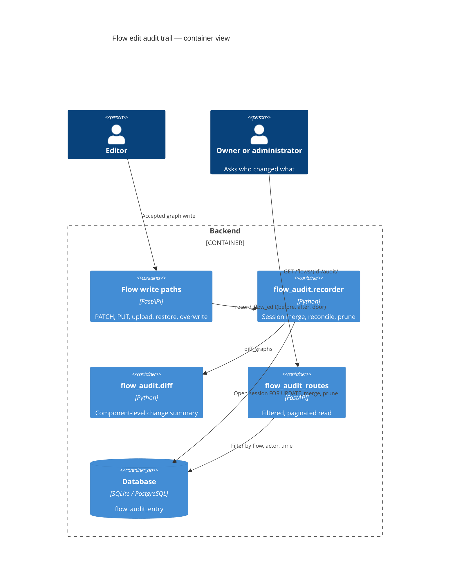
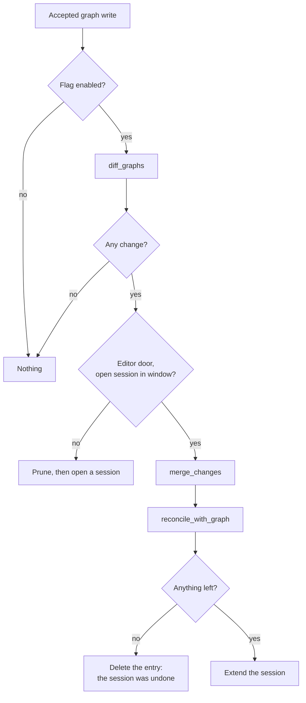

# Feature: Flow Edit Audit Trail

> Generated on: 2026-09-08
> Status: Implemented behind a flag, off by default
> Owner: Cristhian Zanforlin
> Related: [LE-2534](https://datastax.jira.com/browse/LE-2534) under epic [LE-2379](https://datastax.jira.com/browse/LE-2379)
> Companion: [`multi-edit-safety.md`](multi-edit-safety.md) — the concurrency stamp this reads · PRD in `data/user/CZL/MULTI EDIT/`

---

## Table of Contents
1. [Overview](#1-overview)
2. [Ubiquitous Language Glossary](#2-ubiquitous-language-glossary)
3. [Domain Model](#3-domain-model)
4. [Behavior Specifications](#4-behavior-specifications)
5. [Architecture Decision Records](#5-architecture-decision-records)
6. [Technical Specification](#6-technical-specification)
7. [Observability](#7-observability)
8. [Deployment & Rollback](#8-deployment--rollback)
9. [Architecture Diagrams](#9-architecture-diagrams)
10. [Platform Compatibility](#10-platform-compatibility)

---

## 1. Overview

### Summary
A durable record of **who changed a flow and what they changed**, written on every accepted graph write and coalesced into one entry per editing session. Entries describe changes in the same component-level language the conflict dialog uses. Secret values are never recorded.

### Business Context
Measured on a 251-flow instance: **190 flows (76%) had no version entry at all**, because a version is only created by an explicit act and autosave creates none. `Flow.last_modified_by` keeps only the last writer, so fifty saves by one person followed by one save by another read as the second. Nothing recorded *what* changed. The question "who broke this flow, and what did they change" had no answer.

### Bounded Context
Flow Persistence — observability of graph writes.

### Related Contexts
- **Multi-Edit Safety** (Customer-Supplier): decides which writes are accepted; this records exactly those.
- **Flow Version History** (Partnership): snapshots for restoring, a different job — see ADR-004.
- **Authorization Audit** (Separate, do not merge): `authz_audit_log` records permission *decisions*; this records *effects*.

---

## 2. Ubiquitous Language Glossary

| Term | Definition | Code Reference |
|---|---|---|
| **Trail entry** | One person's editing session on one flow, and what it changed. | `FlowAuditEntry` |
| **Session** | Consecutive edits by one person to one flow, folded into a single entry until they stop for the session window. | `_open_entry`, `flow_audit_session_window_seconds` |
| **Door** | Which write path produced the entry. | `SOURCE_EDITOR`, `SOURCE_IMPORT`, `SOURCE_RESTORE`, `SOURCE_OVERWRITE`, `SOURCE_ASSISTANT`, `SOURCE_API` |
| **Change summary** | Component-level description of a write; never a copy of the graph. | `diff_graphs` (`services/flow_audit/diff.py`) |
| **Merge** | Folding a new diff into the session's running summary, keeping the original `before`. | `merge_changes` |
| **Reconciliation** | Re-reading recorded fields from the graph actually written, so the entry cannot claim a change the flow no longer has. | `reconcile_with_graph` |
| **Template metadata** | Underscore-prefixed template keys (`_type`, `_frontend_node_flow_id`) — not fields a person edits. | `_template` filter |
| **Concurrency stamp** | `from_version_token` / `to_version_token`. **Not** a version-history id. | `Flow.version_token` |

---

## 3. Domain Model

### Aggregate: FlowAuditEntry
- **Root entity:** `FlowAuditEntry` (`flow_audit_entry`)
- **Value objects:** the `changes` JSON — a list of change groups, each `{ target, label, badge, changes[] }`

**Invariants**

| Invariant | Guard |
|---|---|
| A write that changes no graph produces no entry. | `graph_changed` gates the call |
| A refused write produces no entry. | The recorder runs only after the write turn is claimed |
| A secret value is never stored. | `_is_secret` — the change is recorded, the value is not |
| An entry never grows with the size of the flow. | Summaries only; long values truncated at 60 chars |
| An entry never claims a change the flow does not have. | `reconcile_with_graph` |
| Only editor writes coalesce. | `_open_entry` returns `None` for every other door |
| A session belongs to one person. | Keyed by `(flow_id, user_id, source)` |
| A trail failure never fails the save. | `record_flow_edit` catches and logs |
| The trail is bounded. | `_prune` at `max_flow_audit_entries_per_flow` |

### Domain events

| Event | Trigger | Payload | Consumers |
|---|---|---|---|
| Session opened | First accepted graph write outside the window | flow, actor, door, tokens, summary | trail readers |
| Session extended | Another editor write inside the window | merged summary, new `to_version_token` | trail readers |
| Session voided | Everything in the session was undone | — (row deleted) | — |

---

## 4. Behavior Specifications

```gherkin
Feature: Who changed a flow, and what they changed
  As someone responsible for a flow
  I want a durable record of every accepted graph change and its author
  So that I can reconstruct what happened without depending on snapshots

  Background:
    Given LANGFLOW_FLOW_AUDIT_ENABLED is true

  Scenario: An edit records its author and its change
    When somebody changes a field on a component
    Then the trail names them, the door "editor", and the field's before and after

  Scenario: A burst of edits is one entry
    When somebody types into a field, producing several saves
    Then there is one entry, reporting where the value started and where it ended

  Scenario: A pause longer than the window starts a new entry
    When somebody edits, stops for longer than the session window, and edits again
    Then there are two entries

  Scenario: An undone change leaves nothing behind
    When somebody changes a value and changes it back within the session
    Then no entry remains, because the flow does not have that change

  Scenario: A secret is recorded as touched and never as a value
    When somebody changes an API key
    Then the field is listed as changed and the value appears nowhere in the trail

  Scenario: Template metadata is not somebody's edit
    When hydration rewrites "_frontend_node_flow_id"
    Then nothing is recorded

  Scenario Outline: Every door is recorded under its own name
    When a flow is changed through <door>
    Then an entry names that door

    Examples:
      | door                     |
      | the editor's autosave    |
      | an import over the flow  |
      | a version restore        |
      | a conflict overwrite     |

  Scenario: Two people editing in one window get one session each
    When two people each change the flow inside the same window
    Then there are two entries, one per person, and neither shares a row

  Scenario: A refused writer adds nothing
    Given twenty-five writers are refused
    Then the trail is unchanged

  Scenario: A failing recorder never costs the save
    Given the diff engine raises
    When somebody saves
    Then the save succeeds and the change is persisted

  Scenario: The trail is off until a deployment turns it on
    Given the flag is false
    When the trail is read
    Then the route answers 404
```

Backed by `src/backend/tests/unit/api/v1/test_flow_audit.py`, `src/backend/tests/unit/services/flow_audit/` (`test_diff`, `test_recorder`, `test_concurrent_sessions`) and `src/frontend/tests/core/regression/flow-audit-trail.spec.ts` + `multi-edit-crowd.spec.ts`.

---

## 5. Architecture Decision Records

### ADR-001 — One entry per editing session, not per write
**Status:** Accepted
**Context:** Autosave produces roughly 240 graph writes per hour of continuous editing. Recorded per write, typing `test` yields `"" → "t" → "te" → "tes" → "test"` — four rows, none useful — and the table grows without bound.
**Decision:** Consecutive editor writes by the same person to the same flow extend the open entry until they stop for `flow_audit_session_window_seconds` (default 300).
**Consequences:** Measured 80 saves of a 20-node flow → **1 entry, 3.8 KB**. An entry reports where a value started and ended, not every keystroke burst. A session that spans a long pause is split, which is correct — it was two sittings.

### ADR-002 — Summaries, never snapshots
**Status:** Accepted
**Context:** The median flow graph is 52 KB (max 488 KB). Storing a graph per write would cost ~12 MB per editing hour per person.
**Decision:** Store the component-level description of the change. Short non-secret values carry before/after; long values carry the fact they changed, truncated; secrets carry neither.
**Consequences:** The trail does not grow with the size of the flow. It cannot be restored from — that stays the version history's job.

### ADR-003 — The summary is produced server-side
**Status:** Accepted
**Context:** `flow-diff.ts` already describes a change well, but it runs in the browser, and an audit row cannot be sourced from the party it describes.
**Decision:** Port the comparison to `services/flow_audit/diff.py` and compute it from the previous `Flow.data` at write time. Keep the two deliberately in step — they describe the same change to the same person.
**Consequences:** One extra comparison per accepted graph write; measured p95 impact under 1 ms. Two implementations to keep aligned, which the shared vocabulary and paired tests make visible.

### ADR-004 — A surface of its own, not the version history panel
**Status:** Accepted
**Context:** The version panel is a list of restore points — every row is clickable to preview or restore. Measured: **66 of 113 existing versions (58%) are already machine-generated**, and the panel prunes at 50 per flow.
**Decision:** The trail gets its own read API and, when designed, its own view, with versions appearing inside it as milestones. Never interleaved rows.
**Consequences:** A trail entry never promises an action it cannot perform, and never consumes the version retention budget. UI still to be validated (Q7 in the PRD).

### ADR-005 — Only editor writes coalesce
**Status:** Accepted
**Context:** Merging a restore into a typing session both mislabels the session and can cancel the act out of existence: restoring a version that undoes the last edit netted out to nothing and left no trace that anyone restored anything.
**Decision:** `_open_entry` returns `None` for every door except the editor. Restores, imports and overwrites are discrete acts, each its own entry.
**Consequences:** The trail distinguishes "someone was editing" from "someone did something deliberate".

### ADR-006 — Reconcile against the graph that was written
**Status:** Accepted
**Context:** Under concurrent unconditional writes, each writer records against the state it read; a later write silently reverts an earlier one, and the entry kept claiming changes the flow no longer had. Measured before the fix: the trail listed seven changed fields when the server had one.
**Decision:** After merging, re-read every recorded field from the graph just written; correct what moved on, drop what returned to its `before`.
**Consequences:** The entry always matches the flow. It also means the lock and the reconciliation are two halves of one guarantee — SQLite ignores `FOR UPDATE`, so removing either breaks the invariant.

### ADR-007 — A trail failure never fails the save
**Status:** Accepted
**Context:** The record is worth less than the work it describes.
**Decision:** `record_flow_edit` catches everything and logs the exception type with the flow id.
**Consequences:** A broad `except` in exchange for a save that cannot be lost. It hid a real defect once — template metadata the diff assumed was a field — which is why the log now names the error.

---

## 6. Technical Specification

### Dependencies

| Component | Role |
|---|---|
| `Flow.version_token` | The stamp each entry moves between |
| `flow_audit_entry` | The trail, migration `6d44d136724d` |
| `attach_usernames` | Resolves actors to names in one query, shared with version history |

### Schema

| Column | Type | Notes |
|---|---|---|
| `flow_id` | UUID | FK, `ON DELETE CASCADE` — a deleted flow takes its trail |
| `user_id` | UUID, null | FK, `ON DELETE SET NULL` — a deleted author renders as unknown |
| `source` | varchar(32) | The door |
| `from_version_token` / `to_version_token` | UUID, null | Concurrency stamps, **not** version ids |
| `changes` | JSON | Change groups |
| `started_at` / `updated_at` | timestamptz | Session bounds |

Indexes: `(flow_id, updated_at)` and `(flow_id, user_id, updated_at)` — the read path and the coalescing lookup.

### API contract

**`GET /api/v1/flows/{flow_id}/audit/`** — read access to the flow is enough; the trail describes a graph the caller can already see in full.

| Parameter | Meaning |
|---|---|
| `actor` | Only entries by this user |
| `since` / `until` | Bound `updated_at` |
| `limit` | 1–200, default 50 |
| `before` | Cursor: continue from this `updated_at` |

```json
{
  "entries": [{
    "id": "…", "flow_id": "…", "user_id": "…", "username": "langflow",
    "source": "editor",
    "from_version_token": "…", "to_version_token": "…",
    "changes": [{ "target": "node:n0", "label": "Chat Input", "badge": "modified",
                  "changes": [{ "kind": "field", "field": "input_value", "label": "Input Text",
                                "before": "one", "after": "two" }] }],
    "started_at": "…", "updated_at": "…"
  }],
  "next_cursor": null
}
```

### Error handling

| Code | Condition | User message | Recovery |
|---|---|---|---|
| `404` | Flag off, or flow not visible | "The flow audit trail is not enabled on this deployment." | Enable the flag |
| `422` | `limit` outside 1–200, malformed id | Validation error | Fix the request |

---

## 7. Observability

| Signal | Type | Where | Threshold |
|---|---|---|---|
| `op=record_flow_edit flow_id=… outcome=dropped error=<Type>` | Log (warning) | `recorder.py` | Any sustained rate means edits are going unrecorded — this exact line, silent about the error type, once hid a defect that dropped every entry |
| Row count of `flow_audit_entry` per flow | Gauge | `TBD` — not emitted today | Should sit far below `max_flow_audit_entries_per_flow` |
| p95 of `PATCH /flows/{id}` | Histogram | HTTP metrics | Measured +0.5 ms with the trail on (7.4 → 7.9 ms) |

No secret, prompt, or field value is ever logged; the warning carries only the flow id and the exception type.

---

## 8. Deployment & Rollback

### Feature flags

| Setting | Purpose | Default | Rollout |
|---|---|---|---|
| `LANGFLOW_FLOW_AUDIT_ENABLED` | Write and expose the trail | `false` | Opt in per deployment; the read route 404s while off |
| `LANGFLOW_FLOW_AUDIT_SESSION_WINDOW_SECONDS` | How long one person's edits fold into a session | `300` | Lower for a more granular trail, at the cost of volume |
| `LANGFLOW_MAX_FLOW_AUDIT_ENTRIES_PER_FLOW` | Retention ceiling per flow | `200` | Pruned when a session opens, so a burst never pays for it |

### Migrations

| Revision | Phase | Reversible |
|---|---|---|
| `6d44d136724d` | EXPAND | Yes — one new table and its indexes; nothing existing is read or written |

### Rollback plan
1. Set `LANGFLOW_FLOW_AUDIT_ENABLED=false`. Writing stops immediately; the read route returns 404. No other behaviour changes.
2. To remove the schema, `alembic downgrade` drops the table. Existing rows are lost — that is the point of the downgrade.
3. Older services never touch the table, so a mixed fleet is safe.

### Smoke tests
- [ ] With the flag off, `GET /flows/{id}/audit/` returns 404 and no rows are written
- [ ] With it on, an edit produces one entry naming the author
- [ ] Changing a secret field records the change and no value
- [ ] `select count(*) from flow_audit_entry where changes like '%sk-%'` returns 0

---

## 9. Architecture Diagrams





---

## 10. Platform Compatibility

| Platform | Supported | Notes |
|---|---|---|
| Linux / macOS / Windows | Yes | No paths, no shell, no naive `datetime.now()` |
| SQLite | Yes | `FOR UPDATE` is ignored here; `reconcile_with_graph` carries the guarantee |
| PostgreSQL | Yes | Verified on 17: migration, 21/21 stress checks |
| Docker | Yes | Same image, no new dependency |
| Kubernetes (multi-replica) | Yes | Sessions are resolved by database lookup, so one session survives hopping between pods — verified with two replicas on one database |
| `lfx serve` | Not applicable | Stateless, no database; only the two settings live in `lfx`, and nothing reads them there |

**Known limitations**
- In OSS, two accounts cannot share a flow, so the multi-actor trail needs an authorization plugin.
- Trail and version history cannot be joined: `flow_version` stores no concurrency stamp (PRD Q9).
- Under concurrent unconditional writes, reconciliation keeps the entry honest but a dropped merge is possible in principle; the invariant checked is "the trail never claims a change the flow does not have".
