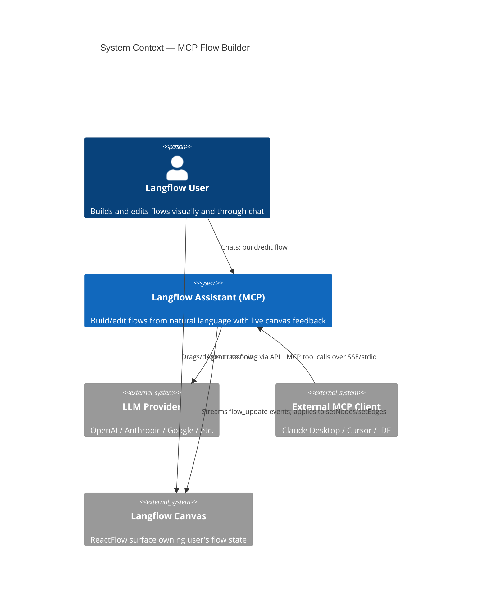
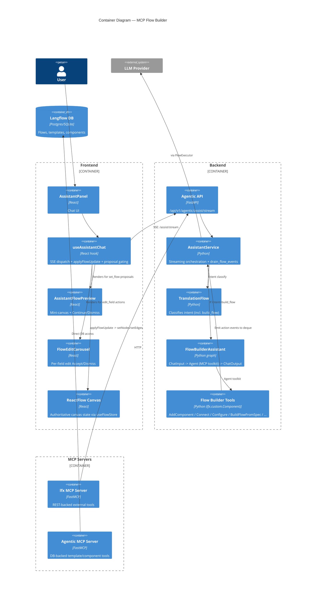

# Feature: Langflow Assistant — MCP Flow Builder Integration

> Generated on: 2026-05-11
> Status: Draft
> Owner: Engineering Team
> Related PRs: #12575 (MCP integration), `feat/assistant-mcp-integration-clean` branch
> Companion document: [`langflow-assistant.md`](./langflow-assistant.md) — read first for base Assistant concepts (session model, SSE pipeline, provider configuration, off-topic guardrails).

---

## Table of Contents
1. [Overview](#1-overview)
2. [Ubiquitous Language Glossary](#2-ubiquitous-language-glossary)
3. [Domain Model](#3-domain-model)
4. [Behavior Specifications](#4-behavior-specifications)
5. [Architecture Decision Records](#5-architecture-decision-records)
6. [Technical Specification](#6-technical-specification)
7. [Observability](#7-observability)
8. [Deployment & Rollback](#8-deployment--rollback)
9. [Architecture Diagrams](#9-architecture-diagrams)
10. [Platform Compatibility](#10-platform-compatibility)

---

## 1. Overview

### Summary

The MCP Flow Builder extends the Langflow Assistant from a single-component generator into a full flow-construction **and** documentation agent. Users describe what they want ("build me a chatbot that answers questions over a PDF", "change the model to gpt-4o", "add a memory component", "create a markdown file documenting this flow"), and an Agent equipped with a toolkit of Model-Context-Protocol (MCP) tools either **builds** a new flow from scratch (destructive, gated behind an explicit **Continue** review step), **edits** the existing canvas live, or **writes/reads files** inside a sandboxed workspace (e.g. documentation, reports).

### Business Context

The base Assistant (`langflow-assistant.md`) generates one custom Python `Component` at a time. That covers writing leaf nodes but not the act of wiring them into a working flow — historically the user's job in the canvas. The MCP integration closes that gap: the Assistant can now **discover** components from the registry, **add**/**remove**/**connect**/**configure** them on the user's canvas, **propose** field edits with diff cards the user approves one-by-one, **build entire flows** from a spec when starting from an empty canvas, and **author files** (documentation `.md`, reports `.txt`, etc.) inside a per-user sandboxed workspace.

Three user behaviors emerge from this:

1. **Live edit mode** — incremental tool calls (`add_component`, `connect_components`, `configure_component`) take effect on the canvas *as the SSE stream arrives*, so users see the agent's work materialize in real time. There is no review step for these — the canvas is the working surface.
2. **Build mode (gated)** — when the agent calls `build_flow` (which emits a destructive `set_flow` action that would replace the entire canvas), the frontend intercepts the payload into a `pendingFlowProposal`, renders a mini-canvas preview, and waits for the user's explicit **Continue** or **Dismiss** click before any canvas state changes. After Continue the badge reverts to "pending" after 3s so the user can re-apply if they edited the canvas.
3. **Manage files (ungated)** — when the agent uses `write_file` / `edit_file` inside its sandbox, the frontend renders a per-file card with **Open** / **Download** buttons. The action is non-destructive (the file lives inside the user's isolated workspace) so there is no Continue gate — the card materializes directly when the agent completes its run.

### Bounded Context

**Context**: `Agentic` — AI-assisted flow construction inside Langflow.

This context owns:
- MCP tool registration and per-request flow state (`ContextVar`-isolated `_working_flow_var`, `_flow_events_var`, `_file_events_var`).
- Flow Builder intent routing (TranslationFlow emits `"build_flow"` and `"manage_files"` alongside existing intents).
- SSE `flow_update` / `flow_preview` / `file_written` event channels.
- Frontend gating for destructive `set_flow` events (Continue/Dismiss with 3s auto-revert) and per-edit-field review carousel.
- Sandboxed filesystem toolkit wrapping (`FileSystemToolComponent` → `wrap_file_tool_with_event`) that emits `file_written` events with the file content inline so the UI renders without a second HTTP fetch.

### Related Contexts

| Context | Relationship | Description |
|---------|--------------|-------------|
| `Assistant (base)` | Inheritance | Shares the SSE pipeline, session model, provider config, intent classifier, and panel UI. Adds new step types and event channels on top. |
| `Flow` | Customer-Supplier | Flow context supplies the current canvas JSON via `_get_current_flow_summary()`; the Assistant writes to `useFlowStore.setNodes/setEdges` to mutate the canvas. |
| `Components Registry` | Conformist | Tools call `load_registry()` / `search_registry()` against the existing component registry. The Assistant adapts to the registry shape; it does not own it. |
| `MCP (LFX)` | Partnership | The `lfx.mcp` package owns the FastMCP server and tool definitions. The Assistant's `flow_builder_assistant` flow imports and toolkits them. |
| `Variables` | Customer-Supplier | Provider API keys and the `FLOW_ID` global var are pulled by the Assistant for tool execution. |

---

## 2. Ubiquitous Language Glossary

Terms below extend the glossary in `langflow-assistant.md`. Where a term overlaps, the MCP-specific meaning is noted.

| Term | Definition | Code Reference |
|------|------------|----------------|
| **MCP Flow Builder Tools** | A bundle of `lfx.custom.Component` subclasses exposed to the Agent as a toolkit. Each tool mutates the per-request working flow and emits an action event. | `src/lfx/src/lfx/mcp/flow_builder_tools.py` |
| **WorkingFlow** | The per-request, in-memory dict representation of the user's flow held in a `ContextVar`. Tools read and write it; it is reset between requests. NOT the user's persisted canvas — it is the agent's scratchpad initialized from the canvas. | `_working_flow_var`, `init_working_flow()`, `get_working_flow()`, `reset_working_flow()` |
| **FlowUpdateAction** | The discrete edit operation a tool emits (`add_component`, `remove_component`, `connect`, `configure`, `set_flow`, `edit_field`, `select_output`, `set_connection_mode`). Serialized into SSE `flow_update` events. | `_emit(action, **data)`, `AgenticFlowUpdateEvent.action` |
| **FlowEvent Queue** | A `deque[dict]` in a `ContextVar` that tools push action events into and the streaming service drains between LLM tokens. | `_flow_events_var`, `drain_flow_events()` |
| **BuildFlowFromSpec** | The tool that constructs a complete flow from a YAML-style text spec. Emits a `set_flow` action and is the only path that triggers Continue gating. Rejects specs with orphan nodes. | `BuildFlowFromSpec` (class), `_find_orphan_nodes()` |
| **PendingFlowProposal** | Frontend state holding a buffered `set_flow` payload plus any tail events that arrived after it. Replayed on Continue, discarded on Dismiss. | `PendingFlowProposal` (TS interface), `proposalPendingRef` |
| **FlowProposalStatus** | Tri-state lifecycle for a proposal: `"pending"` (awaiting user) → `"applied"` (canvas written) or `"dismissed"` (discarded). | `FlowProposalStatus` |
| **ContinueGate** | The frontend rule that buffers `set_flow` into a proposal rather than writing the canvas immediately. Backend signals readiness via `flow_proposal_ready` step. | `onFlowUpdate` set_flow branch, `handleApplyFlowProposal`, `handleDismissFlowProposal` |
| **FlowEditCarousel** | The per-edit Accept/Dismiss UI rendered for `propose_field_edit` actions. Applies a JSON Patch on Accept. Pre-existing; preserved unchanged. | `FlowEditCarousel`, `assistant-flow-edit-card.tsx` |
| **ProposeFieldEdit** | The tool that proposes a single field-value change with a JSON Patch payload. Emits `edit_field` action. The agent uses it when modifying an existing component's field. | `ProposeFieldEdit` (class) |
| **FlowAction** | Frontend representation of a pending `edit_field` proposal (`pending`/`applied`/`dismissed`) shown in the carousel. | `FlowAction` (TS interface) |
| **FlowBuilderAssistant** | The Python-defined flow (`flow_builder_assistant.py`) that wires `ChatInput → Agent (with MCP toolkit) → ChatOutput`. Routed to when intent is `"build_flow"`. | `get_flow_builder_graph`, `FLOW_BUILDER_ASSISTANT_FLOW` |
| **build_flow intent** | TranslationFlow output that routes to `FlowBuilderAssistant` instead of the component-generation flow. | `IntentResult.intent == "build_flow"` |
| **CurrentFlowSummary** | Spec-like text snapshot of the user's existing canvas prepended to the user input as `[Current flow on canvas: ...]`. Lets the agent reason about edits. Also initializes the WorkingFlow. | `_get_current_flow_summary()` |
| **OrphanNode** | A node in a `BuildFlowFromSpec` result with no incident edges. The tool rejects specs containing one to prevent broken canvases. | `_find_orphan_nodes()` |
| **Auto-Layout** | After every `add_component` / `remove_component`, node positions are recomputed by the layout helper so the canvas stays readable as the agent works. | `_layout_flow()` in `flow_builder_tools.py` |
| **flow_proposal_ready** | The progress step the backend emits *only* when at least one `set_flow` was observed during the run. The frontend uses it to render the Continue/Dismiss card. | `format_progress_event("flow_proposal_ready", ...)`, `saw_set_flow` flag |
| **flow_preview event** | SSE event carrying the full flow JSON + node/edge counts + ASCII graph, used to render the mini-canvas preview. Distinct from `flow_update`. | `format_flow_preview_event`, `AgenticFlowPreviewEvent` |
| **Tail Updates** | Defensive buffer for `flow_update` events that arrive *after* a `set_flow` in the same run. Per prompt this shouldn't happen, but if it does they replay on Continue. | `PendingFlowProposal.tailUpdates` |
| **MCP Server (lfx)** | The FastMCP-based server in `lfx/mcp/server.py` exposing REST-backed tools (create_flow, run_flow, build_flow, batch). Talks to the Langflow HTTP API. | `lfx/mcp/server.py`, `LangflowClient` |
| **MCP Server (agentic)** | A second FastMCP server in `langflow/agentic/mcp/server.py` exposing template/component search and flow visualization tools directly against the database. | `langflow/agentic/mcp/server.py` |
| **MCPToolPayload** | Telemetry event logged for every MCP tool invocation (tool name, success, duration, error type). | `_tracked` decorator in `lfx/mcp/server.py` |
| **batch action** | An MCP tool that executes multiple actions sequentially, with `$N.field` reference resolution for chaining outputs to inputs. | `batch()` in `lfx/mcp/server.py` |
| **manage_files intent** | TranslationFlow output that routes a request through the same `FlowBuilderAssistant` flow but signals the frontend to render the "Generating document..." thinking label instead of "Generating flow...". | `TRANSLATION_PROMPT` examples, `IntentResult.intent == "manage_files"` |
| **FileSystemTool** | The sandboxed filesystem toolkit (`read_file`, `write_file`, `edit_file`, `glob_search`, `grep_search`) added to the FlowBuilderAssistant's toolkit. Every path is RELATIVE to the user's per-user sandbox root (`<BASE_DIR>/users/<hash(user_id)>/` or `<BASE_DIR>/shared/` under AUTO_LOGIN). | `FileSystemToolComponent` in `lfx/components/tools/filesystem.py` |
| **FileEvent Queue** | A second `ContextVar`-scoped `deque` parallel to the FlowEvent queue. Tools wrapped by `wrap_file_tool_with_event` push `file_written` entries; the streaming service drains between LLM tokens. Allocates the deque on the parent context so child asyncio tasks inherit the same instance by reference (matches the proven `flow_builder_tools` pattern). | `_file_events_var`, `emit_file_event()`, `drain_file_events()`, `reset_file_events()` |
| **wrap_file_tool_with_event** | Wraps a `FileSystemToolComponent` `StructuredTool` so its successful response triggers an `emit_file_event` with the file's `path`, `size`, and (for `write_file`) the inline `content`. Errors and unparseable responses are passed through unchanged and emit nothing. | `wrap_file_tool_with_event()` in `agentic/services/file_events.py` |
| **WrittenFile** | Frontend representation of a file the agent persisted. Stored on the `AssistantMessage` in arrival order. Carries the inline content so the modal/Download work without a second HTTP fetch. | `WrittenFile` (TS interface), `AssistantMessage.writtenFiles` |
| **file_written event** | SSE event the frontend's `onFileWritten` handler appends to `message.writtenFiles[]`. Payload: `{action, path, size, content?}`. Distinct from `flow_update`. | `format_file_written_event()`, `AgenticFileWrittenEvent` |
| **AssistantFileCard** | Per-file card rendered on the message after a successful write. Shows basename + size + Open/Download buttons. **No fetch** — Open renders the inline `content` via `SanitizedMarkdown`; Download builds a Blob from the same `content`. | `assistant-file-card.tsx`, `file-content-modal.tsx` |
| **generating_document step** | Progress step emitted by the backend when intent is `manage_files`. The frontend uses it to label the simple thinking dots ("Generating document..." instead of a random rotating placeholder). Intentionally NOT in `RICH_LOADING_STEPS` — a rich card morphing into the file card looked like a glitch. | `StepType` Literal, `RICH_LOADING_STEPS` |

---

## 3. Domain Model

### 3.1 Aggregates

#### WorkingFlow (per-request)

The agent's editable representation of the user's flow during a single Assistant request. It exists in a `ContextVar` to isolate concurrent SSE sessions; it is **not** the user's canvas state.

- **Root Entity**: working flow dict (`{"name": str, "data": {"nodes": [...], "edges": [...]}}`).
- **Entities**:
  - `Node` — a component instance with id, type, template, position.
  - `Edge` — a connection (source, sourceHandle, target, targetHandle).
- **Value Objects**:
  - `FlowUpdateAction` — emitted action (see glossary).
  - `FieldPatch` — JSON Patch op for `propose_field_edit`.
- **Invariants**:
  - `init_working_flow()` is called once per request before any tool runs; `reset_working_flow()` is called in the `finally` block of the streaming service so the next request starts clean.
  - `BuildFlowFromSpec` rejects specs whose result contains any orphan node (any node without an incident edge).
  - `ConnectComponents` validates that source output `types` overlap with target input `input_types`, and only attaches Tool-type outputs to `tools` inputs.
  - For `ModelInput` targets, `ConnectComponents` also emits `set_connection_mode` so the canvas knows to render the model-input edge.
  - `ConfigureComponent` mirrors a new model value into the `options` array so the UI dropdown reflects the agent's choice.

#### FlowProposal (frontend)

The buffered representation of a destructive `set_flow` waiting for user approval.

- **Root Entity**: `AssistantMessage.pendingFlowProposal`.
- **Value Objects**:
  - `PendingFlowProposal` (flow JSON, name, nodeCount, edgeCount, tailUpdates).
  - `FlowProposalStatus` (`pending` | `applied` | `dismissed`).
- **Invariants**:
  - Exactly one `pendingFlowProposal` per message — the second `set_flow` in the same run would overwrite the first (and is logged as a warning; per the prompt this never happens).
  - While `flowProposalStatus === "pending"`, subsequent non-`edit_field` flow updates buffer into `tailUpdates` rather than mutating the canvas.
  - On `Continue` (`handleApplyFlowProposal`), the buffered `set_flow` is replayed first, then `tailUpdates` in arrival order, then `status` flips to `applied`.
  - On `Dismiss` (`handleDismissFlowProposal`), no canvas write occurs; the backend's per-request `_working_flow_var` is already reset by the streaming service's `finally`.
  - A new user message auto-dismisses the prior proposal so a stale Continue cannot replay an outdated build.
  - There is **no auto-apply timeout** for flow proposals (intentional divergence from the 30s component-generation fallback — Continue is the only safeguard against destructive replacement).

#### FlowEditProposal (existing — preserved)

The per-edit Accept/Dismiss carousel for field changes. Already documented; unchanged by this work.

- **Root Entity**: `AssistantMessage.flowActions[]`.
- **Value Objects**: `FlowAction` (id, type=`edit_field`, patch, status).
- **Invariants**:
  - Each `edit_field` action carries a `patch` (JSON Patch ops) that is applied via `applyFlowUpdate` on Accept and discarded on Dismiss.
  - The carousel only handles `edit_field`. Other actions never enter it.

### 3.2 Domain Events

The base Assistant event table still applies. The MCP integration adds:

| Event | Trigger | Payload | Consumers |
|-------|---------|---------|-----------|
| `flow_update` (action=`add_component`) | `AddComponent.add_component()` succeeds | `{node}` (full node JSON) | Frontend → `applyFlowUpdate` → `setNodes` (live) |
| `flow_update` (action=`remove_component`) | `RemoveComponent.remove_component()` | `{component_id}` | Frontend removes node + incident edges live |
| `flow_update` (action=`connect`) | `ConnectComponents.connect_components()` | `{edge}` (full edge JSON) | Frontend appends edge + `updateNodeInternals(src, tgt)` |
| `flow_update` (action=`configure`) | `ConfigureComponent.configure_component()` | `{component_id, params}` | Frontend merges `params` into node `template` |
| `flow_update` (action=`set_flow`) | `BuildFlowFromSpec.build_flow()` | `{flow}` (full flow JSON) | Frontend **buffers into** `pendingFlowProposal`; does NOT mutate canvas |
| `flow_update` (action=`edit_field`) | `ProposeFieldEdit.propose_field_edit()` | `{id, component_id, component_type, field, old_value, new_value, description, patch}` | Frontend pushes onto `flowActions[]` for the FlowEditCarousel |
| `flow_update` (action=`select_output`) | `ConnectComponents` when source has multiple outputs | `{component_id, output_name}` | Frontend updates the source node's `selected_output` |
| `flow_update` (action=`set_connection_mode`) | `ConnectComponents` when target is a ModelInput | `{component_id, enabled}` | Frontend toggles ModelInput edge mode on target |
| `flow_preview` | After a successful `set_flow` (or fallback JSON extraction) | `{flow, name, node_count, edge_count, graph}` | Frontend renders mini-canvas preview |
| `progress` step `generating_flow` | `is_flow_request` becomes true at the start of an attempt | standard progress payload | Frontend swaps the loading label to "Generating flow..." |
| `progress` step `flow_proposal_ready` | Streaming finished AND `is_flow_request` AND `saw_set_flow` | standard progress payload | Frontend renders the Continue/Dismiss card |
| `progress` step `generating_document` | `is_document_request` becomes true at the start of an attempt | standard progress payload | Frontend labels the thinking dots "Generating document..." — NO rich loading card (intentional, to avoid the card→card transition glitch) |
| `file_written` (action=`write_file`) | `write_file` tool succeeds inside the wrapper | `{action: "write_file", path, size, content?}` — relative path only, content inline | Frontend appends to `message.writtenFiles[]`; renders `AssistantFileCard` |
| `file_written` (action=`edit_file`) | `edit_file` tool succeeds inside the wrapper | `{action: "edit_file", path, size}` — no content (post-edit body not captured at wrapper time) | Frontend appends to `message.writtenFiles[]`; Open shows "Preview not available" |
| `progress` step `searching_components` / `building_flow` / `flow_built` / `flow_build_failed` / `document_ready` | Reserved step types declared in `StepType` | standard progress payload | Future progress granularity (declared, not all emitted today; `document_ready` was prototyped then dropped in favor of jumping straight to the file card) |

---

## 4. Behavior Specifications

### Feature: MCP Flow Builder

**As a** Langflow user
**I want** to build and modify flows by chatting with an Assistant
**So that** I can scaffold a working flow in seconds and iterate on it in natural language without dragging components

### Background

- Given a user with an active Langflow session.
- And at least one model provider is configured with a valid API key.
- And the user has the assistant panel open on a flow page.

### Scenario: Build a new flow on an empty canvas (gated)

- **Given** the canvas is empty.
- **When** I send "Build me a simple chatbot".
- **Then** the intent is classified as `"build_flow"`.
- **And** I see a `generating_flow` progress step.
- **And** the agent calls `build_flow(spec=...)` which emits a `set_flow` action.
- **And** the canvas remains empty (no nodes added yet).
- **And** I see a `flow_proposal_ready` progress step.
- **And** the message renders a mini-canvas preview with the proposed flow.
- **And** I see a green **Continue** button (`data-testid="assistant-flow-continue-button"`) and a **Dismiss** button (`data-testid="assistant-flow-dismiss-button"`).

### Scenario: Continue applies the proposed flow

- **Given** a `pendingFlowProposal` exists on the message.
- **When** I click **Continue**.
- **Then** the buffered `set_flow` is replayed via `applyFlowUpdate`.
- **And** `setNodes` and `setEdges` are called once each (one batched React render).
- **And** any buffered `tailUpdates` are replayed in arrival order after `set_flow`.
- **And** the proposal status flips to `"applied"`.
- **And** the card switches to an "Added to canvas" badge.
- **And** the canvas matches the proposed flow exactly.

### Scenario: Dismiss discards the proposed flow

- **Given** a `pendingFlowProposal` exists on the message.
- **When** I click **Dismiss**.
- **Then** the proposal status flips to `"dismissed"`.
- **And** no canvas mutation occurs.
- **And** the card shows a muted "Dismissed" label (preview stays visible for context).
- **And** the backend `_working_flow_var` is already reset (by the streaming service's `finally` block) — no extra call needed.

### Scenario: Edit an existing flow live (NOT gated)

- **Given** the canvas already has `ChatInput → OpenAIModel → ChatOutput`.
- **When** I send "change the model to gpt-4o-mini".
- **Then** the intent is `"build_flow"` but no `set_flow` is emitted.
- **And** the agent calls `configure_component(component_id="OpenAIModel-XXXX", params={"model_name": "gpt-4o-mini"})`.
- **And** the `configure` flow update applies live — the model field updates as the event arrives.
- **And** NO Continue/Dismiss buttons appear.
- **And** NO `flow_proposal_ready` step is emitted (`saw_set_flow == False`).

### Scenario: Per-field edit proposal via carousel

- **Given** the canvas has a component with a complex field the agent wants to change carefully.
- **When** the agent calls `propose_field_edit(...)`.
- **Then** a `flow_update` event with `action="edit_field"` arrives.
- **And** a new entry is pushed to the message's `flowActions[]`.
- **And** the `FlowEditCarousel` renders the proposed diff (old → new) with **Accept** and **Dismiss** controls.
- **When** I click **Accept**.
- **Then** the JSON Patch is applied via `applyFlowUpdate({action: "configure", ...})`.
- **And** the carousel marks the entry as `"applied"`.

### Scenario: Adding a component live

- **Given** the canvas has at least one component.
- **When** I send "add a memory component".
- **Then** the agent calls `search_components` and `describe_component` first (per the prompt).
- **And** the agent calls `add_component(component_type="MessageHistory")`.
- **And** a `flow_update` event with `action="add_component"` arrives.
- **And** the new node renders on the canvas instantly.
- **And** node positions are auto-laid-out so the new node doesn't overlap.

### Scenario: Connecting components live

- **Given** the canvas has a `ChatInput` and an `Agent` with no edge between them.
- **When** I send "connect ChatInput to Agent".
- **Then** the agent calls `connect_components(source_id, "message", target_id, "input_value")`.
- **And** a `flow_update` event with `action="connect"` arrives.
- **And** the edge renders on the canvas.
- **And** `updateNodeInternals` is called on both endpoints so handles align.

### Scenario: Build-from-spec with orphan node is rejected

- **Given** an empty canvas.
- **When** the agent generates a spec where one node has no edges.
- **Then** `BuildFlowFromSpec.build_flow()` detects the orphan via `_find_orphan_nodes()`.
- **And** the tool returns an error result.
- **And** NO `set_flow` event is emitted.
- **And** the agent receives the error and retries with corrections.

### Scenario: Multi-output source connection picks the right output

- **Given** a source component with two outputs (`message`, `data`).
- **When** the agent connects the `data` output to a target input.
- **Then** `connect_components` emits BOTH `connect` and `select_output`.
- **And** the source node's `selected_output` is set to `data` so the canvas dropdown reflects reality.

### Scenario: Connection to a ModelInput sets connection mode

- **Given** an `Agent` component with a `language_model` (ModelInput) input.
- **When** the agent connects an `OpenAIModel.text_response` to it.
- **Then** `connect_components` emits `set_connection_mode` first, then `connect`.
- **And** the ModelInput renders in connection mode on the canvas.

### Scenario: Sensitive field values are redacted

- **Given** a component on the canvas has an API key field with a real value.
- **When** the agent calls `get_field_value(component_id, "api_key")`.
- **Then** the tool returns a redacted placeholder (e.g., `"***REDACTED***"`).
- **And** the LLM never sees the secret.

### Scenario: Current flow context is injected into the prompt

- **Given** the canvas has 3 components.
- **When** I send a message.
- **Then** the backend calls `_get_current_flow_summary(FLOW_ID)`.
- **And** the user input is prefixed with `[Current flow on canvas:\n<spec>\n]\n\n<user input>`.
- **And** `init_working_flow(flow_data)` initializes the per-request flow so tools can read it.

### Scenario: Pending proposal is auto-dismissed on next send

- **Given** a `pendingFlowProposal` is showing for a previous message.
- **When** I type a new message and send.
- **Then** the prior proposal is auto-dismissed (no replay).
- **And** the new request starts cleanly.

### Scenario: Tail updates after set_flow are buffered (defensive)

- **Given** the agent — against the prompt rules — emits `set_flow` followed by `add_component` in the same run.
- **When** the `add_component` event arrives while `flowProposalStatus === "pending"`.
- **Then** the event is appended to `pendingFlowProposal.tailUpdates` rather than applied live.
- **And** on Continue, the `set_flow` replays first, then the buffered `add_component` replays.
- **And** a warning is logged so the prompt regression can be tracked.

### Scenario: Build mode on a non-empty canvas is forbidden (prompt rule)

- **Given** the canvas is non-empty.
- **When** the agent considers calling `build_flow` (per prompt this is forbidden on non-empty canvas).
- **Then** the agent uses incremental tools (`add_component`, `connect_components`, `configure_component`) instead.
- **And** no destructive replacement occurs.

### Scenario: Off-topic and Q&A intents bypass the flow builder entirely

- **Given** any canvas state.
- **When** I ask "how does Langflow integrate with Slack?" (Q&A) or "how does n8n work?" (off-topic).
- **Then** the intent is `"question"` or `"off_topic"` (not `"build_flow"`).
- **And** the `FlowBuilderAssistant` flow is NOT executed.
- **And** behavior matches the base Assistant (Q&A token streaming or refusal message).

### Scenario: Backend signals readiness only when a set_flow was emitted

- **Given** the agent only emits incremental edits during a `build_flow`-intent run.
- **When** the run completes.
- **Then** `saw_set_flow` is `False`.
- **And** the backend does NOT emit `flow_proposal_ready`.
- **And** the frontend does NOT show a Continue/Dismiss card.
- **And** the edits remain on the canvas (already applied live).

### Scenario: Continue badge auto-reverts after 3 seconds

- **Given** a `pendingFlowProposal` was applied via Continue.
- **When** 3 seconds pass with `flowProposalStatus === "applied"`.
- **Then** the status reverts to `"pending"` so the user can re-apply.
- **And** if the user dismissed or sent a new message in the meantime, the revert is a no-op.

### Scenario: Create a documentation file (manage_files intent)

- **Given** the assistant panel is open.
- **When** I send "create a markdown file documenting this flow".
- **Then** the TranslationFlow classifies intent as `"manage_files"`.
- **And** the request routes to the same `FlowBuilderAssistant` (toolkit includes `read_file`/`write_file`/`edit_file`/`glob_search`/`grep_search`).
- **And** the frontend renders the thinking dots labelled "Generating document...".
- **When** the agent calls `write_file(path="FLOW_DOCS.md", content="...")`.
- **Then** the wrapper emits `file_written` with `{action: "write_file", path: "FLOW_DOCS.md", size, content}`.
- **And** the message gets a `WrittenFile` entry.
- **When** the `complete` event arrives.
- **Then** the file card renders directly — no Continue gate — with **Open** and **Download** buttons.

### Scenario: Open a written file renders inline content

- **Given** a `WrittenFile` with `content` set.
- **When** I click **Open**.
- **Then** the `FileContentModal` reads `content` from local message state.
- **And** renders it as sanitized markdown via `SanitizedMarkdown` (`rehype-sanitize`).
- **And** there is **no HTTP fetch** — no second auth round-trip, no path-resolution mismatch.

### Scenario: Download a written file builds a Blob locally

- **Given** a `WrittenFile` with `content` set.
- **When** I click **Download**.
- **Then** the card builds a `Blob([content], "text/plain;charset=utf-8")` from in-memory state.
- **And** triggers an `<a download>` click.
- **And** revokes the object URL.
- **And** the user's browser saves the file.

### Scenario: Read a sandboxed file (read-only path)

- **Given** the user previously wrote `NOTES.md` to the sandbox.
- **When** I send "read the NOTES.md file".
- **Then** TranslationFlow classifies as `"manage_files"`.
- **And** the agent calls `read_file(path="NOTES.md")`.
- **And** the tool returns the content (with line numbers) to the LLM.
- **And** NO `file_written` event is emitted (read paths don't emit).
- **And** the agent's textual response includes the relevant content or summary.

### Scenario: Search across sandbox files

- **Given** the user has multiple `.md` files in the workspace.
- **When** I send "find 'API key' across my docs".
- **Then** the agent calls `grep_search(pattern="API key")`.
- **And** the result feeds the LLM's text response.
- **And** no `file_written` events are emitted.

### Scenario: Failed write does not emit a stale event

- **Given** the agent calls `write_file(path="../escape.md", content=...)`.
- **When** `FileSystemToolComponent._write_file` refuses with PermissionError.
- **Then** the response carries an `"error"` key.
- **And** the wrapper sees the error and DOES NOT emit `file_written`.
- **And** the frontend has no stale card for a write that never happened.

### Scenario: Backend embeds content inline, frontend has no fetch endpoint

- **Given** a successful `write_file`.
- **When** the SSE pipeline drains file events.
- **Then** the `file_written` payload carries `content` directly.
- **And** the frontend does NOT call a separate endpoint to read the file.
- **And** the only HTTP surface is the existing `/api/v1/agentic/assist/stream`.

### Scenario: No Continue gate for sandboxed file actions

- **Given** the agent wrote a file.
- **When** the `complete` event arrives.
- **Then** the frontend renders the `AssistantFileCard` directly.
- **And** there is no "Document ready" intermediate state.
- **And** there is no Continue button — the action is non-destructive (the file is already inside the user's per-user sandbox).

---

## 5. Architecture Decision Records

### ADR-MCP-001: ContextVar-Scoped Per-Request Working Flow

**Status**: Accepted

#### Context

Tools need to mutate a shared flow representation across multiple calls within a single Assistant request (e.g., `add_component` → `configure_component` → `connect_components`). They also need to be isolated between concurrent SSE sessions (two users editing different flows at the same time). A module-level global would break concurrency; passing the flow into every tool call as an explicit argument would clutter the tool API and confuse the LLM.

#### Decision

Hold per-request state in `contextvars.ContextVar`:

- `_working_flow_var: ContextVar[dict | None]` — the working flow dict.
- `_flow_events_var: ContextVar[deque[dict]]` — the queue of emitted action events.
- `_current_flow_id_var: ContextVar[str | None]` — the canvas flow id (for context-aware tools).

`init_working_flow()` and `reset_working_flow()` bracket the streaming service's request handling. Tools call `_ensure_working_flow()` to fetch the current value or raise.

#### Consequences

**Benefits:**
- Concurrent SSE sessions are fully isolated — Python's `ContextVar` propagates correctly across `asyncio` tasks.
- Tool signatures stay clean (no `flow_state` parameter the LLM has to manage).
- Reset in `finally` guarantees clean state even on exceptions/cancellations.

**Trade-offs:**
- ContextVar semantics are subtle. Code paths that spawn threads (not tasks) would not see the value — but the Assistant streaming pipeline is fully async.

**Key Files:**
- `src/lfx/src/lfx/mcp/flow_builder_tools.py:31-77` — ContextVar declarations + helpers.
- `src/backend/base/langflow/agentic/services/assistant_service.py:247` — `reset_working_flow()` at start of request.

---

### ADR-MCP-002: Live Application of Incremental Edits, Gated `set_flow` Only

**Status**: Accepted (supersedes initial "all flow_updates gated" proposal in `PLAN_flow_builder_continue_step.md`)

#### Context

Originally every `flow_update` event was considered for gating behind Continue. That would mean each `add_component`, `connect`, and `configure` produces a card the user has to approve before it lands on the canvas. In practice that made the editing UX intolerable — the agent's value is to *make* changes; reviewing every micro-step defeats the purpose.

But the destructive `set_flow` (replaces the entire canvas in one operation) is genuinely dangerous. If the user has unsaved work on the canvas and the agent decides to rebuild from scratch, applying that eagerly silently destroys their work.

#### Decision

Gate **only** the `set_flow` action behind an explicit Continue review step. All other actions (`add_component`, `remove_component`, `connect`, `configure`, `select_output`, `set_connection_mode`) apply live. The `edit_field` action keeps its existing per-edit carousel (FlowEditCarousel) — it was already user-gated by design.

The frontend's `onFlowUpdate` handler branches on action type:

```ts
if (event.action === "edit_field") { /* push to flowActions for carousel */ }
else if (event.action === "set_flow") { /* buffer into pendingFlowProposal */ }
else { applyFlowUpdate(event); /* live, unchanged */ }
```

The backend emits `flow_proposal_ready` only when at least one `set_flow` was observed during the run (`saw_set_flow` flag), so pure-edit runs never trigger the card.

#### Consequences

**Benefits:**
- Live editing UX preserved — the agent's work feels collaborative.
- Destructive operations are safely gated.
- Clear two-layer guard: backend only signals readiness when warranted; frontend only enters pending state when `set_flow` arrives.

**Trade-offs:**
- If the agent misbehaves and mixes `set_flow` with incremental edits in one run, the frontend defensively buffers tail events (see ADR-MCP-003) — adds a small amount of complexity in `onFlowUpdate`.

**Key Files:**
- `src/frontend/.../hooks/use-assistant-chat.ts` — `onFlowUpdate` branch.
- `src/backend/.../assistant_service.py:307-337,422-428` — `saw_set_flow` tracking + `flow_proposal_ready` emission.
- `src/backend/.../flows/flow_builder_assistant.py:44-56` — agent prompt forbids `build_flow` on a non-empty canvas.

---

### ADR-MCP-003: Defensive Tail-Update Buffering After `set_flow`

**Status**: Accepted

#### Context

The agent prompt explicitly forbids mixing `build_flow` with subsequent incremental edits in the same run. But prompts are guidance, not guarantees. If the agent emits `set_flow` followed by `add_component`, the naive implementation would buffer the `set_flow` (good) but apply the `add_component` live to the *old* canvas (bad — leaves half-built state).

#### Decision

Once `proposalPendingRef.current === true`, route all subsequent non-`edit_field` events into `pendingFlowProposal.tailUpdates`. On Continue, replay `set_flow` first, then `tailUpdates` in arrival order. Log a warning so this regression is observable.

#### Consequences

**Benefits:**
- No partial canvas state if the agent misbehaves.
- Replay order is deterministic — Continue always produces the same final canvas.

**Trade-offs:**
- Tail-update path is rarely exercised, so it depends on testing discipline to keep working.
- `edit_field` still bypasses the buffer (it has its own carousel and never mutates canvas without user approval), so it can't cause damage by being applied live.

**Key Files:**
- `src/frontend/.../hooks/use-assistant-chat.ts:385-400` — buffering branch.
- `src/frontend/.../hooks/use-assistant-chat.ts:528-531` — replay on apply.

---

### ADR-MCP-004: No Auto-Apply Timeout for Flow Proposals

**Status**: Accepted

#### Context

The component-generation flow has a 30s auto-transition from "Validated" loading to the result card. That works because clicking Continue there is purely cosmetic — the code is already validated and the user is just acknowledging it.

For build-from-scratch flow proposals, Continue is the **only** safeguard against destructive canvas replacement. An auto-apply timer would replace the user's work without consent the moment they walk away from the screen.

#### Decision

No auto-apply for flow proposals. The proposal stays in `pending` indefinitely until explicit user action (Continue, Dismiss, or sending a new message — which auto-dismisses).

#### Consequences

**Benefits:**
- User control is preserved; no surprise canvas wipes.
- Behavior is predictable across long idle periods.

**Trade-offs:**
- A forgotten proposal lingers in the chat history until the user dismisses it or starts a new request.

**Key Files:**
- `src/frontend/.../components/assistant-message.tsx` — no timeout effect for `flowProposalStatus`.

---

### ADR-MCP-005: Drain-Between-Tokens Event Flushing

**Status**: Accepted

#### Context

The agent emits flow events via `_emit()` from inside tool implementations. The streaming service needs to forward those to the SSE client *as they happen*, not all at the end. But flow events are generated inside synchronous tool methods, while the LLM produces tokens asynchronously. There is no natural channel between them — the tool already ran by the time the LLM emits its next token.

#### Decision

Tools push events into a `deque` held in `_flow_events_var`. The streaming service polls `drain_flow_events()` between every LLM token event and at the end of generation. Each drained batch is yielded as one or more `flow_update` SSE events.

```python
async for event_type, event_data in flow_generator:
    if event_type == "token":
        for update in drain_flow_events():
            if update.get("action") == "set_flow":
                saw_set_flow = True
            yield format_flow_update_event(update)
        yield format_token_event(event_data)
```

#### Consequences

**Benefits:**
- Live UX — tool effects are visible on the canvas within ~1 token of LLM latency.
- Simple decoupling between sync tool code and async streaming.

**Trade-offs:**
- Events are not delivered with sub-token granularity — but token cadence is fast enough for the canvas to feel live.
- A tool that emits many events but no tokens between them would batch them up. In practice each tool emits one or two actions per call, and the LLM produces tool-call boundary tokens around each call.

**Key Files:**
- `src/lfx/src/lfx/mcp/flow_builder_tools.py:48-77` — emit and drain.
- `src/backend/.../assistant_service.py:329-346` — drain loop in the streaming pipeline.

---

### ADR-MCP-006: Reject Specs with Orphan Nodes

**Status**: Accepted

#### Context

LLMs can produce flow specs where a component is declared but never wired. The resulting flow is broken — the orphan node doesn't participate in execution and clutters the canvas.

#### Decision

`BuildFlowFromSpec.build_flow()` calls `_find_orphan_nodes()` on the produced flow. If any node has no incident edges, the tool returns an error result and does **not** emit `set_flow`. The agent receives the error and retries with corrections (or asks for clarification).

#### Consequences

**Benefits:**
- Higher quality of generated flows.
- The LLM gets immediate, actionable error feedback ("node X has no edges").

**Trade-offs:**
- Single-node "flows" (only valid in pathological cases) cannot be built. This is acceptable.

**Key Files:**
- `src/lfx/src/lfx/mcp/flow_builder_tools.py:632-655` — `_find_orphan_nodes()` and the orphan check in `build_flow()`.

---

### ADR-MCP-007: Two MCP Servers — `lfx/mcp` (canvas-aware) and `agentic/mcp` (DB-aware)

**Status**: Accepted

#### Context

The MCP integration needs two different scopes of capability:

1. **Canvas-scoped tools** for the Assistant agent: add/remove/connect components in the user's working flow, with all the special-case behavior (auto-layout, ModelInput connection mode, multi-output selection, sensitive-field redaction).
2. **System-scoped tools** for IDE integrations and external MCP clients: search the component registry, fetch starter templates, query flow metadata directly from the database.

Mixing both in one server would conflate concerns — the canvas-scoped tools need `ContextVar` per-request state, while the DB-scoped tools need a database session.

#### Decision

Maintain two FastMCP servers:

- **`src/lfx/src/lfx/mcp/server.py`** — REST-backed tools (`create_flow`, `add_component`, `connect_components`, `run_flow`, `build_flow`, `batch`, …). Uses `LangflowClient` HTTP client. Used by external MCP clients (Claude Desktop, Cursor, etc.).
- **`src/backend/base/langflow/agentic/mcp/server.py`** — DB-backed tools (template search, component search, flow visualization). Uses `session_scope()` directly. Powers internal Assistant capabilities.

The Assistant's `FlowBuilderAssistant` flow uses the **canvas-scoped** tool *classes* directly (imports from `lfx.mcp.flow_builder_tools`) — it does not go through the external MCP transport. This keeps in-process performance (no HTTP round-trip) while reusing the same tool definitions exposed externally.

#### Consequences

**Benefits:**
- Separation of concerns: canvas vs. system.
- Each server can evolve independently.
- External MCP clients get the full tool surface; the in-process Assistant gets a fast path.

**Trade-offs:**
- Two servers to maintain.
- Tool naming overlap (e.g., both have a notion of "component") must be kept consistent.

**Key Files:**
- `src/lfx/src/lfx/mcp/server.py` — external MCP server.
- `src/backend/base/langflow/agentic/mcp/server.py` — agentic MCP server.
- `src/backend/base/langflow/agentic/flows/flow_builder_assistant.py:10-20` — direct imports of tool classes.

---

### ADR-MCP-008: Inject Current Flow Context into the Prompt

**Status**: Accepted

#### Context

The agent needs to know the current state of the canvas to make intelligent editing decisions ("change the model to X" requires knowing which component is the model). Without context, the agent would have to call `search_components` and `get_field_value` on every turn to reconstruct the picture — slow and expensive.

#### Decision

Before invoking the FlowBuilderAssistant graph, the streaming service calls `_get_current_flow_summary(FLOW_ID)`. This produces a spec-like text summary of the canvas (component types, ids, key fields, edges) and prepends it to the user input as a `[Current flow on canvas: ...]` block. The same call initializes the per-request `_working_flow_var` so tools start with the canvas state instead of an empty flow.

#### Consequences

**Benefits:**
- One-shot decisions: the agent has context immediately on its first reasoning step.
- Tools that read the flow (`get_field_value`) work correctly from the first call.
- The agent prompt can distinguish "EDIT mode" (canvas non-empty) from "BUILD mode" (canvas empty) deterministically.

**Trade-offs:**
- The current-flow summary adds tokens to every flow-builder request. Mitigated by compact spec format.

**Key Files:**
- `src/backend/.../services/assistant_service.py:_get_current_flow_summary`, lines 67–80 and 251–253.
- `src/backend/.../flows/flow_builder_assistant.py:47-56` — prompt section explaining the block.

---

### ADR-MCP-009: Telemetry-Tracked MCP Tool Invocations

**Status**: Accepted

#### Context

External MCP clients calling Langflow tools needed observability — without it, debugging integration issues (Claude Desktop failures, Cursor timeouts) was guesswork.

#### Decision

The `_tracked` decorator in `lfx/mcp/server.py` wraps every public MCP tool. On each call it captures the tool name, success/failure, duration in ms, and error type, then pushes an `MCPToolPayload` event to the `TelemetryService` (started by `_telemetry_lifespan` when the FastMCP server boots).

#### Consequences

**Benefits:**
- Per-tool latency and failure breakdowns available out of the box.
- Tool authors don't need to add telemetry manually.

**Trade-offs:**
- Tool errors are caught and recorded — make sure the original exception is still surfaced to the caller (the decorator re-raises).

**Key Files:**
- `src/lfx/src/lfx/mcp/server.py` — `_tracked` decorator and `MCPToolPayload`.

---

### ADR-MCP-010: Single Flow + Dynamic Intent Routing (over a separate `document_assistant.py`)

**Status**: Accepted (supersedes initial plan in `PLAN_document_assistant.md`)

#### Context

The original `PLAN_document_assistant.md` proposed a brand-new flow (`document_assistant.py`) routed from a fifth intent `"manage_files"`. The rationale was strict scope: a documentation-writing agent should not also mutate the canvas.

In practice the FlowBuilderAssistant's prompt already gives the agent strong guidance, and adding ~250 lines of duplicate orchestration (graph construction, model config, ChatInput→Agent→ChatOutput wiring) just to swap one toolkit was not worth the cost. The SECURITY guarantees for filesystem operations live in `FileSystemToolComponent` itself, not in any orchestration layer — a separate flow would not have added safety.

#### Decision

Extend `flow_builder_assistant.py`'s toolkit with the 5 `FileSystemToolComponent` tools (wrapped for write/edit so they emit `file_written`). Route both `"build_flow"` and `"manage_files"` intents to the **same** flow. The intent only affects the **step label** ("Generating flow..." vs "Generating document...") and any downstream UX decisions.

#### Consequences

**Benefits:**
- ~250 lines saved (one flow file instead of two).
- Single source of truth for the agent's behavior across both intents.
- Users can legitimately mix flow edits + file authoring in one turn ("configure this model and save the change log to `CHANGELOG.md`").

**Trade-offs:**
- The agent has access to write_file even when the user only said "build a flow". The prompt addresses this; abuse risk is low because the FS is sandboxed.
- Prompt grew by ~30 lines (filesystem section).

**Key Files:**
- `src/backend/base/langflow/agentic/flows/flow_builder_assistant.py` — `build_toolkit()` appends wrapped FS tools.
- `src/backend/base/langflow/agentic/services/assistant_service.py` — `is_document_request` flag drives the step label only; same `flow_filename = FLOW_BUILDER_ASSISTANT_FLOW`.

---

### ADR-MCP-011: Inline File Content in `file_written` (no separate HTTP fetch endpoint)

**Status**: Accepted (supersedes the initial endpoint-based design)

#### Context

The first design for "Open" / "Download" on a file card was to expose a `GET /api/v1/agentic/files?path=...` endpoint protected by `CurrentActiveUser`. The frontend would `fetch` it on click, decode the body, and render. We even wrote the endpoint with proper sandbox delegation (`FileSystemToolComponent._validate_path` + `_read_bytes_no_follow`).

In production the fetch path failed with "Couldn't load this file" — the frontend `fetch` was not riding the cookie/auth chain the rest of the app uses. Debugging revealed a deeper architectural issue: there were now **two** sandbox-resolution code paths (the agent's tool at write time, the endpoint at read time). When AUTO_LOGIN flips between modes or the user_id binding differs, the two paths can resolve to different absolute paths even with identical inputs.

#### Decision

Skip the endpoint entirely. The agent's `write_file` already receives the file content as a tool argument. The wrapper captures that content (`kwargs["content"]` for `write_file`) and the `emit_file_event` payload carries it inline. The SSE `file_written` event ships `{action, path, size, content?}` to the frontend, which stores it in `WrittenFile.content` on the message. Open/Download read from local state.

#### Consequences

**Benefits:**
- Zero new HTTP surface — one less authenticated endpoint to maintain and threat-model.
- No path-resolution mismatch possible: there is only ONE place that resolves the path (the agent's tool at write time).
- No auth concerns for Open/Download — no network call.
- No fetch latency on click.

**Trade-offs:**
- The file content travels over the SSE wire once. For typical docs (≤ a few KB) the overhead is negligible. Files larger than `MAX_FILE_SIZE_BYTES` (10 MB) are refused at the FS-tool layer anyway.
- `edit_file` does not carry post-edit content (the wrapper has only `old_string`/`new_string`, not the final body). The Open modal shows "Preview not available" for edit events; the action card still allows the user to confirm the edit happened.

**Key Files:**
- `src/backend/base/langflow/agentic/services/file_events.py` — `wrap_file_tool_with_event` captures `kwargs["content"]` for `write_file`.
- `src/backend/base/langflow/agentic/helpers/sse.py` — `format_file_written_event` ships `content` when present.
- `src/frontend/.../components/assistant-file-card.tsx` — builds Blob from `file.content`.
- `src/frontend/.../components/file-content-modal.tsx` — renders via `SanitizedMarkdown(chatMessage=content)`.

---

### ADR-MCP-012: ContextVar Sharing Within Request, Isolation Across Requests

**Status**: Accepted

#### Context

The first `file_events.py` design made `reset_file_events()` set the ContextVar to `None`, hoping that lazy allocation would give each child task its own deque. The intent was tight isolation across concurrent asyncio tasks. In practice this **broke production**: the agent's tool (running in a child task spawned by `execute_flow_file_streaming`) emitted into a freshly-allocated deque visible only inside that child's context. The parent task (`assistant_service`) drained from a different ContextVar binding and got an empty list. `file_written` events never reached the SSE stream.

The proven `lfx.mcp.flow_builder_tools._flow_events_var` does the opposite: `reset_working_flow()` allocates a deque **in the parent context** before spawning child tasks. Children inherit the same deque object by reference; emits in children are immediately visible in the parent.

#### Decision

`reset_file_events()` now does `_file_events_var.set(deque())` in the parent (request handler) context, before any child task is spawned. Child tasks created by `asyncio.gather` inherit the reference. Cross-request isolation is provided by the FastAPI task-per-request boundary (each new HTTP request gets its own root context).

#### Consequences

**Benefits:**
- The pattern is now identical to the existing, battle-tested `_flow_events_var`.
- Production works: `file_written` events flow from the agent through the SSE stream to the frontend.

**Trade-offs:**
- Inside a single request, `asyncio.gather`-spawned tasks SHARE the deque. This is the desired behavior here, but a future change that needs per-task isolation would have to allocate its own ContextVar.

**Key Files:**
- `src/backend/base/langflow/agentic/services/file_events.py` — `reset_file_events()` allocates `deque()` in the parent.
- `src/backend/tests/unit/agentic/services/test_file_events.py` — `test_file_events_should_be_shared_across_asyncio_tasks_within_same_request` pins this behavior.

---

### ADR-MCP-013: No Continue Gate, No Rich Loading Card for Documents

**Status**: Accepted

#### Context

After landing the basic `manage_files` flow, three iterations of UX feedback narrowed the design:

1. **First**: a Continue gate after `document_ready` (mirroring `flow_proposal_ready`). User feedback: "não precisa desse document ready. pode ir pra tela final."
2. **Second**: jump straight to file card but keep a rich loading card during streaming. Feedback: "ele está aparecendo como se fosse um streaming e depois virando" — the card→card transition looked like a glitch.
3. **Third (current)**: only the simple thinking dots during the wait, labelled "Generating document..." to match the input placeholder. File card materializes on `complete`.

#### Decision

- **No** `document_ready` progress step is emitted by the backend.
- **No** Continue gate on the frontend for written files.
- `generating_document` is intentionally **NOT** in `RICH_LOADING_STEPS` — falls through to the simple `ThinkingIndicator`.
- The thinking-message label is overridden when `progress.step === "generating_document"` to show `progress.message` (which the backend sets to "Generating document...").
- File cards render via the `hasWrittenFiles` branch in `assistant-message.tsx` directly on the next render after the `file_written` event arrives.

#### Consequences

**Benefits:**
- No visual transition between loading card and final card.
- The action is non-destructive (sandboxed), so the Continue gate would have added friction without value.
- Reduced state machine: one path from streaming → file card.

**Trade-offs:**
- Less ceremony for a successful file write; user might miss the "ta-da" moment. Acceptable — the agent's text response gives context.

**Key Files:**
- `src/frontend/.../assistant-message.tsx` — `RICH_LOADING_STEPS` excludes `generating_document`; `thinkingMessage` override; `writtenFiles` render branch.
- `src/backend/.../assistant_service.py` — `is_document_request` only drives the initial step label; no `document_ready` emit.

---

### ADR-MCP-014: Continue Badge Auto-Reverts After 3s

**Status**: Accepted

#### Context

Once `flowProposalStatus === "applied"` the preview card showed "Added to canvas" indefinitely. Users couldn't re-apply the same proposal — e.g., after they edited the canvas and wanted to overwrite it again. They had to send a new request to get a fresh proposal.

#### Decision

After `handleApplyFlowProposal` flips status to `"applied"`, schedule a `setTimeout(3000)` that flips it back to `"pending"` — **only if** the status is still `"applied"` at that moment (a dismiss or a new send in the meantime is a no-op). 3000ms matches the existing `APPROVED_DISPLAY_DURATION_MS` used by the legacy "Add to Flow" path.

#### Consequences

**Benefits:**
- Users can re-apply without a fresh agent run.
- Consistent with the legacy "Add to Flow" 3s pattern.
- Preserves the visual record of what was accepted (the proposal data stays on the message).

**Trade-offs:**
- The badge is transient — a user looking back at chat history won't see "Added to canvas" forever, just the Continue button (with the proposal mini-canvas still visible).

**Key Files:**
- `src/frontend/.../hooks/use-assistant-chat.ts` — `handleApplyFlowProposal` schedules the revert.

---

## 6. Technical Specification

### 6.1 Dependencies

| Type | Name | Purpose |
|------|------|---------|
| Library | `FastMCP` | Both MCP servers use FastMCP for tool registration and SSE/stdio transport. |
| Library | `lfx.custom.Component` | Base class for all flow-builder tools. |
| Library | `lfx.io` (`MessageTextInput`, `Output`) | Declares tool inputs and outputs visible to the agent. |
| Library | `httpx.AsyncClient` | `LangflowClient` uses it for REST calls from the external MCP server. |
| Library | `contextvars.ContextVar` | Per-request isolation for working flow + event queue. |
| Service | `TelemetryService` | Receives `MCPToolPayload` events from `_tracked`. |
| Service | `FlowExecutor` | Runs the `FlowBuilderAssistant` Python graph. |
| Service | `TranslationFlow` | Classifies intent including the new `"build_flow"` value. |
| Frontend | `@xyflow/react` (`useFlowStore`, `updateNodeInternals`) | Apply tool actions to the canvas in real time. |
| Frontend | `ReactFlow` mini-canvas | Renders the `assistant-flow-preview` proposal preview. |

### 6.2 API Contracts

The MCP integration is layered on top of the existing Assistant SSE endpoint. **No new HTTP endpoint** is introduced for the in-process flow-builder path — it is invoked by the same `/api/v1/agentic/assist/stream` call, routed by intent.

#### POST /api/v1/agentic/assist/stream (extended)

**Purpose**: Generate components, answer questions, or build/edit flows with streaming progress.

**Request** (unchanged from base Assistant):
```json
{
  "flow_id": "string - UUID of the current flow",
  "input_value": "string - user message",
  "provider": "string - optional",
  "model_name": "string - optional",
  "max_retries": "integer - optional",
  "session_id": "string - agentic_<uuid>"
}
```

**Response (SSE Stream — new events)**:

Event: `progress` with new step types
```json
{
  "event": "progress",
  "step": "generating_flow | flow_proposal_ready | searching_components | building_flow | flow_built | flow_build_failed",
  "attempt": 1,
  "max_attempts": 4,
  "message": "Generating flow..." 
}
```

Event: `flow_update` (per emitted tool action)
```json
{
  "event": "flow_update",
  "action": "add_component | remove_component | connect | configure | set_flow | edit_field | select_output | set_connection_mode",
  "node": "object - for add_component",
  "edge": "object - for connect",
  "component_id": "string - for remove_component, configure, edit_field, select_output, set_connection_mode",
  "params": "object - for configure",
  "flow": "object - full flow JSON for set_flow",
  "id": "string - action id for edit_field (matches the carousel entry)",
  "component_type": "string - for edit_field",
  "field": "string - for edit_field",
  "old_value": "any - for edit_field",
  "new_value": "any - for edit_field",
  "description": "string - human-readable summary for edit_field",
  "patch": "array - JSON Patch ops for edit_field",
  "output_name": "string - for select_output",
  "enabled": "boolean - for set_connection_mode"
}
```

Event: `flow_preview`
```json
{
  "event": "flow_preview",
  "flow": "object - full flow JSON",
  "name": "string - flow name",
  "node_count": "integer",
  "edge_count": "integer",
  "graph": "string - ASCII graph"
}
```

#### MCP Server (external, `lfx/mcp/server.py`) — selected tools

| Tool | Inputs | Action emitted | Notes |
|------|--------|----------------|-------|
| `login` | `username`, `password`, `server_url` | — | Stores credentials for subsequent calls. |
| `create_flow` | `name`, `description?` | — | Creates an empty flow. |
| `create_flow_from_spec` | `spec` (text) | — | Creates flow, components, edges; validates by server-build. |
| `list_flows` | `query?` | — | Returns flows with ASCII graph. |
| `add_component` | `flow_id`, `component_type` | `add_component` | Posts `component_added` event back to server. |
| `connect_components` | `flow_id`, `source_id`, `source_output`, `target_id`, `target_input` | `connect` | Auto-enables `tool_mode` if connecting via `component_as_tool`. |
| `run_flow` | `flow_id`, `input_value`, `tweaks?` | — | Streams tokens. |
| `build_flow` | `flow_id` | — | Triggers async server-side build; returns `job_id`. |
| `validate_flow` | `flow_id` | — | Streams build events; fast-fails on first error. |
| `batch` | `actions: list` | — | Executes actions sequentially; supports `$N.field` refs. |

#### MCP Server (agentic, `langflow/agentic/mcp/server.py`)

| Tool | Inputs | Notes |
|------|--------|-------|
| `search_templates` | query, tags | DB-backed starter-project search. |
| `create_flow_from_template` | `template_id` | Returns id + UI link. |
| `search_components`, `get_component`, `list_component_types`, `count_components` | — | Component metadata. |
| `visualize_flow_graph`, `get_flow_ascii_diagram`, `get_flow_text_representation`, `get_flow_structure_summary` | `flow_id` | Visualization helpers. |
| `get_flow_component_details`, `get_flow_component_field_value`, `update_flow_component_field`, `list_flow_component_fields` | `flow_id`, `component_id`, … | Per-component operations against persisted flows. |

#### In-process Flow Builder Tools (`lfx/mcp/flow_builder_tools.py`)

These are not externally callable via MCP transport — they are imported directly into `FlowBuilderAssistant`.

| Tool class | Inputs | Action emitted |
|------------|--------|----------------|
| `SearchComponentTypes` | `query?` | — |
| `DescribeComponentType` | `component_type` | — |
| `GetFieldValue` | `component_id`, `field_name?` | — (returns redacted value for sensitive fields) |
| `ProposeFieldEdit` | `component_id`, `field_name`, `new_value` | `edit_field` |
| `AddComponent` | `component_type` | `add_component` |
| `RemoveComponent` | `component_id` | `remove_component` |
| `ConnectComponents` | `source_id`, `source_output`, `target_id`, `target_input` | `connect` (+ optional `set_connection_mode`, `select_output`) |
| `ConfigureComponent` | `component_id`, `params` (JSON) | `configure` |
| `BuildFlowFromSpec` | `spec` (text) | `set_flow` (or none on orphan-node rejection) |

### 6.3 Error Handling

Inherits the base Assistant's error table. MCP-specific cases:

| Error Code | Condition | User Message | Recovery Action |
|------------|-----------|--------------|-----------------|
| `ToolError` | `BuildFlowFromSpec` produced an orphan node | The tool returns an error message; the agent retries with corrections. | Agent self-corrects; user does not see a failure unless the retry exhausts. |
| `ToolError` | `ConnectComponents` output/input types do not overlap | Agent receives the mismatch error and re-plans the connection. | Agent self-corrects. |
| `ToolError` | `AddComponent` with unknown `component_type` | Agent receives "component_type not found in registry". | Agent calls `search_components` first. |
| `ToolError` | `GetFieldValue` with unknown `component_id` | "component_id not found in working flow". | Agent reads current-flow context block. |
| `ValueError` | `ConfigureComponent` received non-JSON params | Tool returns parse error. | Agent retries with valid JSON. |
| `FlowExecutionError` | Underlying LLM/tool execution failed | Friendly message via `extract_friendly_error()`. | Retry loop with `EXECUTION_RETRY_TEMPLATE`. |
| `OrphanNodeError` | Build spec produced a disconnected node | Returned as a tool error to the agent (not user-facing directly). | Agent rebuilds spec. |

Frontend errors are limited to: SSE stream disconnect (cancelled state), missing flow data on a `set_flow` event (defensive log + skip), and `applyFlowUpdate` failure (caught and reported as a toast).

---

## 7. Observability

### 7.1 Key Metrics

| Metric | Type | Description | Alert Threshold |
|--------|------|-------------|-----------------|
| `assistant_intent_build_flow_total` | Counter | Requests classified as `"build_flow"` | N/A (baseline) |
| `assistant_flow_proposal_ready_total` | Counter | Flow proposals delivered (`saw_set_flow` true) | N/A |
| `assistant_flow_proposal_continue_total` | Counter | Proposals applied via Continue | N/A |
| `assistant_flow_proposal_dismiss_total` | Counter | Proposals dismissed | Continue rate < 50% may indicate poor spec quality |
| `assistant_flow_update_events_total{action=...}` | Counter | Tool action emissions broken down by action type | Spike in `set_flow` on edit-mode runs warrants investigation |
| `assistant_flow_orphan_rejection_total` | Counter | `BuildFlowFromSpec` rejections due to orphan nodes | High rate indicates a prompt or model regression |
| `assistant_flow_tail_update_buffered_total` | Counter | Defensive tail-update buffering events | Any non-zero value indicates the agent ignored prompt rules |
| `mcp_tool_invocations_total{tool=...,success=...}` | Counter | Per-tool MCP invocations via `_tracked` | N/A |
| `mcp_tool_duration_ms{tool=...}` | Histogram | Per-tool latency from `_tracked` | P95 > 5s |
| `assistant_flow_apply_duration_ms` | Histogram | Frontend wall-clock time from Continue click to `setNodes`/`setEdges` complete | P95 > 500ms with >50 nodes |

### 7.2 Important Logs

| Log Level | Event | Fields | When |
|-----------|-------|--------|------|
| `INFO` | `assistant.intent.classified` | `intent`, `session_id` | After TranslationFlow runs |
| `INFO` | `flow_builder.tool.invoked` | `tool_name`, `component_id?`, `component_type?` | Each tool entry |
| `INFO` | `flow_builder.action.emitted` | `action`, `node_count`, `edge_count` | Each `_emit()` call |
| `INFO` | `flow_builder.proposal.ready` | `attempt`, `node_count`, `edge_count` | When `flow_proposal_ready` fires |
| `WARNING` | `flow_builder.tail_updates.buffered` | `set_flow_emitted_at`, `tail_count` | Mixed run defensive branch |
| `WARNING` | `flow_builder.text_fallback` | — | Agent emitted flow JSON in text instead of using tools (regression signal) |
| `ERROR` | `flow_builder.spec.orphan` | `orphan_node_ids`, `spec_excerpt` | `BuildFlowFromSpec` rejection |
| `ERROR` | `flow_builder.tool.failed` | `tool_name`, `error` | Tool raised an exception |
| `INFO` | `flow_builder.working_flow.reset` | `session_id` | Cleanup in streaming `finally` |

### 7.3 Dashboards

**MCP Flow Builder Usage:**
- Intent distribution (generate_component vs build_flow vs question vs off_topic).
- Action mix (`add_component` / `connect` / `configure` / `set_flow` / `edit_field`) per request.
- Continue vs Dismiss rate over time.
- Top failing tools by `mcp_tool_invocations_total{success="false"}`.

**MCP Flow Builder Health:**
- Orphan rejection rate (alert > 5% of `build_flow` intent runs).
- Tail-update buffering rate (alert > 0).
- Tool P95 latency.
- Text-fallback frequency (alert > 0 — indicates prompt regression).

---

## 8. Deployment & Rollback

### 8.1 Feature Flags

None at the moment. The MCP integration is on whenever the agentic backend is up. The Continue gate is opt-in by message state — old messages persisted in `localStorage` without `pendingFlowProposal` deserialize cleanly and use the legacy `Add to Flow` button path in `assistant-flow-preview.tsx`.

### 8.2 Database Migrations

None. The integration is entirely runtime: per-request state (`ContextVar`), in-flight SSE events, frontend state (`localStorage` for session history per ADR-015 in the base doc). No new tables, columns, or indexes.

### 8.3 Rollback Plan

1. **Frontend regression** — revert the frontend PR. Old messages without `pendingFlowProposal` deserialize as legacy flow previews; new build requests would still hit the eager-apply path until the next deploy.
2. **Backend regression** — revert the backend PR. The TranslationFlow returns to two intents (component vs question); flow-builder requests get classified as `question` and answered as Q&A (degraded but safe).
3. **Both** — revert the merge commit. No data migration needed.

### 8.4 Smoke Tests

Inherits the base Assistant smoke tests. Add:

- [ ] On an empty canvas: send "Build me a chatbot". Verify `generating_flow` → `flow_proposal_ready` progress sequence. Verify mini-canvas preview appears with Continue + Dismiss.
- [ ] Click **Continue**: canvas materializes the exact flow shown in the preview. Card shows "Added to canvas".
- [ ] Repeat with **Dismiss**: canvas stays empty. Card shows "Dismissed".
- [ ] On a non-empty canvas: send "change the model to gpt-4o-mini". Verify the model field updates live and NO Continue button appears.
- [ ] On a non-empty canvas: send "add a memory component". Verify the node appears live with auto-layout.
- [ ] On a non-empty canvas: send a `propose_field_edit`-triggering request (e.g., "set the system prompt to 'You are a bakery assistant'"). Verify the FlowEditCarousel appears with Accept/Dismiss.
- [ ] Verify sensitive field redaction: ask "what is the API key on the OpenAIModel?" and verify the agent does not echo the secret.
- [ ] Verify off-topic guardrail still works: "how does n8n work?" → refusal message, no flow builder invocation.
- [ ] Verify session isolation: open two Langflow tabs, build a flow in each — proposals do not cross over.
- [ ] Send a new message while a proposal is pending: verify auto-dismiss of the prior proposal.
- [ ] Verify `mcp_tool_invocations_total` increments for each tool call (check metrics endpoint).
- [ ] External MCP smoke (if Claude Desktop / Cursor is connected): list tools, call `list_flows`, `create_flow_from_spec`, `run_flow`. Verify auth flow via `login`.

---

## 9. Architecture Diagrams

### 9.1 Context Diagram (Level 1)



### 9.2 Container Diagram (Level 2)



### 9.3 Component Flow — Build Request

```mermaid
flowchart TD
    A[User: "Build me a chatbot"] --> B{TranslationFlow}
    B -->|intent=build_flow| C[Inject current flow context<br/>_get_current_flow_summary]
    C --> D[init_working_flow]
    D --> E[Run FlowBuilderAssistant graph]

    E --> F[Agent reasoning loop]
    F -->|tool: search_components| G[Read registry]
    F -->|tool: describe_component| G
    F -->|tool: build_flow spec| H[BuildFlowFromSpec]

    H --> I{Orphan nodes?}
    I -->|Yes| J[Return error to agent<br/>no emit]
    J --> F
    I -->|No| K[_emit set_flow]

    K --> L[deque flow event]
    L --> M[svc.drain_flow_events between tokens]
    M --> N[SSE flow_update: set_flow]
    N --> O[Frontend onFlowUpdate]
    O --> P[Buffer into pendingFlowProposal<br/>canvas UNCHANGED]

    P --> Q{End of run?}
    Q -->|saw_set_flow=true| R[SSE progress flow_proposal_ready]
    R --> S[Frontend renders preview card<br/>Continue / Dismiss]

    S -->|Continue| T[applyFlowUpdate set_flow]
    T --> U[setNodes/setEdges<br/>canvas materialized]
    S -->|Dismiss| V[Discard proposal<br/>canvas untouched]
```

### 9.4 Component Flow — Edit Request

```mermaid
flowchart TD
    A[User: "change the model to gpt-4o"] --> B{TranslationFlow}
    B -->|intent=build_flow| C[Inject current flow context]
    C --> D[init_working_flow]
    D --> E[FlowBuilderAssistant]

    E --> F[Agent calls configure_component]
    F --> G[_emit configure]
    G --> H[deque]
    H --> I[drain_flow_events -> SSE flow_update]
    I --> J[Frontend onFlowUpdate]
    J --> K{action == set_flow?}
    K -->|No| L[applyFlowUpdate live<br/>setNodes patches template]

    L --> M{End of run?}
    M -->|saw_set_flow=false| N[Complete event<br/>no flow_proposal_ready]
    N --> O[No Continue card<br/>canvas already up to date]
```

### 9.5 State Machine — FlowProposal

```
                  set_flow arrives
   (idle) ────────────────────────────▶ (pending)
                                          │
                          ┌───────────────┼────────────────┐
                          │               │                │
              user Continue          user Dismiss      new send (auto-dismiss)
                          │               │                │
                          ▼               ▼                ▼
                      (applied)       (dismissed)       (dismissed)
              replay set_flow +     no canvas write
              tailUpdates in order
```

---

## 10. Platform Compatibility

### 10.1 Supported Platforms

| Platform | Versions | Architecture | Status |
|----------|----------|--------------|--------|
| Linux | Ubuntu 22.04+, Debian 12+ | x86_64, arm64 | Supported |
| macOS | 13+ | x86_64, arm64 | Supported |
| Windows | 10 22H2, 11 | x86_64 | Supported |
| Docker | linux/amd64, linux/arm64 | — | Supported |

### 10.2 Platform-Specific Implementations

The MCP Flow Builder integration is pure Python (backend) and TypeScript/React (frontend). It introduces no filesystem APIs, no native modules, no subprocess spawning, and no OS-specific code paths.

| Capability | Linux | macOS | Windows | Notes |
|------------|-------|-------|---------|-------|
| MCP transport (SSE) | HTTP via `uvicorn` | HTTP via `uvicorn` | HTTP via `uvicorn` | Identical |
| MCP transport (stdio) | stdin/stdout | stdin/stdout | stdin/stdout | Identical |
| External MCP shell launchers | bash | zsh/bash | PowerShell | The optional shell launchers under `src/lfx/src/lfx/mcp/shell/` ship platform-specific scripts; the in-process flow builder does not use them. |
| Per-request `ContextVar` state | asyncio task-local | asyncio task-local | asyncio task-local | Identical |

### 10.3 Known Platform-Specific Limitations

- None known. The Continue/Dismiss gate, tool emission, and SSE pipeline have no OS-specific code paths.
- Windows users connecting external MCP clients should use the PowerShell shell launcher in `src/lfx/src/lfx/mcp/shell/` (this predates the integration but is the entry point for `lfx mcp` invocations from Cursor / Claude Desktop on Windows).

### 10.4 Installation by Platform

No installation step beyond running Langflow. The MCP integration is built into the application.

**To expose Langflow as an MCP server to an external client (Claude Desktop / Cursor):**

```bash
# Any platform — launch as a managed process
uv run lfx mcp serve
```

Then configure your MCP client to point at the launched binary or the HTTP endpoint. The agentic Assistant continues to work unchanged regardless of whether an external MCP client is connected.

### 10.5 CI Coverage Matrix

| OS | Unit Tests | Integration | E2E | Smoke (Docker) |
|----|------------|-------------|-----|----------------|
| Ubuntu (latest) | ✅ | ✅ | ✅ | ✅ |
| macOS (latest) | ✅ | ✅ | ➖ | ➖ |
| Windows (latest) | ✅ | ✅ | ➖ | ➖ |

➖ = E2E and Docker smoke run on Ubuntu only; Playwright assistant specs (including the new `assistant-flow-builder-continue.spec.ts`) are wrapped by `withEventDeliveryModes` to cover streaming, polling, and direct event delivery. Per-platform parity is verified by unit + integration tiers.
