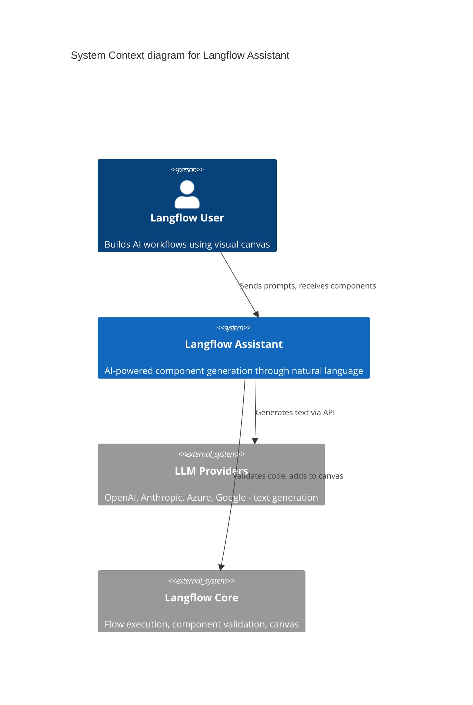
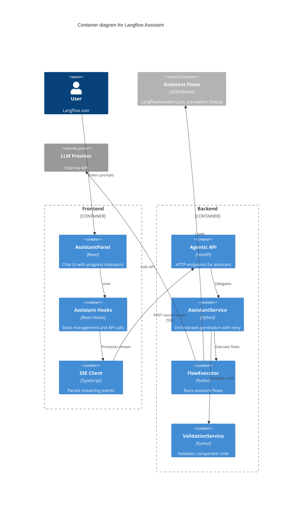
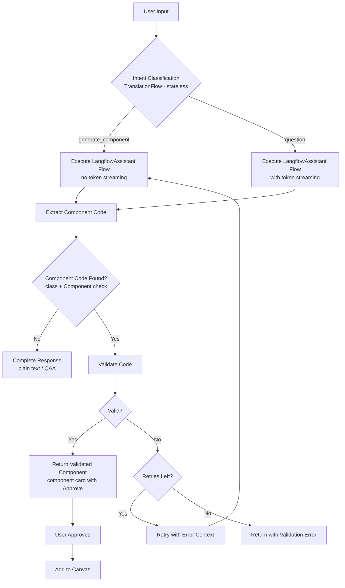

# Feature: Langflow Assistant

> Generated on: 2026-01-21
> Updated on: 2026-02-16
> Status: Draft
> Owner: Engineering Team

---

## Table of Contents
1. [Overview](#1-overview)
2. [Ubiquitous Language Glossary](#2-ubiquitous-language-glossary)
3. [Domain Model](#3-domain-model)
4. [Behavior Specifications](#4-behavior-specifications)
5. [Architecture Decision Records](#5-architecture-decision-records)
6. [Technical Specification](#6-technical-specification)
7. [Observability](#7-observability)
8. [Deployment & Rollback](#8-deployment--rollback)
9. [Architecture Diagrams](#9-architecture-diagrams)

---

## 1. Overview

### Summary

The Langflow Assistant is an AI-powered chat interface that helps users generate custom Langflow components through natural language prompts. It provides real-time streaming feedback during component generation, automatic code validation with retry logic, and seamless integration with the Langflow canvas.

### Business Context

Building custom components in Langflow requires knowledge of the component architecture, Python programming, and understanding of inputs/outputs. The Langflow Assistant removes this barrier by allowing users to describe what they want in natural language, and the AI generates validated, ready-to-use component code that can be added directly to their flow.

### Bounded Context

**Context**: `Agentic` - AI-assisted development capabilities within Langflow

This context owns:
- AI assistant interactions and chat management
- Component code generation and validation
- Streaming progress updates and token delivery
- Model provider integration and configuration

### Related Contexts

| Context | Relationship | Description |
|---------|--------------|-------------|
| `Flow` | Customer-Supplier | Assistant generates components that integrate with flows; Flow context supplies flow IDs and component APIs |
| `Model Providers` | Conformist | Assistant conforms to configured model providers (OpenAI, Anthropic, etc.) for LLM capabilities |
| `Variables` | Customer-Supplier | Variables context supplies API keys; Assistant uses them for model authentication |
| `Custom Components` | Customer-Supplier | Custom Components context supplies validation APIs; Assistant uses them to validate generated code |

---

## 2. Ubiquitous Language Glossary

| Term | Definition | Code Reference |
|------|------------|----------------|
| **Assistant** | AI-powered chat interface that generates Langflow components from natural language | `AssistantPanel`, `AssistantService` |
| **AssistantMessage** | A single message in the chat, either from user or assistant | `AssistantMessage` interface |
| **ComponentCode** | Python code that defines a Langflow component with inputs, outputs, and processing logic | `component_code` field, `extract_component_code()` |
| **IntentClassification** | LLM-based detection of whether user wants to generate a component or ask a question | `classify_intent()`, `IntentResult` |
| **ProgressStep** | A discrete stage in the component generation pipeline (generating, validating, etc.) | `StepType`, `AgenticStepType` |
| **SSE** | Server-Sent Events - Protocol for streaming real-time progress updates from server to client | `StreamingResponse`, `postAssistStream()` |
| **TokenEvent** | Real-time streaming of LLM output tokens for Q&A responses | `AgenticTokenEvent`, `format_token_event()` |
| **Validation** | Process of compiling and instantiating generated component code to verify correctness | `validate_component_code()`, `ValidationResult` |
| **ValidationRetry** | Automatic re-generation attempt when validation fails, including error context | `VALIDATION_RETRY_TEMPLATE`, `max_retries` |
| **ViewMode** | Display mode for the assistant panel: sidebar (docked left) or floating (centered modal) | `AssistantViewMode`, `useAssistantViewMode()` |
| **ModelProvider** | External LLM service (OpenAI, Anthropic, etc.) used for generation | `provider`, `PREFERRED_PROVIDERS` |
| **EnabledProvider** | A model provider that has been configured with valid API credentials | `get_enabled_providers_for_user()` |
| **FlowExecutor** | Service that runs Langflow flows programmatically for assistant operations | `FlowExecutor`, `execute_flow_file()` |
| **TranslationFlow** | Pre-built flow that translates user input and classifies intent | `TranslationFlow.json`, `TRANSLATION_FLOW` |
| **LangflowAssistantFlow** | Pre-built flow containing the main assistant prompt and component generation logic | `LangflowAssistant.json`, `LANGFLOW_ASSISTANT_FLOW` |
| **ReasoningUI** | Animated typing display showing "thinking" messages during component generation | `AssistantLoadingState` |
| **ApproveAction** | User action to add a validated component to the canvas | `handleApprove()`, `addComponent()` |

---

## 3. Domain Model

### 3.1 Aggregates

#### AssistantSession

The core aggregate managing a user's interaction session with the assistant.

- **Root Entity**: `AssistantSession` (implicit, managed via `session_id`)
- **Entities**:
  - `AssistantMessage` - Individual messages in the conversation
  - `AgenticProgressState` - Current step in generation pipeline
- **Value Objects**:
  - `AssistantModel` - Selected provider/model combination
  - `AgenticResult` - Final generation result with validation status
  - `ValidationResult` - Outcome of code validation
  - `IntentResult` - Translation and intent classification
- **Invariants**:
  - A session must have a valid `flow_id` to generate components
  - Only one message can be in `streaming` status at a time
  - `session_id` is generated once per session on the frontend and reused across all requests in the same session
  - A new `session_id` is only generated when the user explicitly clicks "New session"
  - `session_id` must be passed with every request to maintain conversation memory
  - The TranslationFlow must NOT share the assistant's `session_id` (it is stateless)

#### ComponentGeneration

Represents a single component generation attempt with validation.

- **Root Entity**: Generation attempt (tracked via `validation_attempts`)
- **Value Objects**:
  - `ComponentCode` - Extracted Python code
  - `ValidationResult` - Compilation and instantiation result
- **Invariants**:
  - Maximum retries cannot exceed configured `max_retries`
  - Component code must contain a class inheriting from `Component`
  - Component must define inputs or outputs to be valid

#### ModelProviderConfiguration

Configuration for available LLM providers.

- **Root Entity**: Provider configuration per user
- **Value Objects**:
  - `EnabledProvider` - Provider with valid API key
  - `ProviderModel` - Available model for a provider
- **Invariants**:
  - At least one provider must be enabled to use assistant
  - API key must be valid and non-empty for provider to be enabled
  - Provider preference order: OpenAI > Anthropic > others

#### Model Selection Behavior

The frontend implements automatic model selection to ensure a valid model is always sent to the backend:

- **Auto-selection**: When no model is explicitly selected, the first available model from enabled providers is automatically selected
- **Persistence**: Selected model is stored in localStorage (`assistant_model`)
- **Validation**: On load, persisted model is validated to ensure it has required fields (`provider`, `name`). Invalid entries are cleared
- **Invariant**: A request must never be sent without a valid model selection to prevent backend fallback to unexpected providers

### 3.2 Domain Events

| Event | Trigger | Payload | Consumers |
|-------|---------|---------|-----------|
| `ProgressUpdate` | Each pipeline stage transition | `{step, attempt, max_attempts, message?, error?}` | Frontend UI (SSE) |
| `TokenGenerated` | Each LLM output token (Q&A only) | `{chunk: string}` | Frontend UI (SSE) |
| `GenerationComplete` | Pipeline finished successfully | `{result, validated, class_name?, component_code?}` | Frontend UI (SSE) |
| `GenerationError` | Unrecoverable error occurred | `{message: string}` | Frontend UI (SSE) |
| `GenerationCancelled` | User cancelled or disconnected | `{message?: string}` | Frontend UI (SSE) |
| `ValidationSucceeded` | Code compiled and instantiated | `{class_name, code}` | Assistant Service |
| `ValidationFailed` | Code failed to compile/instantiate | `{error, code, class_name?}` | Assistant Service (triggers retry) |
| `ComponentApproved` | User clicked "Add to Canvas" | `{component_code, class_name}` | Canvas (adds node) |

---

## 4. Behavior Specifications

### Feature: Langflow Assistant

**As a** Langflow user
**I want** to generate custom components using natural language
**So that** I can build flows without writing Python code manually

### Background
- Given a user with an active Langflow session
- And at least one model provider is configured with a valid API key
- And the user has a flow open in the canvas

### Scenario: Generate a simple component successfully
- **Given** the assistant panel is open
- **When** I enter "Create a component that converts text to uppercase"
- **And** I click send
- **Then** I should see a "generating_component" progress indicator
- **And** I should see the reasoning UI with typing animation
- **And** I should see an "extracting_code" progress indicator
- **And** I should see a "validating" progress indicator
- **And** I should see a "validated" success indicator
- **And** I should see the generated component code
- **And** I should see an "Add to Canvas" button

### Scenario: Ask a question about Langflow
- **Given** the assistant panel is open
- **When** I enter "How do I connect two components?"
- **And** I click send
- **Then** I should see a "generating" progress indicator
- **And** I should see streaming text response
- **And** I should NOT see the validation indicators
- **And** I should NOT see an "Add to Canvas" button

### Scenario: Add generated component to canvas
- **Given** a validated component has been generated
- **When** I click the "Add to Canvas" button
- **Then** the component should be validated through the component API
- **And** the component should appear on the canvas at viewport center
- **And** I should see a success notification

### Scenario: Select a specific model for generation
- **Given** the assistant panel is open
- **And** I have multiple model providers configured
- **When** I click the model selector
- **And** I select "gpt-4o" from "openai"
- **And** I enter "Create a text splitter component"
- **And** I click send
- **Then** the generation should use the selected model
- **And** I should see the model name in the request

### Scenario: Auto-select first available model
- **Given** the assistant panel is open
- **And** I have not previously selected a model
- **And** I have at least one model provider configured
- **When** the model selector initializes
- **Then** the first available model should be automatically selected
- **And** the selected model should be persisted for future sessions

### Scenario: Maintain conversation memory across messages
- **Given** the assistant panel is open
- **And** I have previously generated a component
- **When** I ask a follow-up question like "can you use dataframe output instead?"
- **Then** the assistant should remember the previous component
- **And** it should generate a modified version of the component
- **And** I should see the same progress indicators as the initial generation
- **And** I should see the component card with "Approve" and "View Code" buttons

### Scenario: Follow-up modification classified as component generation
- **Given** I have generated a component in the current session
- **When** I send a modification request like "add error handling" or "use X instead"
- **Then** the intent should be classified as "generate_component" (not "question")
- **And** the progress card should appear immediately (no token streaming)
- **And** the validation pipeline should run as normal

### Scenario: New session resets conversation memory
- **Given** I have messages in the assistant chat
- **When** I click "+ New session" in the header (direct button next to the close button)
- **Then** all messages should be cleared
- **And** a new session ID should be generated
- **And** subsequent messages should not reference previous conversation

### Scenario: Preserve chat history across view mode changes
- **Given** I have messages in the assistant chat
- **And** the assistant is in sidebar mode
- **When** I switch to floating mode
- **Then** all my chat history should be preserved
- **And** the conversation should continue seamlessly

### Scenario: Multi-language support
- **Given** the assistant panel is open
- **When** I enter "Crie um componente que soma dois numeros" (Portuguese)
- **And** I click send
- **Then** the input should be translated to English internally
- **And** the intent should be classified as "generate_component"
- **And** I should receive a valid component that adds numbers

### Scenario: Automatic retry on validation failure
- **Given** the assistant panel is open
- **And** max_retries is set to 3
- **When** I submit a request that generates invalid code
- **Then** I should see a "validation_failed" indicator with the error
- **And** I should see a "retrying" indicator
- **And** the system should automatically re-generate with error context
- **And** I should see "Attempt 2 of 3" in the UI

### Scenario: Max retries exhausted
- **Given** the assistant panel is open
- **And** max_retries is set to 2
- **When** the generated code fails validation 3 times
- **Then** I should see the final "validation_failed" status
- **And** I should see the validation error message
- **And** I should see the invalid component code (for debugging)
- **And** I should NOT see an "Add to Canvas" button

### Scenario: No model provider configured
- **Given** no model providers are configured
- **When** I open the assistant panel
- **Then** I should see the "No Models Configured" empty state
- **And** the input field should be disabled
- **And** I should see a link to Settings > Model Providers

### Scenario: API key expired or invalid
- **Given** the configured API key is invalid
- **When** I submit a generation request
- **Then** I should see an error message about the API key
- **And** the error should mention configuring in Settings

### Scenario: User cancels generation
- **Given** a component generation is in progress
- **When** I click the stop button
- **Then** the generation should be cancelled
- **And** I should see a "cancelled" status on the message
- **And** the progress indicators should disappear
- **And** I should be able to send a new message

### Scenario: Open assistant with keyboard shortcut
- **Given** I am on the flow page with focus on the canvas (not in a text input)
- **When** I press the **A** key
- **Then** the assistant panel should open
- **And** the text input should be auto-focused so I can start typing immediately
- **And** pressing **A** again (when not focused on the input) should close it

### Scenario: Close assistant with Escape
- **Given** the assistant panel is open
- **When** I press **Escape**
- **Then** the assistant panel should close
- **And** this should work whether focus is on the canvas or inside the assistant's text input

### Scenario: Input placeholder during generation
- **Given** a component generation or Q&A response is in progress
- **Then** the input placeholder should show "Working on it..." instead of the random suggestion text
- **And** once generation completes, the placeholder should return to normal

### Scenario: Streaming content hides raw code for misclassified intent
- **Given** a follow-up request was misclassified as "question" instead of "generate_component"
- **And** the LLM response streams component code (tokens visible as raw markdown)
- **When** the streaming content matches a Python class extending Component
- **Then** the raw code should be hidden and replaced with the progress card (ReasoningUI)
- **And** the user should never see raw component code streaming in the chat

### Scenario: Clear conversation history
- **Given** I have multiple messages in the chat
- **When** I click the clear history / new session button
- **Then** all messages should be removed
- **And** a new `session_id` should be generated
- **And** the empty state should appear (sidebar mode)
- **And** any in-progress generation should be cancelled

### Scenario: Use sidebar view mode
- **Given** the assistant panel is in floating mode
- **When** I click the view mode toggle
- **Then** the panel should dock to the left side
- **And** the panel should span the full height
- **And** my preference should be persisted

---

## 5. Architecture Decision Records

### ADR-001: Server-Sent Events (SSE) for Streaming

**Status**: Accepted

#### Context
The assistant needs to provide real-time feedback during component generation, which can take 10-60 seconds. Users need to see progress updates and token streaming to understand the system is working.

#### Decision
Use Server-Sent Events (SSE) for streaming progress updates and tokens from backend to frontend, instead of WebSockets or polling.

#### Consequences

**Benefits:**
- Simpler implementation than WebSockets (unidirectional)
- Native browser support via `fetch` with `ReadableStream`
- Automatic reconnection handling
- Works well with HTTP/2

**Trade-offs:**
- Unidirectional only (client cannot send during stream)
- Limited to text-based data (JSON encoded)
- Some proxy/firewall issues possible

**Impact on Product:**
- Users see real-time progress during generation
- Reduced perceived latency
- Better user experience during long operations

---

### ADR-002: Intent Classification via LLM

**Status**: Accepted

#### Context
The assistant needs to distinguish between component generation requests and general questions. Additionally, users may write prompts in any language.

#### Decision
Use a dedicated LLM-based TranslationFlow to classify intent and translate input to English before processing.

#### Consequences

**Benefits:**
- Accurate intent detection via LLM reasoning
- Multi-language support without explicit language detection
- Consistent English input for component generation flow

**Trade-offs:**
- Additional LLM call adds latency (~1-2 seconds)
- Additional cost per request
- Fallback needed if classification fails

**Impact on Product:**
- Users can write in any language
- Better routing between Q&A and component generation
- Slightly increased response time

---

### ADR-003: Automatic Validation with Retry

**Status**: Accepted

#### Context
LLMs sometimes generate code with syntax errors or missing imports. Manual retry is frustrating for users.

#### Decision
Automatically validate generated code by instantiating the component class. On failure, retry with error context included in the prompt.

#### Consequences

**Benefits:**
- Higher success rate for component generation
- Self-healing through error context
- Better user experience (no manual retry needed)

**Trade-offs:**
- Multiple LLM calls on failure (up to 4x cost)
- Longer total time when retries needed
- Some errors may not be fixable by retry

**Impact on Product:**
- Users get working components more often
- Reduced frustration from validation failures
- Transparent retry process via progress UI

---

### ADR-004: Floating and Sidebar View Modes

**Status**: Accepted

#### Context
Different users have different workflows. Some prefer a focused chat experience, others want the assistant always visible while working on the canvas.

#### Decision
Support two view modes: floating (centered modal) and sidebar (docked left). Persist user preference in local storage.

#### Implementation Note
The `AssistantPanel` component uses a **single-instance pattern** where the same component handles both view modes internally. This ensures chat history and state are preserved when users switch between floating and sidebar modes. The view mode is stored in a shared Zustand store (`useAssistantViewMode`) rather than conditionally rendering separate components.

#### Consequences

**Benefits:**
- Flexible UI adapts to user preference
- Sidebar mode enables continuous assistance while building
- Floating mode provides focused interaction
- Chat history preserved across view mode changes

**Trade-offs:**
- Additional UI complexity
- Two layouts to maintain
- Responsive design challenges

**Impact on Product:**
- Improved user satisfaction through customization
- Better workflow integration

---

### ADR-005: Frontend-Owned Session Persistence

**Status**: Accepted

#### Context
The assistant had no conversation memory — every message was treated as a new session because the frontend never sent a `session_id`. The backend generated a new UUID per request (`request.session_id or str(uuid.uuid4())`), so the Agent's memory component never found previous messages.

#### Decision
The frontend generates a `session_id` once (via `useRef`) when the `useAssistantChat` hook initializes, and includes it in every `postAssistStream` request. A new `session_id` is only generated when the user clicks "New session" (`handleClearHistory`).

#### Consequences

**Benefits:**
- Conversation memory works across follow-up messages
- Users can iterate on component designs within a session
- "New session" provides a clean slate when needed

**Trade-offs:**
- Session memory is only frontend-scoped (lost on page refresh)
- Long sessions accumulate message history that may affect LLM context

**Key Files:**
- `src/frontend/.../hooks/use-assistant-chat.ts` — `sessionIdRef` stores the ID, passed in every request
- `src/backend/.../agentic/api/router.py` — falls back to `uuid.uuid4()` only if no `session_id` is sent

---

### ADR-006: TranslationFlow Session Isolation

**Status**: Accepted

#### Context
The TranslationFlow (intent classification) and LangflowAssistant flow shared the same `session_id`. This caused cross-flow contamination: the TranslationFlow's JSON intent responses were stored alongside the assistant's messages. On subsequent requests, the TranslationFlow's LLM saw messages from both flows in its history, causing intent classification to fail and default to `"question"`.

#### Decision
1. Pass `session_id=None` when calling `classify_intent` — the TranslationFlow is stateless and does not need conversation memory.
2. Set `should_store_message=False` on both ChatInput and ChatOutput in the TranslationFlow — it should never persist messages.

#### Consequences

**Benefits:**
- Intent classification is stateless and deterministic per message
- No cross-flow contamination in the assistant's message history
- TranslationFlow works identically on 1st and Nth request

**Trade-offs:**
- TranslationFlow has no context about previous turns (addressed by improved prompt, see ADR-007)

**Key Files:**
- `src/backend/.../agentic/services/assistant_service.py` — `session_id=None` in `classify_intent` call
- `src/backend/.../agentic/flows/translation_flow.py` — `should_store_message=False`

---

### ADR-007: Intent-Independent Code Extraction with Improved Classification

**Status**: Accepted

#### Context
Follow-up modification requests like "can you use dataframe output instead?" were classified as `"question"` because the TranslationFlow prompt only recognized explicit creation verbs (create/build/generate). This caused the Q&A path to be taken — tokens were streamed and no code extraction/validation occurred, so the component card never appeared.

#### Decision
Two-layer fix:

1. **Primary: Improved intent classification** — Updated the TranslationFlow prompt to recognize modification and follow-up patterns (e.g., "use X instead", "add Y", "change Z") as `"generate_component"`. This ensures the correct UX path (progress card, no token streaming) for modifications.

2. **Fallback: Intent-independent code extraction** — The streaming assistant service now always attempts code extraction from the response, regardless of intent classification. If a response classified as `"question"` happens to contain valid Langflow component code (`"class " in code and "Component" in code`), it is extracted, validated, and returned with the component card. This is a safety net for edge cases the prompt doesn't catch.

#### Consequences

**Benefits:**
- Follow-up modifications show the same clean UX as initial generation
- No risk of showing raw code to the user for any response that contains a component
- Graceful degradation: if intent classification misses a case, the fallback catches it

**Trade-offs:**
- Fallback path still briefly streams tokens before showing the card (slightly jarring UX)
- Code extraction runs on all responses (negligible performance cost — regex on a string)

**Key Files:**
- `src/backend/.../agentic/flows/translation_flow.py` — expanded `TRANSLATION_PROMPT` with modification examples
- `src/backend/.../agentic/services/assistant_service.py` — removed `if not is_component_request: return` early exit

---

### ADR-008: Fixed-Width Zoom Percentage Display

**Status**: Accepted

#### Context
The zoom percentage in the canvas controls bar (e.g., "65%", "150%", "200%") caused the entire controls bar to shift width when the zoom changed between values with different character counts. This created a visually distracting layout jump.

#### Decision
Apply a fixed width (`w-11`, 44px) with `text-center` to the zoom percentage display. Reduce the button's outer padding (`px-0.5`) to remove dead space between the redo icon and the percentage, and add `gap-0.5` between the percentage text and the chevron icon.

#### Key Files:
- `src/frontend/.../canvasControlsComponent/CanvasControlsDropdown.tsx` — fixed-width zoom display

---

### ADR-009: GPU-Accelerated Panel Open Transition

**Status**: Accepted

#### Context
Opening the assistant panel felt sluggish when there were previous chat messages. The root cause was `transition-all duration-300` on the panel container, which forced the browser to transition every CSS property (including height, width, border, shadow) across the entire message DOM on every open/close.

#### Decision
1. Replace `transition-all` with `transition-[opacity,transform]` — only animate the two properties needed for the fade+slide effect.
2. Reduce `duration-300` to `duration-200` for a snappier feel.
3. Add `will-change-[opacity,transform]` to hint the browser to GPU-accelerate these properties, avoiding expensive repaints on the message list.

#### Consequences

**Benefits:**
- Panel opens instantly regardless of message count
- No layout thrashing from transitioning height/width/shadow/border
- GPU-composited animation avoids main-thread repaints

**Trade-offs:**
- Size changes (compact → expanded) are no longer animated (they snap instantly, which is actually preferable)

**Key Files:**
- `src/frontend/.../assistantPanel/assistant-panel.tsx` — `containerClasses` transition properties

---

## 6. Technical Specification

### 6.1 Dependencies

| Type | Name | Purpose |
|------|------|---------|
| Service | `FlowExecutor` | Executes pre-built assistant flows (.py or .json, with .py taking priority) |
| Service | `ProviderService` | Detects configured model providers and retrieves API keys |
| Service | `VariableService` | Retrieves user's stored API keys from encrypted storage |
| Service | `ValidationService` | Compiles and instantiates component code for validation |
| External API | LLM Provider APIs | OpenAI, Anthropic, Azure, Google - for text generation |
| Library | `lfx.run` | Flow execution engine |
| Library | `lfx.custom.validate` | Component class creation and validation |
| Frontend | `use-stick-to-bottom` | Auto-scroll behavior in chat |
| Frontend | `@xyflow/react` | Canvas integration for component placement |

### 6.2 API Contracts

#### POST /api/v1/agentic/assist/stream

**Purpose**: Generate component or answer question with streaming progress updates

**Request**:
```json
{
  "flow_id": "string - Required. UUID of the current flow",
  "input_value": "string - The user's message/prompt",
  "provider": "string - Optional. Model provider (openai, anthropic, etc.)",
  "model_name": "string - Optional. Specific model name (gpt-4o, claude-3-opus, etc.)",
  "max_retries": "integer - Optional. Max validation retries (default: 3)",
  "session_id": "string - Required for conversation memory. Generated once per session by the frontend, reused across all requests. New ID on 'New session' only. Backend falls back to uuid4() if omitted."
}
```

**Response (SSE Stream)**:

Event: `progress`
```json
{
  "event": "progress",
  "step": "generating_component | generating | extracting_code | validating | validated | validation_failed | retrying",
  "attempt": 0,
  "max_attempts": 3,
  "message": "string - Human-readable status message",
  "error": "string - Optional. Error message for validation_failed",
  "class_name": "string - Optional. Component class name",
  "component_code": "string - Optional. Generated code for validation_failed"
}
```

Event: `token` (Q&A only)
```json
{
  "event": "token",
  "chunk": "string - Token text"
}
```

Event: `complete`
```json
{
  "event": "complete",
  "data": {
    "result": "string - Full response text",
    "validated": true,
    "class_name": "UppercaseComponent",
    "component_code": "class UppercaseComponent(Component):...",
    "validation_attempts": 1
  }
}
```

Event: `error`
```json
{
  "event": "error",
  "message": "string - Friendly error message"
}
```

Event: `cancelled`
```json
{
  "event": "cancelled",
  "message": "string - Optional cancellation reason"
}
```

---

#### GET /api/v1/agentic/check-config

**Purpose**: Check if assistant is properly configured and return available providers

**Request**: None (uses authenticated user context)

**Response (Success)**:
```json
{
  "configured": true,
  "configured_providers": ["openai", "anthropic"],
  "providers": [
    {
      "name": "openai",
      "configured": true,
      "default_model": "gpt-4o",
      "models": [
        {"name": "gpt-4o", "display_name": "GPT-4o"},
        {"name": "gpt-4-turbo", "display_name": "GPT-4 Turbo"}
      ]
    }
  ],
  "default_provider": "openai",
  "default_model": "gpt-4o"
}
```

---

#### POST /api/v1/agentic/assist

**Purpose**: Non-streaming version of assist (deprecated, prefer streaming)

**Request**: Same as `/assist/stream`

**Response (Success)**:
```json
{
  "result": "string - Full response",
  "validated": true,
  "class_name": "MyComponent",
  "component_code": "string - Python code",
  "validation_attempts": 1
}
```

### 6.3 Error Handling

| Error Code | Condition | User Message | Recovery Action |
|------------|-----------|--------------|-----------------|
| `400` | No provider configured | "No model provider is configured. Please configure at least one model provider in Settings." | Navigate to Settings > Model Providers |
| `400` | Provider not available | "Provider 'X' is not configured. Available providers: [list]" | Select a different provider or configure the requested one |
| `400` | Missing API key | "OPENAI_API_KEY is required for the Langflow Assistant with openai. Please configure it in Settings > Model Providers." | Add API key in Settings |
| `400` | Unknown provider | "Unknown provider: X" | Use a supported provider |
| `404` | Flow file not found | "Flow file 'X.json' not found" | Ensure agentic flows are deployed |
| `500` | Flow execution error | "An error occurred while executing the flow." | Retry request; check server logs |
| `ValidationError` | Code syntax error | Includes `SyntaxError: ...` | System auto-retries with error context |
| `ValidationError` | Import error | Includes `ModuleNotFoundError: ...` | System auto-retries with error context |
| `ValidationError` | Missing Component base | "Could not extract class name from code" | System auto-retries with hint |
| `NetworkError` | Client disconnected | "Request cancelled" | User can retry |

---

## 7. Observability

### 7.1 Key Metrics

| Metric | Type | Description | Alert Threshold |
|--------|------|-------------|-----------------|
| `assistant_requests_total` | Counter | Total number of assistant requests | N/A (baseline) |
| `assistant_requests_by_intent` | Counter | Requests segmented by intent (generate_component, question) | N/A |
| `assistant_generation_duration_seconds` | Histogram | Time from request to completion | P95 > 60s |
| `assistant_validation_attempts` | Histogram | Number of validation attempts per request | P95 > 2 |
| `assistant_validation_success_rate` | Gauge | Percentage of validations succeeding on first attempt | < 70% |
| `assistant_provider_usage` | Counter | Requests by provider (openai, anthropic, etc.) | N/A |
| `assistant_errors_total` | Counter | Total errors by type | > 10/min |
| `assistant_cancellations_total` | Counter | User-initiated cancellations | > 20% of requests |

### 7.2 Important Logs

| Log Level | Event | Fields | When |
|-----------|-------|--------|------|
| `INFO` | `assistant.request.started` | `user_id`, `flow_id`, `provider`, `model_name`, `intent` | Request received |
| `INFO` | `assistant.generation.attempt` | `attempt`, `max_retries` | Each generation attempt |
| `INFO` | `assistant.validation.success` | `class_name`, `attempts` | Component validated successfully |
| `WARNING` | `assistant.validation.failed` | `error`, `attempt`, `class_name` | Validation failed, will retry |
| `ERROR` | `assistant.validation.exhausted` | `error`, `attempts`, `code_snippet` | Max retries reached |
| `INFO` | `assistant.request.completed` | `duration_ms`, `validated`, `attempts` | Request finished |
| `INFO` | `assistant.request.cancelled` | `reason`, `duration_ms` | User cancelled |
| `ERROR` | `assistant.flow.error` | `error_type`, `error_message`, `flow_name` | Flow execution failed |

### 7.3 Dashboards

**Assistant Usage Dashboard:**
- Request Rate - Requests per minute over time
- Intent Distribution - Pie chart of generate_component vs question
- Provider Usage - Bar chart of requests by provider
- Validation Success Rate - Time series of first-attempt success rate
- Response Time P50/P95/P99 - Latency distribution

**Assistant Health Dashboard:**
- Error Rate by Type - Stacked area chart
- Provider Availability - Status indicators per provider
- Validation Failure Reasons - Top error messages
- Stream Disconnect Rate - Client disconnects over time

---

## 8. Deployment & Rollback

### 8.1 Feature Flags

| Flag | Purpose | Default | Rollout Strategy |
|------|---------|---------|------------------|
| `assistant_enabled` | Enable/disable the assistant feature globally | on | 100% (GA) |
| `assistant_retry_enabled` | Enable automatic validation retries | on | 100% |
| `assistant_translation_flow` | Enable multi-language support via TranslationFlow | on | 100% |

### 8.2 Database Migrations

- No database migrations required
- Configuration stored in existing `variables` table (API keys)
- Session messages are persisted in the message store (keyed by `session_id`), enabling conversation memory within a session
- Session ID is frontend-scoped (generated per hook instance, reset on "New session")

### 8.3 Rollback Plan

1. **Immediate**: Set `assistant_enabled` feature flag to `off`
2. **If backend issues**: Revert backend deployment to previous version
3. **If frontend issues**: Revert frontend deployment to previous version
4. **Data considerations**: No persistent data to rollback
5. **Dependencies**: No downstream dependencies affected

### 8.4 Smoke Tests

- [ ] Open assistant panel from canvas controls
- [ ] Verify model providers are detected (if configured)
- [ ] Submit a simple component generation request
- [ ] Verify progress indicators appear during generation
- [ ] Verify component code is displayed on completion
- [ ] Click "Add to Canvas" and verify component appears
- [ ] Submit a Q&A question and verify streaming response
- [ ] Submit a follow-up modification (e.g., "use dataframe output instead") and verify the progress card appears (not raw code)
- [ ] Verify conversation memory: ask a follow-up that references the previous component
- [ ] Click "New session" and verify the assistant does not remember the previous conversation
- [ ] Cancel a generation in progress
- [ ] Clear conversation history
- [ ] Press **A** on the canvas to open the assistant and verify the input is auto-focused
- [ ] Press **Escape** to close the assistant (from both canvas and input focus)
- [ ] Verify the input placeholder shows "Working on it..." during generation (not a random suggestion)
- [ ] Toggle between sidebar and floating view modes
- [ ] Verify zoom percentage display doesn't shift the controls bar when zooming between 60% and 200%
- [ ] Open the assistant panel with previous messages and verify it opens instantly (no lag)

---

## 9. Architecture Diagrams

### 9.1 Context Diagram (Level 1)



### 9.2 Container Diagram (Level 2)



### 9.3 Component Flow Diagram



### 9.4 State Machine: Generation Pipeline

```
┌──────────┐    ┌────────────────────────┐    ┌─────────────────────┐
│  Start   │───▶│  generating_component  │───▶│  generation_complete │
└──────────┘    │    (or "generating")   │    └──────────┬──────────┘
                └────────────────────────┘               │
                                                         │
                                                ┌────────▼────────┐
                                                │  Extract Code   │ ← runs for ALL responses
                                                └────────┬────────┘
                                                         │
                         ┌───────────────────────────────┼───────────────────┐
                         │ No Component Code             │ Component Code    │
                         ▼                               ▼                   │
                ┌────────────────┐             ┌─────────────────┐           │
                │    complete    │             │ extracting_code │           │
                │  (plain text)  │             └────────┬────────┘           │
                └────────────────┘                      │                    │
                                                        ▼                    │
                                               ┌─────────────────┐           │
                                               │   validating    │           │
                                               └────────┬────────┘           │
                                                        │                    │
                                    ┌───────────────────┼────────────────┐   │
                                    │ Valid             │ Invalid        │   │
                                    ▼                   ▼                │   │
                           ┌─────────────────┐ ┌──────────────────────┐  │   │
                           │    validated    │ │  validation_failed   │  │   │
                           └────────┬────────┘ └──────────┬───────────┘  │   │
                                    │                     │              │   │
                                    ▼                     ▼              │   │
                           ┌─────────────────┐   ┌─────────────────┐    │   │
                           │    complete     │   │    retrying     │────┘   │
                           │   (validated)   │   └─────────────────┘        │
                           └─────────────────┘          │                   │
                                                        │ max retries       │
                                                        ▼                   │
                                               ┌─────────────────┐          │
                                               │    complete     │◀─────────┘
                                               │ (not validated) │
                                               └─────────────────┘
```
