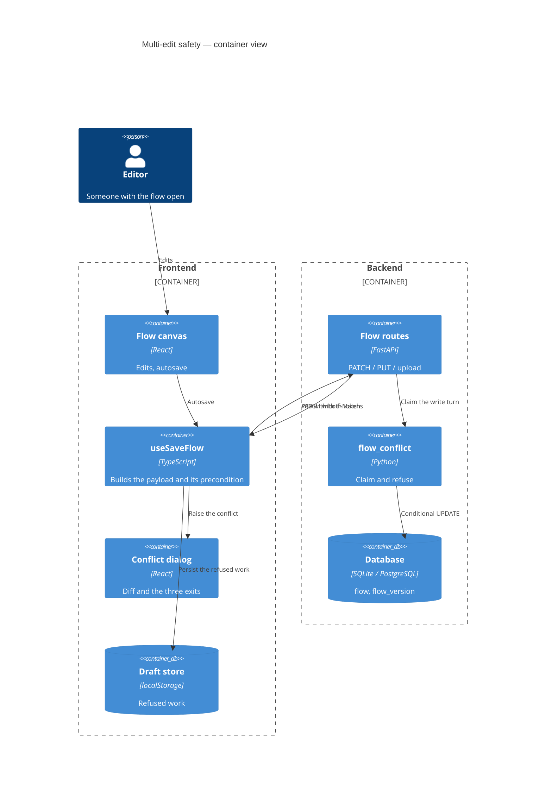
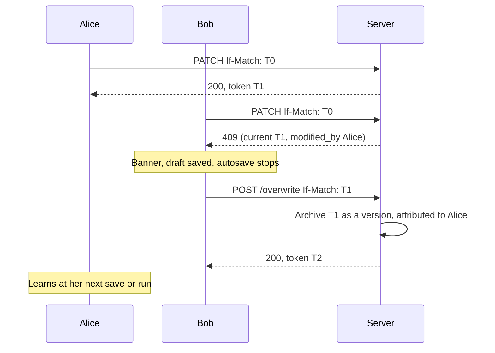

# Feature: Multi-Edit Safety for Flows

> Generated on: 2026-09-08
> Status: Implemented, pending merge
> Owner: Cristhian Zanforlin
> Related: Epic [LE-2379](https://datastax.jira.com/browse/LE-2379) · Tasks LE-2399, LE-2400, LE-2401, LE-2402

---

## Table of Contents
1. [Overview](#1-overview)
2. [Ubiquitous Language Glossary](#2-ubiquitous-language-glossary)
3. [Domain Model](#3-domain-model)
4. [Behavior Specifications](#4-behavior-specifications)
5. [Architecture Decision Records](#5-architecture-decision-records)
6. [Technical Specification](#6-technical-specification)
7. [Observability](#7-observability)
8. [Deployment & Rollback](#8-deployment--rollback)
9. [Architecture Diagrams](#9-architecture-diagrams)
10. [Platform Compatibility](#10-platform-compatibility)

---

## 1. Overview

### Summary
A save that would overwrite somebody else's work is **refused** instead of silently landing. The person is told the version they are editing is out of date, shown what each side changed, and given three exits — update the flow with a merge they choose, duplicate into a flow of their own, or drop their changes and take the latest. Nobody loses work without deciding to.

### Business Context
A flow is a shared artefact, and the editor autosaves the whole graph every few seconds. Before this, the last writer won and the loser's work vanished with no message. With an authorization plugin registered, several people already share one flow, so the exposure is not theoretical.

### Bounded Context
Flow Persistence — optimistic concurrency on the flow graph.

### Related Contexts
- **Flow Version History** (Partnership): stores the version an update replaces, so it stays recoverable.
- **Authorization** (Conformist): decides who may open a flow at all; in OSS the pass-through keeps flows owner-scoped.
- **Flow Edit Audit Trail** (Customer-Supplier): consumes the same version stamp to describe accepted writes.

### Explicitly not in this release
Presence. Nobody is warned *before* a conflict happens — two people can work unaware of each other until one of them saves. The heartbeat/lock half of the epic was **dropped**, not deferred.

---

## 2. Ubiquitous Language Glossary

| Term | Definition | Code Reference |
|---|---|---|
| **Version token** | UUID identifying the flow's current graph. Rotated on every write that changes `data`, never accumulated. | `Flow.version_token` |
| **Precondition** | The token a client sends to say "write only if the flow is still where I left it". | `parse_if_match`, `If-Match` header |
| **Claim** | Taking the right to write, as one indivisible conditional UPDATE. | `claim_version_token` |
| **Conflict** | The state a flow enters for one client when its save was refused. | `useFlowConflictStore`, `FlowConflict` |
| **Change** | One recognisable difference between two graphs, at component level. | `FlowChange`, `diffGraphs` |
| **Change group** | Every change to one component, offered as a single choice. | `ChangeGroup`, `groupChangesByTarget` |
| **Contested component** | A component both people changed; the copy can carry one version or the other, never a blend. | `contestedTargetKeys` |
| **Update flow** | Exit that writes the merge to the original and archives the replaced version. | `POST /flows/{id}/overwrite` |
| **Duplicate** | Exit that writes the merge to a new, inert flow. | `POST /flows/{id}/fork`, `build_fork_payload` |
| **Take latest** | Exit that drops the person's own changes and reloads the server's version. | `onDiscard`, `fetchAndAdoptServerVersion` |
| **Draft** | The refused work, kept in browser storage so a reload cannot lose it. | `saveConflictDraft`, `lf_draft_{userId}_{flowId}` |
| **Abandoned flow** | A flow duplicated out of; further writes to it are refused locally. | `abandonedFlowIds` |

---

## 3. Domain Model

### Aggregate: Flow (root)
- **Root entity:** `Flow`
- **Concurrency state:** `version_token`, `last_modified_by`
- **Child entities:** `FlowVersion` (snapshots)

**Invariants**

| Invariant | Guard |
|---|---|
| Only a write that changes `data` rotates the token. | `graph_changed` in `_patch_flow` / `_update_existing_flow` |
| At most one of N racing writers with the same precondition may win. | `claim_version_token` — conditional UPDATE, not read-compare |
| A NULL token is never a precondition failure. | `ensure_version_precondition` — legacy rows stay writable |
| A client cannot choose its own token. | `version_token` absent from `_UPDATABLE_FLOW_FIELDS` |
| An overwrite requires the token it reviewed. | `overwrite_flow` returns 428 without `If-Match` |
| The version an update replaces is recoverable. | `create_flow_version_entry` before the write |
| A duplicate is inert. | `build_fork_payload` clears endpoint, MCP, webhook, lock; access PRIVATE |

### Domain events

| Event | Trigger | Payload | Consumers |
|---|---|---|---|
| Token rotated | Any accepted graph write | new `version_token`, `last_modified_by` | open editors (on their next save or run) |
| Save refused | Precondition mismatch | `flow_version_conflict` + both tokens + author | conflict banner, dialog, draft store |

---

## 4. Behavior Specifications

```gherkin
Feature: A save never silently overwrites somebody else
  As a person editing a flow others can edit
  I want a save built on a replaced version to be refused
  So that nobody's work disappears without a decision

  Background:
    Given a flow that two people have open

  Scenario: The second writer is refused, not overwritten
    Given the first person has saved a change
    When the second person's autosave is sent with the version they loaded
    Then the write is refused with 409 and the code "flow_version_conflict"
    And the refusal names who wrote last

  Scenario: A refused flow stops writing
    Given a person whose save was refused
    When they keep editing for another ten seconds
    Then no further save is attempted

  Scenario: Renaming does not take the writer's turn
    Given somebody else changed the graph after I opened the flow
    When I rename the flow without touching the canvas
    Then the rename is saved and the version token does not change

  Scenario: A save that writes nothing never reports success
    Given a flow in conflict
    When I press Ctrl+S
    Then no success message appears and the conflict dialog opens

  Scenario Outline: Every exit resolves the conflict
    Given a conflict with changes on both sides
    When I choose "<exit>"
    Then the banner clears and <outcome>

    Examples:
      | exit        | outcome                                                        |
      | Update flow | the merge is written and the replaced version is in history    |
      | Duplicate   | the merge lands in a new flow and the original is untouched    |
      | Take latest | my changes are dropped and nothing is written to the flow      |

  Scenario: Taking a component takes it whole
    Given both of us changed the same component
    When I select their version of it
    Then my change to that component is shown as replaced, not silently dropped

  Scenario: Work survives a reload while the conflict is open
    Given a conflict with unsaved work
    When I reload the page
    Then I am offered the work back, and restoring it raises the conflict again

  Scenario: Running a stale flow is refused
    Given a conflict on the flow
    When I run it
    Then the dialog opens instead of a build starting

  Scenario: Running without editing is not a conflict
    Given somebody else changed the flow and I changed nothing
    When I run it
    Then the canvas adopts their version with a notice and no dialog
```

Each scenario maps to a spec in `src/frontend/tests/core/regression/` (`multi-edit-conflict`, `multi-edit-stress`, `multi-edit-stress2`, `multi-edit-three-exits`, `multi-edit-two-people-exits`, `multi-edit-crowd`) or to `src/backend/tests/unit/api/v1/test_flow_conflict.py`.

---

## 5. Architecture Decision Records

### ADR-001 — A conditional UPDATE, not a read-then-compare
**Status:** Accepted
**Context:** Comparing the token in Python after `SELECT ... FOR UPDATE` looked sufficient. SQLite ignores `FOR UPDATE` entirely, so concurrent writers all read the same token, all passed the comparison, and all wrote — six simultaneous saves were accepted where one should have been.
**Decision:** Claim the write turn with a single `UPDATE ... WHERE version_token = expected`. Only the writer that moves the row off `expected` proceeds.
**Consequences:** Correct on every backend without backend-specific code. Costs one extra statement per graph write. Verified at 200 concurrent writers: exactly one 200, 199 refusals, no 5xx.

### ADR-002 — The precondition is optional
**Status:** Accepted
**Context:** Requiring `If-Match` would break every existing API client and every pre-upgrade row on the day of the upgrade.
**Decision:** A request without the header behaves exactly as before. A malformed header is rejected with 400 rather than ignored — treating it as absent would silently downgrade the write to unconditional.
**Consequences:** Backward compatible. The guarantee holds only for clients that send the header; the editor always does.

### ADR-003 — The graph travels only when the person edited it
**Status:** Accepted
**Context:** Opening a flow rewrites nodes (component refreshes, model inputs), and clicking a node writes `selected` into the graph. Comparing the payload against the baseline therefore called a plain rename a competing graph write — the rename was refused and silently discarded.
**Decision:** A save carries `data` only when the person edited the canvas, or when a caller supplies a graph the canvas does not hold (applying a template). Canvas state that belongs to the viewer — viewport, `selected`, `dragging`, `resizing` — is excluded from the comparison.
**Consequences:** Renames, project moves and lock toggles never conflict. Automatic hydration changes are persisted by the next real edit rather than on their own.

### ADR-004 — A blocked save fails loudly
**Status:** Accepted
**Context:** `saveFlow` returned quietly for a flow in conflict, so every caller's success path ran. Ctrl+S and the settings dialog both announced "saved" over a write that never happened.
**Decision:** Raise `FlowSaveBlockedError`; every caller that announces success calls `handleBlockedSave` first.
**Consequences:** No false reassurance. Every direct caller of `saveFlow` had to be reviewed.

### ADR-005 — Component-level merge, one row per component
**Status:** Accepted
**Context:** Interleaving two people's edits inside one component can produce a configuration neither wrote. An early UI listed each change separately, which gave one component several checkboxes that always moved together.
**Decision:** The unit of choice is the component. One row per component, listing everything that changed inside it. Adopting a component's edge brings the endpoints it needs.
**Consequences:** No blended component. A row is honest about what ticking it does.

### ADR-006 — Autosave at 5s with a 15s ceiling
**Status:** Accepted
**Context:** At 300 ms, opening a flow could take the writer's turn from somebody actively editing. A plain trailing debounce has no ceiling: measured against a real server, a long interval held 23 seconds of continuous editing in memory and surfaced the conflict only once the person stopped.
**Decision:** `AUTOSAVE_DEBOUNCE_TIME = 5000` with `maxWait = 3 × interval`.
**Consequences:** Fewer false conflicts and fewer writes; up to 15 seconds of work at risk in a crash, which the draft store covers.

---

## 6. Technical Specification

### Dependencies

| Component | Role |
|---|---|
| `Flow.version_token`, `Flow.last_modified_by` | Concurrency state, migration `439697865628` |
| `flow_version` | Stores the version an update replaces |
| `localStorage` | Holds the refused draft, keyed `lf_draft_{userId}_{flowId}` |

### API contracts

**`PATCH /api/v1/flows/{flow_id}`** — optional `If-Match: <version_token>`

| Response | Condition |
|---|---|
| `200` + `version_token` | Accepted; the token is new when `data` changed |
| `409` | Precondition failed — body below |
| `400` | `If-Match` is not a UUID |

```json
{
  "detail": {
    "code": "flow_version_conflict",
    "expected_version_token": "…", "current_version_token": "…",
    "modified_by": { "id": "…", "username": "…" }, "modified_at": "…"
  }
}
```

**`GET /api/v1/flows/{flow_id}/version-state`** — current token, last author (resolved to a name), `updated_at`.

**`POST /api/v1/flows/{flow_id}/overwrite`** — requires `If-Match` (the reviewed token). `428` without it, `409` if the flow moved again, `200` with the updated flow.

**`POST /api/v1/flows/{flow_id}/fork`** — read access is enough; returns `201` with an inert copy. `409` when a concurrent fork took the copy's name.

### Error handling

| Code | Condition | User message | Recovery |
|---|---|---|---|
| `flow_version_conflict` | Precondition mismatch | "The version you're editing is out of date" | Update flow / Duplicate / Take latest |
| `428` | Overwrite without `If-Match` | — (client always sends it) | Reopen the dialog |
| `400` | Malformed `If-Match` | Generic save error | Fix the client |
| `409` (fork) | Copy name taken concurrently | "Could not duplicate the flow" | Retry |
| `503` | Database busy on version restore | "The database is busy" | The client retries once |

---

## 7. Observability

| Signal | Where | Notes |
|---|---|---|
| `op=update_flow flow_id=… exhausted lock retries` | `logger.awarning` | Existing lock-retry warning on the save path |
| 409 rate on `PATCH /flows/{id}` | HTTP metrics | The conflict rate; a spike means people are colliding |
| 428 on `/overwrite` | HTTP metrics | Should be zero — the client always sends the precondition |

No metric was added for this feature. `TBD`: whether the conflict rate deserves a counter of its own — worth deciding once the trail is enabled somewhere and there is real data.

---

## 8. Deployment & Rollback

### Feature flags
None. The refusal is unconditional — it is the guarantee.

| Setting | Purpose | Default |
|---|---|---|
| `LANGFLOW_AUTO_SAVING_INTERVAL` | Debounce before a save; continuous editing is written at 3× this at the latest | `5000` |

### Migrations

| Revision | Phase | Reversible |
|---|---|---|
| `439697865628` | EXPAND | Yes — two nullable columns and one index, no backfill |

### Rollback plan
1. Deploy the previous release. Older services never read `version_token`, and a NULL token is treated as "no precondition", so a mixed fleet degrades to today's behaviour rather than breaking.
2. The columns can stay; `alembic downgrade` removes them if required.
3. Drafts in `localStorage` are per-browser and expire with the user clearing site data.

### Smoke tests
- [ ] Two tabs on one flow: the second save is refused and the banner appears
- [ ] Each of the three exits resolves the conflict
- [ ] A rename with a stale token still saves
- [ ] `PATCH` without `If-Match` still returns 200

---

## 9. Architecture Diagrams





---

## 10. Platform Compatibility

| Platform | Supported | Notes |
|---|---|---|
| Linux / macOS / Windows | Yes | No platform-specific code; UTC at every boundary |
| SQLite | Yes | The conditional UPDATE is what makes it correct here |
| PostgreSQL | Yes | Verified on 17, including two replicas against one database |
| Docker | Yes | Same image; no new dependency |
| Kubernetes (multi-replica) | Yes | The write turn is decided in the database, so it holds across pods |
| `lfx serve` | Not applicable | Stateless, no database, no flow persistence |

**Known limitation.** In OSS, two different users cannot open the same flow — the pass-through authorization service reports `supports_cross_user_fetch() == False`, so flows stay owner-scoped. The multi-user path requires a registered authorization plugin; without one, the realistic case is one account across tabs or API clients.
