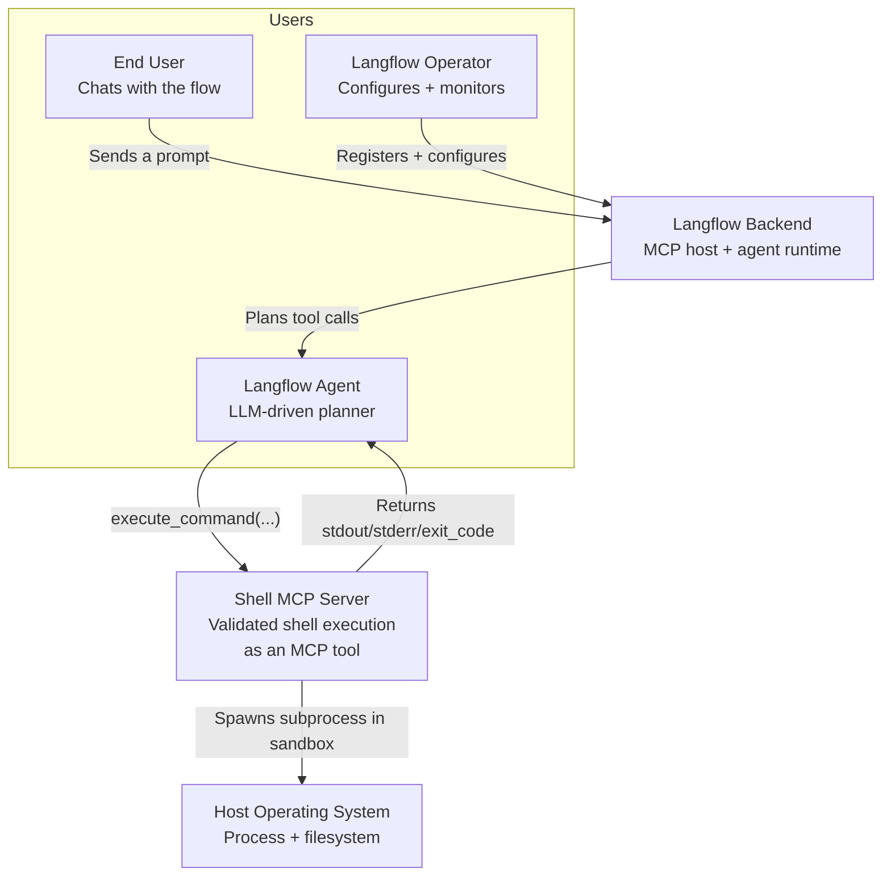
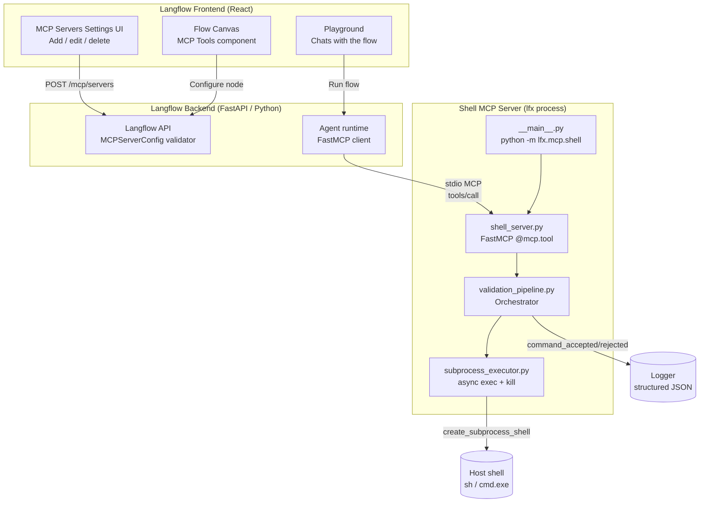
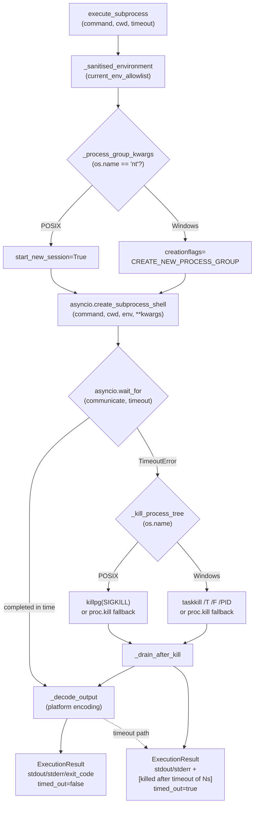
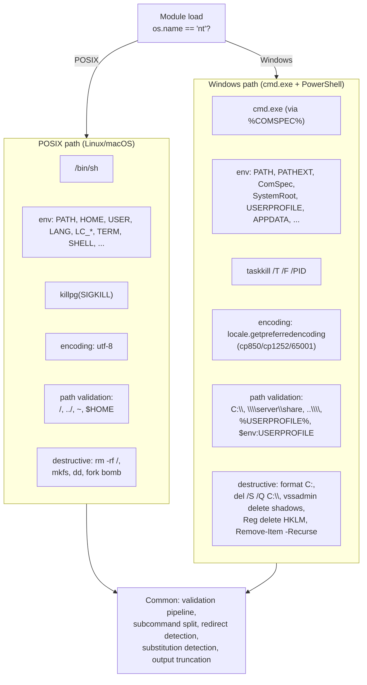

# Feature: Shell Command MCP Server

> Generated on: 2026-04-28
> Status: Review
> Owner: Langflow Platform Team

---

## Table of Contents
1. [Overview](#1-overview)
2. [Ubiquitous Language Glossary](#2-ubiquitous-language-glossary)
3. [Domain Model](#3-domain-model)
4. [Behavior Specifications](#4-behavior-specifications)
5. [Architecture Decision Records](#5-architecture-decision-records)
6. [Technical Specification](#6-technical-specification)
7. [Observability](#7-observability)
8. [Deployment & Rollback](#8-deployment--rollback)
9. [Architecture Diagrams](#9-architecture-diagrams)

---

## 1. Overview

### Summary

The Shell Command MCP Server is a standalone process that exposes a single tool — `execute_command` — over the Model Context Protocol (MCP). Connected to a Langflow Agent through the `MCP Tools` component, the server lets the agent run shell commands on the host machine, gated by a five-stage validation pipeline that classifies, screens for catastrophic patterns, enforces a configurable read-only mode, and confines execution to a sandboxed working directory. It is designed to be language-agnostic and reusable outside Langflow: any MCP client can connect to it.

### Business Context

Modern Langflow agents need controlled access to the host shell to perform inspection (`ls`, `dir`, `cat`, `git status`), generate files, and orchestrate small build/test workflows. Without guardrails, a single prompt-injection attack could lead an agent to run `rm -rf /` or exfiltrate `~/.ssh/id_rsa`. The Shell Command MCP Server solves this by intercepting every command before execution and routing it through a multi-stage, stateless validator inspired by `claw-code/bash_validation.rs`. Operators get a configurable trust boundary (working directory, mode, timeout, output size) and a stable rejection contract instead of unbounded shell access.

### Bounded Context

**MCP Integration Context** — within the broader Langflow MCP boundary that already includes the Langflow operations server (`lfx-mcp`). The Shell Command MCP Server is a sibling capability: a separate process, separate entry point, separate concerns (host-shell execution rather than flow manipulation).

### Related Contexts

| Context | Relationship | Notes |
|---------|--------------|-------|
| Langflow MCP Tools Component | **Customer-Supplier** (we are the supplier) | The Shell Server publishes `execute_command`; `MCPToolsComponent` consumes it |
| Langflow Agent (MCP host) | **Conformist** (we conform to MCP protocol) | We accept whatever JSON-RPC the host sends |
| Langflow Backend MCP Allowlist (`MCPServerConfig`) | **Anti-Corruption Layer** | The backend enforces an allowlist of binaries; we work *within* it by being invoked as `python -m lfx.mcp.shell` |
| Operating System Shell (sh / cmd.exe) | **External — Conformist** | We delegate execution to the platform shell and adapt our regex, env allowlist, and process-kill strategy per platform |

---

## 2. Ubiquitous Language Glossary

| Term | Definition | Code Reference |
|------|------------|----------------|
| **Shell Command** | The opaque string the agent wants to execute. Subject to validation, never trusted. | `command: str` parameter of `execute_command` |
| **Subcommand** | A single command segment after splitting on top-level shell operators (`;`, `&&`, `\|\|`, `\|`, `&`). Each subcommand is validated independently. | `split_subcommands()` |
| **Validation Pipeline** | The ordered chain of stages a command passes through before reaching the executor. First failure short-circuits the rest. | `validation_pipeline.run_validation_pipeline()` |
| **Command Intent** | A coarse classification of what a command tries to do: read-only, write, destructive, network, process management, package management, system admin, or unknown. | `CommandIntent` enum |
| **Destructive Pattern** | A regex-encoded family of catastrophic commands (e.g. `rm -rf /`, `format C:`, `dd of=/dev/sda`, fork bombs). Matching this pattern is rejected unconditionally, regardless of mode. | `_DESTRUCTIVE_PATTERNS` |
| **Shell Mode** | Server-wide policy: `read_only` blocks anything beyond `READ_ONLY` intent; `read_write` allows the full spectrum (still gated by destructive patterns and path validation). | `ShellMode` enum |
| **Working Directory** | The trust-boundary directory the server uses as `cwd` for subprocesses. Absolute paths outside this directory are rejected by Stage 4. | `working_directory: str` in `ShellServerConfig` |
| **Sandbox** | The combination of `working_directory` and the validation pipeline. Not a true OS sandbox (no namespaces / Docker) — a logical scoping mechanism. | n/a (concept) |
| **Rejection Reason** | A stable, machine-readable enum value returned to the caller when the command is refused. | `RejectionReason` enum |
| **Validation Result** | The outcome of a single validation stage: either `ok` or a rejection with `reason` + `message`. | `ValidationResult` dataclass |
| **Execution Result** | The final shape returned to the agent: `stdout`, `stderr`, `exit_code`, `timed_out`, plus rejection fields when applicable. | `ExecutionResult` dataclass |
| **Write Redirect** | A shell construct (`>`, `>>`, `2>`, `&>`, `*>`) that writes the output of a read-only command to disk. Triggers intent escalation to `WRITE`. | `redirect_detection.has_write_redirect()` |
| **Command Substitution** | The `$(...)` and backtick `` `...` `` constructs that embed an arbitrary inner command. Refused outright by the pipeline. | `substitution_detection.has_command_substitution()` |
| **Eval-style Cmdlet** | PowerShell `Invoke-Expression`, `Invoke-Command -ScriptBlock`, and the alias `iex` — the PowerShell equivalent of `eval`/`bash -c`. Forced to `UNKNOWN`. | `_INTENT_BY_BINARY` overrides |
| **Subprocess Executor** | The async component that actually spawns the child process, applies the timeout, and tree-kills on expiration. | `subprocess_executor.execute_subprocess()` |
| **Env Allowlist** | The platform-specific set of environment variables forwarded to the spawned subprocess. All other parent-env keys (including secrets like `LANGFLOW_API_KEY`) are stripped. | `current_env_allowlist()` |
| **Output Truncation** | The post-execution step that caps `stdout` and `stderr` at `max_output_bytes` and appends a `[... truncated NN bytes]` marker. | `output_truncation.truncate_output()` |

---

## 3. Domain Model

### 3.1 Aggregates

#### Shell Server Configuration

- **Root Entity**: `ShellServerConfig` — frozen dataclass loaded once at server startup.
- **Entities**: none (config is a single value).
- **Value Objects**: `ShellMode` (enum), the integer limits (`max_timeout`, `max_output_bytes`, `max_command_length`), and the resolved `working_directory` path string.
- **Invariants**:
  - `working_directory` MUST point to an existing directory at startup; otherwise the server refuses to boot.
  - `mode` MUST be one of `read_only` / `read_write`.
  - `max_timeout`, `max_output_bytes`, `max_command_length` MUST all be strictly positive integers.
  - The instance is frozen — no field may be mutated after construction (avoids TOCTOU between validation and execution).

#### Validation Pipeline

- **Root Entity**: the `run_validation_pipeline` orchestration function.
- **Entities**: none — every stage is a stateless pure function.
- **Value Objects**: `ValidationResult`, `CommandIntent`, `RejectionReason`.
- **Invariants**:
  - Stages run in fixed order: length cap → substitution check → split → (destructive → classify → redirect-aware mode → path) per subcommand.
  - The first failing stage short-circuits the rest (early return).
  - Every stage is pure — no I/O, no globals, deterministic from `(command, config)` inputs.
  - `ValidationResult` is immutable; stages cannot mutate prior results.

#### Shell Execution Session

- **Root Entity**: a single invocation of `execute_command`.
- **Entities**: the spawned `asyncio.subprocess.Process`.
- **Value Objects**: `ExecutionResult`.
- **Invariants**:
  - Subprocess is spawned with a clamped timeout: `min(caller_timeout, server.max_timeout)`.
  - Subprocess inherits **only** the env vars in `current_env_allowlist()` — no parent-env leak.
  - On timeout, the process tree is killed before the executor returns; no child outlives the call.
  - `stdout` and `stderr` are decoded with the platform's preferred encoding (UTF-8 on POSIX, OEM/ANSI codepage on Windows).
  - When output exceeds `max_output_bytes`, the result is truncated **and** flagged with `truncated: true`.

### 3.2 Domain Events

| Event | Trigger | Payload | Consumers |
|-------|---------|---------|-----------|
| `shell_mcp.command_accepted` | A command passes the full pipeline and the executor is about to run. | `description`, `timeout` (clamped) | Operator via `logger.info`; future audit log |
| `shell_mcp.command_rejected` | The pipeline rejects a command at any stage. | `reason` (RejectionReason value), `description` | Operator via `logger.info`; future audit log |

> Note: Events are currently emitted as structured log entries via `lfx.log.logger`. Persistent event storage and a dedicated audit-log queue are V2 work.

---

## 4. Behavior Specifications

### Feature: Controlled shell execution for AI agents

**As a** Langflow operator
**I want** my agents to execute shell commands within a sandboxed working directory and a refusable safety policy
**So that** agents can be productive on inspection and orchestration tasks without exposing the host to catastrophic destruction or data exfiltration

### Background

- Given the Shell MCP Server is registered with the Langflow backend
- And the `working_directory` env points to an existing, dedicated sandbox folder
- And the agent has the `MCP Tools` component connected to its `Tools` input

---

### Scenario: Listing files in the sandbox

- **Given** `LANGFLOW_SHELL_MODE=read_only` and a sandbox containing `notes.txt`
- **When** the agent calls `execute_command(command="ls")`
- **Then** the response has `exit_code=0`, `timed_out=false`, no `rejected` field, and `stdout` contains `notes.txt`

### Scenario: Listing files in the sandbox on Windows

- **Given** `LANGFLOW_SHELL_MODE=read_only` on a Windows host with the sandbox containing `notes.txt`
- **When** the agent calls `execute_command(command="dir")`
- **Then** the response has `exit_code=0` and `stdout` contains `notes.txt`

### Scenario: Refusing destructive system wipe

- **Given** any mode (even `read_write`)
- **When** the agent calls `execute_command(command="rm -rf /")`
- **Then** the response has `rejected=true`, `rejection_reason="destructive_pattern"`, `exit_code=-1`, and the underlying subprocess is **never** spawned

### Scenario: Refusing destructive Windows format

- **Given** the server runs on Windows in `read_write` mode
- **When** the agent calls `execute_command(command="format /Q C:")`
- **Then** the response has `rejected=true` and `rejection_reason="destructive_pattern"`

### Scenario: Composite command with hidden destructive subcommand

- **Given** `read_write` mode
- **When** the agent calls `execute_command(command="ls && rm -rf /")`
- **Then** the response has `rejected=true` and `rejection_reason="destructive_pattern"` (the splitter validates each subcommand independently)

### Scenario: Refusing brace-expansion bypass

- **Given** any mode
- **When** the agent calls `execute_command(command="rm -rf /{etc,var,usr}")`
- **Then** the response has `rejected=true` and `rejection_reason="destructive_pattern"` — the expansion would otherwise wipe `/etc`, `/var`, `/usr`

### Scenario: Read-only mode blocks file mutation

- **Given** `LANGFLOW_SHELL_MODE=read_only`
- **When** the agent calls `execute_command(command="touch newfile.txt")`
- **Then** the response has `rejected=true` and `rejection_reason="mode_violation"`

### Scenario: Read-only mode blocks redirect-disguised writes

- **Given** `LANGFLOW_SHELL_MODE=read_only`
- **When** the agent calls `execute_command(command="echo evil > poisoned.txt")`
- **Then** the response has `rejected=true` and `rejection_reason="mode_violation"` — `echo` itself is read-only but the `>` makes the effective intent `WRITE`

### Scenario: Read-write mode allows redirects

- **Given** `LANGFLOW_SHELL_MODE=read_write`
- **When** the agent calls `execute_command(command="echo data > out.txt")`
- **Then** the command runs successfully, `exit_code=0`, and `out.txt` is created in the sandbox

### Scenario: Path traversal outside the sandbox is refused

- **Given** the sandbox is `/tmp/sandbox`
- **When** the agent calls `execute_command(command="cat ../etc/passwd")`
- **Then** the response has `rejected=true` and `rejection_reason="path_traversal"`

### Scenario: Windows home env-var reference is refused

- **Given** the server runs on Windows and the sandbox is `C:\Users\me\sandbox`
- **When** the agent calls `execute_command(command="type %USERPROFILE%\\Desktop\\notes.txt")`
- **Then** the response has `rejected=true` and `rejection_reason="path_traversal"`

### Scenario: Command substitution is always refused

- **Given** any mode, any working directory
- **When** the agent calls `execute_command(command="echo $(rm -rf /)")`
- **Then** the response has `rejected=true` and `rejection_reason="shell_substitution_not_allowed"`

### Scenario: Single-quoted substitution is treated as literal

- **Given** any mode
- **When** the agent calls `execute_command(command="echo '$(rm -rf /)'")`
- **Then** the command runs successfully and prints the literal string — single-quoted regions never expand

### Scenario: PowerShell Invoke-Expression is refused as eval

- **Given** the server runs on Windows in `read_write` mode
- **When** the agent calls `execute_command(command='Invoke-Expression "Remove-Item -Recurse -Force C:\\\\"')`
- **Then** the response has `rejected=true` and `rejection_reason="unknown_classification"`

### Scenario: Legitimate Invoke-WebRequest still works

- **Given** `read_write` mode on Windows
- **When** the agent calls `execute_command(command="Invoke-WebRequest https://api.example.com")`
- **Then** the command runs (network intent allowed in `read_write`)

### Scenario: Timeout kills the subprocess and the call returns quickly

- **Given** `LANGFLOW_SHELL_MAX_TIMEOUT=5`
- **When** the agent calls `execute_command(command="sleep 30", timeout=5)`
- **Then** the response returns in approximately 5 seconds with `timed_out=true`, `stderr` ends with `[killed after timeout of 5s]`, and a host-side `ps` confirms the `sleep` process has been terminated

### Scenario: Output exceeding the cap is truncated

- **Given** `LANGFLOW_SHELL_MAX_OUTPUT_BYTES=200`
- **When** the agent calls `execute_command(command="yes hello | head -n 1000")`
- **Then** the response has `truncated=true` and `stdout` ends with `[... truncated NN bytes]`

### Scenario: Caller timeout above server cap is clamped down

- **Given** `LANGFLOW_SHELL_MAX_TIMEOUT=30`
- **When** the agent calls `execute_command(command="echo hi", timeout=999)`
- **Then** the effective timeout used by the executor is `30`, not `999`

### Scenario: Unknown classification is fail-closed

- **Given** any mode
- **When** the agent calls `execute_command(command="some-binary-not-in-the-table --foo")`
- **Then** the response has `rejected=true` and `rejection_reason="unknown_classification"`

### Scenario: Secret env vars do not leak to the subprocess

- **Given** the backend was launched with `LANGFLOW_API_KEY=super-secret`
- **And** `read_write` mode
- **When** the agent calls `execute_command(command="env")` (POSIX) or `execute_command(command="set")` (Windows)
- **Then** `stdout` does NOT contain `super-secret` — only the platform-specific env allowlist is forwarded

### Scenario: Input length cap enforces a sane upper bound

- **Given** `LANGFLOW_SHELL_MAX_COMMAND_LENGTH=4096`
- **When** the agent calls `execute_command(command="echo " + "x" * 5000)`
- **Then** the response has `rejected=true` and `rejection_reason="input_too_large"`

---

## 5. Architecture Decision Records

### ADR-001: Build as a separate FastMCP server (not a Langflow component)

**Status**: Accepted

#### Context

We need to expose shell execution to Langflow agents. Two natural shapes exist: a Python "Component" living inside the Langflow process (like `MCPToolsComponent`), or a standalone MCP server invoked over stdio.

#### Decision

Build it as a standalone FastMCP server (`lfx-shell-mcp` / `python -m lfx.mcp.shell`). The existing `MCPToolsComponent` in Langflow connects to it as a client.

#### Consequences

**Benefits:**
- Reusable outside Langflow — any MCP client (Claude Desktop, mcp-cli, custom tools) can connect.
- Process isolation: a crash in the shell server never takes down the Langflow backend.
- Mirrors the existing `lfx-mcp` server pattern in the same codebase, reducing cognitive load.
- Sidesteps coupling between Langflow's component runtime and the validation pipeline.

**Trade-offs:**
- Adds an extra subprocess on every flow run that uses the tool (cold-start cost on each MCP handshake).
- Configuration lives in env vars rather than the flow JSON — less discoverable for end users.
- Forces clients to deal with the Langflow MCP allowlist (see ADR-007).

**Impact on Product:**
- Slight onboarding friction (operators must register the server in Settings → MCP Servers); offset by reusability across flows and other MCP clients.

---

### ADR-002: Multi-stage validation pipeline (not a flat blocklist)

**Status**: Accepted

#### Context

The classic approach is a single regex blocklist of "bad" commands. This conflates orthogonal concerns (mode, path scoping, intent), produces unmaintainable regexes, and offers no diagnostic granularity ("why was this rejected?").

#### Decision

Decompose validation into independent, ordered, stateless stages:
1. Input length cap (cheap DoS guard)
2. Command-substitution refusal (fail-closed for `$(...)` / backticks)
3. Subcommand split (so each chained command is validated independently)
4. Per-subcommand:
   - 4a. Destructive pattern detection
   - 4b. Intent classification (with redirect-aware escalation)
   - 4c. Mode validation
   - 4d. Path validation

Each stage returns a `ValidationResult` with a stable `RejectionReason`.

#### Consequences

**Benefits:**
- Each stage has one job and is unit-testable in isolation. The codebase has 100% line+branch coverage on five of the seven validation modules.
- Diagnostics: callers learn *which* stage failed and *why*, allowing the agent to retry with adjusted commands.
- New stages can be added without touching existing ones (e.g., we added redirect detection and substitution detection late in development without disturbing the others).

**Trade-offs:**
- More files than a "single big validator" — the `mcp/shell/` package has 13 modules. We accept this for SRP/auditability.
- Slight performance cost from running multiple regex passes per subcommand. Negligible at MCP-call frequencies.

**Impact on Product:**
- Stable, explainable rejection contract → better agent UX and clearer security posture for operators.

---

### ADR-003: Fail-closed on UNKNOWN classification

**Status**: Accepted

#### Context

Stage 1 (classification) has a curated table mapping leading binaries to intents. Any binary not in the table returns `CommandIntent.UNKNOWN`. We must decide how the pipeline treats UNKNOWN.

#### Decision

Treat UNKNOWN as a hard rejection, **regardless of mode**. The rationale: if we don't know what the binary does, we can't reason about its safety; the safer default is to refuse it.

This automatically blocks common bypass vectors: `bash -c "..."`, `sh -c "..."`, `python -c "..."`, `eval "..."`, `iex "..."`, `[ScriptBlock]::Create("...")` — all of these are wrappers we deliberately don't model.

#### Consequences

**Benefits:**
- Unknown-equals-bypass is a classic security failure; we eliminate it by construction.
- The classification table is the single source of truth for "what we trust" — easier to audit.

**Trade-offs:**
- Uncommon-but-legitimate binaries (`rg`, `bat`, `zsh` extensions, niche dev tools) get rejected and require an explicit add to the table.
- Onboarding friction when an operator's agent picks a tool the table doesn't recognise.

**Impact on Product:**
- A small, vocal set of users will hit `unknown_classification` and need to file requests. The table is easy to extend, mitigating the friction.

---

### ADR-004: Refuse `$(...)` / backticks outright (no recursive validation)

**Status**: Accepted

#### Context

Command substitution embeds an arbitrary inner command. We could attempt to recursively validate the inner command's bytes with the same pipeline. But: substitutions can themselves contain substitutions; the inner command can read environment variables we don't know; the regex anchors `(?:^|[\s;|&])` were never designed to recognise `$(` / `` ` `` as a boundary.

#### Decision

Refuse the construct unconditionally. Emit a new, distinct `RejectionReason.SHELL_SUBSTITUTION_NOT_ALLOWED` so the agent learns this is a known refused construct (not a misclassification) and can retry with two separate calls.

#### Consequences

**Benefits:**
- Closes a critical bypass class. `echo $(rm -rf /)` is the canonical example: every other stage's anchors miss the destructive subcommand because of the leading `(`.
- Simpler code: no recursion, no risk of infinite expansion loops.
- Single-quoted regions are correctly exempted (POSIX literals).

**Trade-offs:**
- Common idioms like `git log --pretty="$(date)"` or `echo "user=$(whoami)"` are refused. Agents must run two calls.
- The test suite has a deliberate "paranoid" case where arithmetic expansion `$((1+1))` is also flagged; this is acceptable noise compared to missing a real substitution.

**Impact on Product:**
- Documented restriction. Onboarding materials explicitly say: *"if you need command output, run two calls."*

---

### ADR-005: Redirect detection escalates intent to WRITE (rather than rejecting outright)

**Status**: Accepted

#### Context

`echo evil > poisoned.txt` is a write — but the leading binary `echo` is `READ_ONLY`. Without intervention, `read_only` mode lets it pass and the file is created. We needed a fix that closes the bypass without breaking the same usage in `read_write` mode (which is a legitimate operator workflow).

#### Decision

Detect write redirects (`>`, `>>`, `2>`, `&>`, `*>`) in the subcommand, and when the classified intent is `READ_ONLY`, escalate it to `WRITE` for the mode-validation stage. `read_only` mode then blocks it via the existing `MODE_VIOLATION` path; `read_write` mode is unaffected.

#### Consequences

**Benefits:**
- Backward-compatible with `read_write` workflows (the most common test case in development).
- Reuses the existing rejection reason (`mode_violation`) — no new vocabulary for operators to learn.
- The redirect detector is a pure function tested independently with 29 cases covering quote handling, escapes, and PowerShell `*>` syntax.

**Trade-offs:**
- A specific rejection like `WRITE_REDIRECT_IN_READ_ONLY` would have been more descriptive in error messages, but adding a new code for what is effectively a write would proliferate the enum.
- The detector intentionally treats `2>` as a write redirect even though it captures stderr — this is correct (it still creates a file) but might surprise users expecting `2>` to be inert.

**Impact on Product:**
- `read_only` mode is now genuinely read-only.

---

### ADR-006: Cross-platform support without forking the codebase

**Status**: Accepted

#### Context

POSIX shells (sh/bash/zsh) and Windows shells (cmd.exe / PowerShell) differ on: shell binary, command line operators, environment variables, kill-tree mechanism, output encoding, paths (drive letters, UNC), and command vocabulary.

#### Decision

Single codebase with platform-aware seams:
- `current_env_allowlist()` returns POSIX or Windows allowlist via `os.name`.
- `subprocess_executor._process_group_kwargs()` returns `start_new_session=True` (POSIX) or `creationflags=CREATE_NEW_PROCESS_GROUP` (Windows).
- `_kill_process_tree` dispatches to `killpg(SIGKILL)` (POSIX) or `taskkill /T /F /PID` (Windows).
- `_select_output_encoding()` returns `utf-8` (POSIX) or `locale.getpreferredencoding()` (Windows).
- `validation_path._is_absolute_outside` handles both POSIX absolutes and Windows drive letters / UNC.
- `classification._INTENT_BY_BINARY` merges POSIX and Windows binaries plus PowerShell verb prefixes.
- `validation_destructive` includes both POSIX patterns (`rm -rf /`, `dd of=/dev/sda`) and Windows patterns (`format C:`, `vssadmin delete shadows`, `Remove-Item -Recurse -Force C:\`).

#### Consequences

**Benefits:**
- One repository, one test suite (490+ tests), one PR. Cross-platform tests run on the dev machine via `os.name` mocks; real subprocess tests run on whichever platform CI uses.
- Defense in depth: Windows destructive patterns trip even on POSIX (in case a Linux box has a `format` binary on `$PATH`), and vice versa.

**Trade-offs:**
- Some files (`shell_constants.py`, `subprocess_executor.py`, `validation_path.py`, `validation_destructive.py`) carry both platforms' concerns. They remain coherent because each platform's section is annotated and tested separately.
- The Windows code paths can only be exercised end-to-end on a Windows runner; the rest is mocked.

**Impact on Product:**
- Day-one Windows support (cmd.exe + PowerShell cmdlets) without a separate release.

---

### ADR-007: Workaround for the Langflow MCP allowlist

**Status**: Accepted (workaround)

#### Context

Langflow's backend (`MCPServerConfig` validator in `src/backend/base/langflow/api/v2/schemas.py`) restricts MCP server commands to a fixed allowlist: `{bash, cmd, docker, node, npx, python, python3, sh, uvx}`. Our published console script `lfx-shell-mcp` is not in the list and is rejected by the backend with:

> *Value error, Command 'lfx-shell-mcp' is not allowed for security reasons. Allowed commands: ...*

#### Decision

Document and embrace the allowlist. Operators register the server using:

| Field | Value |
|-------|-------|
| Command | `python` |
| Arguments | `-m`, `lfx.mcp.shell` |

This works because:
- `python` is allowed.
- `-m` is not in the backend's `DANGEROUS_KEYWORDS` (`-c`, `-e`, `-y`, `pip`, `install`, `npm`, `eval`, `exec`).
- `lfx.mcp.shell` has no shell metacharacters.

#### Consequences

**Benefits:**
- Zero changes required to Langflow's security posture. We ride on top of an existing protective layer.
- Operators get one consistent registration story across platforms.

**Trade-offs:**
- Slightly less ergonomic than a single binary. Compensated by clear documentation.
- We rely on the backend allowlist staying stable. If `python` were ever removed, we'd need to coordinate.

**Impact on Product:**
- A documented gotcha, surfaced in §10 of the QA guide and in the troubleshooting section of the manual-test guide.

---

## 6. Technical Specification

### 6.1 Dependencies

| Type | Name | Purpose |
|------|------|---------|
| Python package | `mcp >= 1.17.0, < 2.0.0` | FastMCP server framework (already in `lfx` deps) |
| Python module | `asyncio` (stdlib) | Subprocess management with timeout |
| Python module | `subprocess` (stdlib) | Used dynamically on Windows for `CREATE_NEW_PROCESS_GROUP` |
| Python module | `shlex` (stdlib) | Lexical tokenisation for path validation |
| Python module | `re` (stdlib) | All pattern matching |
| Python module | `pathlib` (stdlib) | Path normalisation, resolution, drive-letter handling (`PureWindowsPath`) |
| Python module | `locale` (stdlib) | Encoding detection on Windows |
| Python module | `signal` (stdlib) | `SIGKILL` for POSIX tree-kill |
| External binary | `taskkill` (Windows) | Tree-kill on Windows; resolved via `%PATH%` |
| Logger | `lfx.log.logger` | Structured event logging |

No new dependencies were added; the feature builds entirely on what `lfx` already imports.

### 6.2 API Contracts

#### MCP Tool: `execute_command`

**Purpose**: Execute a shell command in the configured working directory.

**Request** (JSON-RPC `tools/call` payload):

```json
{
  "name": "execute_command",
  "arguments": {
    "command": "string — the shell command to execute (required)",
    "timeout": "int — max seconds before kill (optional, default 120)",
    "description": "string — purpose of the command for audit logging (optional)"
  }
}
```

**Response (Success)**:

```json
{
  "stdout": "string — captured stdout of the subprocess (truncated if large)",
  "stderr": "string — captured stderr",
  "exit_code": "int — the process's exit code (0 = success)",
  "timed_out": "bool — true if the timeout fired and the process was killed",
  "truncated": "bool — present and true only if stdout or stderr was truncated"
}
```

**Response (Rejection)**:

```json
{
  "stdout": "",
  "stderr": "string — explanation of why the command was rejected",
  "exit_code": -1,
  "timed_out": false,
  "rejected": true,
  "rejection_reason": "destructive_pattern | mode_violation | path_traversal | unknown_classification | input_too_large | shell_substitution_not_allowed"
}
```

#### CLI Entry Points

| Command | Equivalent | Use case |
|---------|-----------|----------|
| `lfx-shell-mcp` | `python -m lfx.mcp.shell` | Direct invocation outside Langflow |
| `python -m lfx.mcp.shell` | (canonical form) | Invocation from within the Langflow MCP allowlist |

### 6.3 Error Handling

| `rejection_reason` | Condition | User Message (returned in `stderr`) | Recovery Action |
|-------------------|-----------|--------------------------------------|-----------------|
| `destructive_pattern` | Stage 2 matched a known catastrophic pattern | `Command rejected: matches destructive pattern (<label>): '<command>'` | None — by design. Refactor the request to a non-destructive equivalent. |
| `mode_violation` | Stage 3 — non-read-only intent attempted under `read_only` mode | `Command rejected: server is in read_only mode (intent=<intent>).` | Operator may switch to `read_write` mode; otherwise refactor to read-only operations. |
| `path_traversal` | Stage 4 — token escapes the working directory | `Command rejected: path token '<token>' <reason>.` | Use a path inside the working directory. |
| `unknown_classification` | Stage 1 — leading binary not in the table | `Command rejected: unable to classify intent (fail-closed).` | Use a recognised binary, or file a request to add the binary to the classification table. |
| `input_too_large` | Length cap exceeded | `Command rejected: input exceeds max_command_length (<N>).` | Shorten the command or raise `LANGFLOW_SHELL_MAX_COMMAND_LENGTH`. |
| `shell_substitution_not_allowed` | `$(...)` or backticks detected | `Command rejected: shell command substitution ($(...) or \`...\`) is not allowed. Run the inner command separately and pass its result as a literal argument.` | Issue two `execute_command` calls. |

Configuration errors at startup (raised as `ValueError` from `ShellServerConfig.from_environment()`) are NOT trapped — they propagate up and prevent the server from booting. This is intentional: we want misconfiguration to fail loudly rather than degrade silently.

| Configuration Error | Trigger |
|---------------------|---------|
| `LANGFLOW_SHELL_WORKING_DIR must point to an existing directory: <path>` | Path missing or is a file |
| `LANGFLOW_SHELL_MODE must be one of read_only, read_write, got '<value>'` | Mode value not in enum |
| `LANGFLOW_SHELL_MAX_TIMEOUT must be a positive integer, got <value>` | Non-positive or non-integer |
| `LANGFLOW_SHELL_MAX_OUTPUT_BYTES must be a positive integer, got <value>` | Same |

---

## 7. Observability

### 7.1 Key Metrics

These metrics are emitted via `logger.info` events today; persistent metric backends (Prometheus / Datadog) integrate by parsing the structured logs.

| Metric | Type | Description | Alert Threshold |
|--------|------|-------------|-----------------|
| `shell_mcp.commands_accepted_total` | Counter | Number of commands that passed the pipeline | n/a (informational) |
| `shell_mcp.commands_rejected_total` | Counter (labelled by `reason`) | Number of commands rejected per reason | Spike on `destructive_pattern` (>5/min) → potential prompt-injection attack |
| `shell_mcp.commands_timed_out_total` | Counter | Number of commands killed by timeout | >10% of accepted → review timeout policy |
| `shell_mcp.command_duration_seconds` | Histogram | Wall-clock time from accept to result | p95 > server `max_timeout` × 0.8 → tune timeouts |
| `shell_mcp.output_truncated_total` | Counter | Number of responses where output was truncated | Sustained >20% → review `max_output_bytes` |

### 7.2 Important Logs

| Log Level | Event | Fields | When |
|-----------|-------|--------|------|
| INFO | `shell_mcp.command_accepted` | `description`, `timeout` | Pipeline passed; subprocess about to run |
| INFO | `shell_mcp.command_rejected` | `reason`, `description` | Pipeline rejected at any stage |
| (none) | — | — | The command string itself is **not** logged by default to avoid accidentally persisting paths or content the operator considers sensitive. The `description` field is the audit hook. |

The structured logger is `lfx.log.logger`. Format follows the conventions of the rest of the `lfx` codebase (structlog console renderer in dev, JSON in prod).

### 7.3 Dashboards

- **Operator dashboard**: rate of commands accepted vs rejected, broken down by `rejection_reason`, with a focus panel on `destructive_pattern` (potential attack surface).
- **Performance dashboard**: command duration histogram, timeout rate, truncation rate.

(Both dashboards live in the platform's standard observability stack — placeholder for the team's actual URLs.)

---

## 8. Deployment & Rollback

### 8.1 Feature Flags

This feature is not gated by a runtime feature flag. Activation is by **opt-in registration**: the server only runs if an operator explicitly adds it to Settings → MCP Servers and a flow uses the `MCP Tools` component pointing at it.

| Implicit Flag | Purpose | Default | Rollout |
|---------------|---------|---------|---------|
| MCP server registered? | Enables the tool for all flows that connect to it | not registered | per-operator opt-in |
| `LANGFLOW_SHELL_MODE` | Hard kill switch — `read_only` blocks all writes | `read_write` | recommend `read_only` for first deploy, then graduate |

### 8.2 Database Migrations

None. The Shell MCP Server is stateless from the database's perspective. Configuration lives in environment variables; events are emitted to logs only.

### 8.3 Rollback Plan

1. **Soft rollback (no code revert):** an operator removes the `langflow-shell` server from Settings → MCP Servers, or deletes the `MCP Tools` node from any flows that reference it. The server process stops on the next backend cycle. No data state to revert.
2. **Hard rollback (revert PR):**
   - Revert the merge commit on the release branch.
   - Re-run `uv pip install -e src/lfx` to restore the previous package state.
   - Restart the Langflow backend.
   - Inform operators that any existing `langflow-shell` registrations will fail to launch (silent — show as red badge in the MCP servers list); they should remove the registration manually.
3. **Migration considerations:** none. There is no schema change.
4. **Dependent rollbacks:** none. The feature is leaf in the dependency graph.

### 8.4 Smoke Tests

After deploy, an operator should verify:

- [ ] `python -c "import lfx.mcp.shell.shell_server; print('OK')"` succeeds in the backend's venv.
- [ ] Adding a STDIO server with command `python` and args `-m lfx.mcp.shell` and a valid `LANGFLOW_SHELL_WORKING_DIR` results in a green badge.
- [ ] In a flow with `MCP Tools` connected to that server, `execute_command(command="ls")` (Linux/macOS) or `dir` (Windows) returns a non-empty `stdout` with `exit_code=0`.
- [ ] In `read_only` mode, `execute_command(command="echo evil > poisoned.txt")` returns `rejection_reason="mode_violation"` and the file does **not** appear in the sandbox.
- [ ] In `read_write` mode (one-time validation), `execute_command(command="rm -rf /")` returns `rejection_reason="destructive_pattern"` and the host is unaffected.
- [ ] `execute_command(command="sleep 30", timeout=2)` returns within ~2 s with `timed_out=true`, and `ps` confirms no orphan `sleep` process remains.

A complete QA matrix is documented in `CZL/QA_GUIDE_SHELL_MCP.md` (60+ scenarios across functional, security, and platform-specific checks).

---

## 9. Architecture Diagrams

### 9.1 Context Diagram (Level 1)



### 9.2 Container Diagram (Level 2)



### 9.3 Component Diagram (Level 3) — Validation Pipeline

```mermaid
graph TD
  IN["Incoming command\n(string)"]
  CFG[("ShellServerConfig\nfrozen, env-loaded")]

  IN --> S0{Length cap\n< max_command_length?}
  S0 -->|"no"| R_LEN["REJECT\ninput_too_large"]
  S0 -->|"yes"| S1{has_command_substitution\n($(...) or backticks?)}

  S1 -->|"yes"| R_SUB["REJECT\nshell_substitution_not_allowed"]
  S1 -->|"no"| SPLIT["split_subcommands\nby ; && || | &"]

  SPLIT --> LOOP{For each\nsubcommand}

  LOOP --> S2{validate_not_destructive\n(matches destructive pattern?)}
  S2 -->|"yes"| R_DEST["REJECT\ndestructive_pattern"]
  S2 -->|"no"| CLS["classify_command\n(intent)"]

  CLS --> RED{has_write_redirect?\n(>, >>, 2>, etc.)}
  RED -->|"yes + intent=READ_ONLY"| ESC["intent ← WRITE"]
  RED -->|"no"| KEEP["intent unchanged"]
  ESC --> S3
  KEEP --> S3

  S3{validate_mode\n(intent vs config.mode)}
  S3 -->|"UNKNOWN"| R_UNK["REJECT\nunknown_classification"]
  S3 -->|"intent > read_only\nin read_only"| R_MODE["REJECT\nmode_violation"]
  S3 -->|"ok"| S4{validate_paths\n(any token outside cwd?)}

  S4 -->|"yes"| R_PATH["REJECT\npath_traversal"]
  S4 -->|"no, more subcmds"| LOOP
  S4 -->|"no, all subcmds done"| OK["PASS to executor"]

  CFG -.-> S0
  CFG -.-> S3
  CFG -.-> S4
```

### 9.4 Component Diagram (Level 3) — Subprocess Executor



### 9.5 Component Diagram (Level 3) — Cross-Platform Behaviour Selection



---
