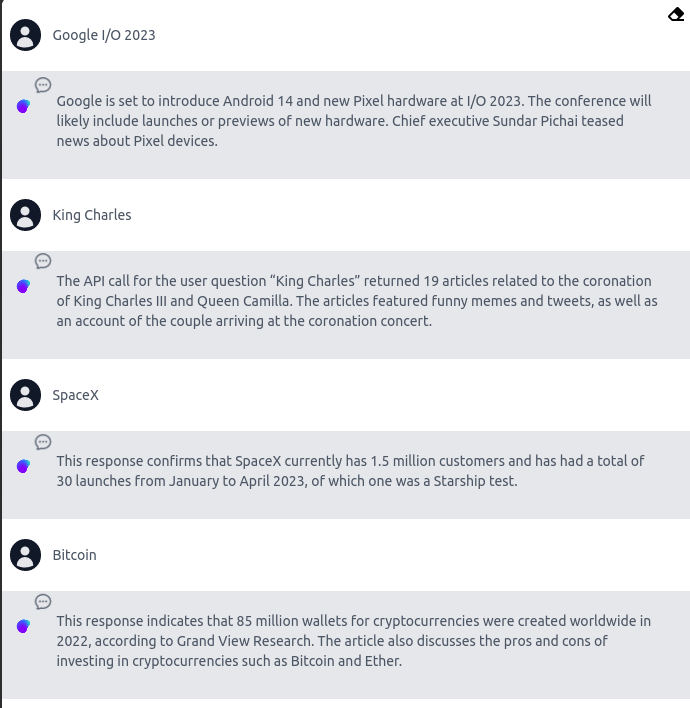

`News API` is a tool that allows you to get information about the top headlines of current new stories. To use the News API, you first need to sign up [News API](https://newsapi.org/){.internal-link target=_blank} for an API key on the provider's website.

{width=60%}
{width=60%}

### ⛓️LangFlow example

{width=80%}
{width=80%}

### Chatbot:

{width=50%}

[Get JSON file](data/News_api.json){: .md-button download="News_api"} 

For the example, we used `OpenAI` as the LLM, but you can use any LLM that has an API. Make sure to get the API key from the LLM provider. For example, [OpenAI](https://platform.openai.com/){.internal-link target=_blank} requires you to create an account to get your API key.

Check out the [OpenAI](https://platform.openai.com/docs/introduction/overview){.internal-link target=_blank} documentation to learn more about the API and the options that contain in the node.