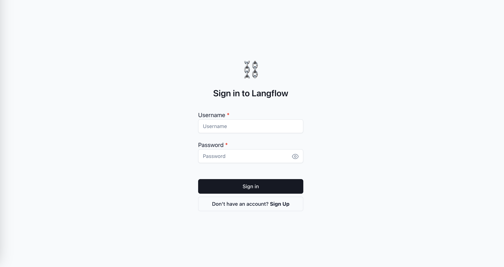
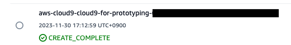

# Langflow on AWS

**想定時間**: 30 分

## 説明

Langflow on AWS では、 [AWS Cloud Development Kit](https://aws.amazon.com/cdk/?nc2=type_a) (CDK) を用いて Langflow を AWS 上にデプロイする方法を学べます。
このチュートリアルは、AWS アカウントと AWS に関する基本的な知識を有していることを前提としています。

作成するアプリケーションのアーキテクチャです。

AWS CDK によって Langflow のアプリケーションをデプロイします。アプリケーションは [Amazon CloudFront](https://aws.amazon.com/cloudfront/?nc1=h_ls) を介して配信されます。CloudFront は 2 つのオリジンを有しています。1 つ目は静的な Web サイトを配信するための [Amazon Simple Storage Service](https://aws.amazon.com/s3/?nc1=h_ls) (S3)、2 つ目は バックエンドと通信するための [Application Load Balancer](https://aws.amazon.com/elasticloadbalancing/application-load-balancer/?nc1=h_ls) (ALB) です。ALB の背後には FastAPI が動作する [AWS Fargate](https://aws.amazon.com/fargate/?nc2=type_a) 、データベースの [Amazon Aurora](https://aws.amazon.com/rds/aurora/?nc2=type_a) が作成されます。
Fargate は [Amazon Elastic Container Registry](https://aws.amazon.com/ecr/?nc1=h_ls) (ECR) に保存された Docker イメージを使用します。
Aurora のシークレットは [AWS Secrets Manager](https://aws.amazon.com/secrets-manager/?nc2=type_a) によって管理されます。

# 環境構築とデプロイ方法

1. [AWS CloudShell](https://us-east-1.console.aws.amazon.com/cloudshell/home?region=us-east-1)を開きます。

1. 以下のコマンドを実行します。

   ```shell
   git clone https://github.com/aws-samples/cloud9-setup-for-prototyping
   cd cloud9-setup-for-prototyping
   ./bin/bootstrap
   ```

1. `Done!` と表示されたら [AWS Cloud9](https://us-east-1.console.aws.amazon.com/cloud9control/home?region=us-east-1#/) から `cloud9-for-prototyping` を開きます。
   

1. 以下のコマンドを実行します。
   ```shell
   git clone https://github.com/langflow-ai/langflow.git
   cd langflow/scripts/aws
   cp .env.example .env # 環境設定を変える場合はこのファイル(.env)を編集してください。
   npm ci
   cdk bootstrap
   cdk deploy
   ```
1. 表示される URL にアクセスします。
   ```shell
   Outputs:
   LangflowAppStack.frontendURLXXXXXX = https://XXXXXXXXXXX.cloudfront.net
   ```
1. サインイン画面でユーザー名とパスワードを入力します。`.env`ファイルでユーザー名とパスワードを設定していない場合、ユーザー名は`admin`、パスワードは`123456`で設定されます。
   

# 環境の削除

1. `Cloud9` で以下のコマンドを実行します。

   ```shell
   bash delete-resources.sh
   ```

1. [AWS CloudFormation](https://us-east-1.console.aws.amazon.com/cloudformation/home?region=us-east-1#/getting-started)を開き、`aws-cloud9-cloud9-for-prototyping-XXXX` を選択して削除します。
   
