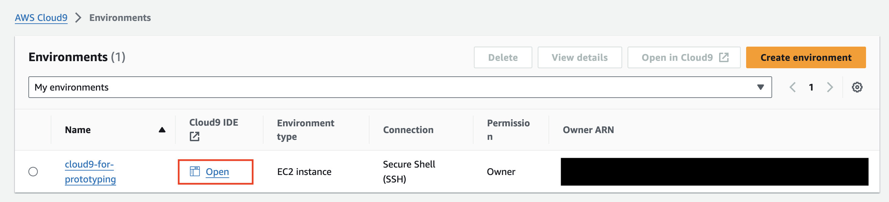

# Deploy Langflow on AWS

**Duration**: 30 minutes

## Introduction

In this tutorial, you will learn how to deploy langflow on AWS using [AWS Cloud Development Kit](https://aws.amazon.com/cdk/?nc2=type_a) (CDK).
This tutorial assumes you have an AWS account and basic knowledge of AWS.

The architecture of the application to be created:

Langflow is deployed using AWS CDK. The application is distributed via [Amazon CloudFront](https://aws.amazon.com/cloudfront/?nc1=h_ls), which has two origins: the first is [Amazon Simple Storage Service](https://aws.amazon.com/s3/?nc1=h_ls) (S3) for serving a static website, and the second is an [Application Load Balancer](https://aws.amazon.com/elasticloadbalancing/application-load-balancer/?nc1=h_ls) (ALB) for communicating with the backend. [AWS Fargate](https://aws.amazon.com/fargate/?nc2=type_a), where FastAPI runs and [Amazon Aurora](https://aws.amazon.com/rds/aurora/?nc2=type_a), the database, are created behind the ALB.
Fargate uses a Docker image stored in [Amazon Elastic Container Registry](https://aws.amazon.com/ecr/?nc1=h_ls) (ECR).
Aurora's secret is managed by [AWS Secrets Manager](https://aws.amazon.com/secrets-manager/?nc2=type_a).

# How to set up your environment and deploy langflow

1. Open [AWS CloudShell](https://us-east-1.console.aws.amazon.com/cloudshell/home?region=us-east-1).
1. Run the following commands in Cloudshell:
   ```shell
   git clone https://github.com/aws-samples/cloud9-setup-for-prototyping
   cd cloud9-setup-for-prototyping
   cat params.json | jq '.name |= "c9-for-langflow"'
   ./bin/bootstrap
   ```
1. When you see `Done!` in Cloudshell, open `c9-for-langflow` from [AWS Cloud9](https://us-east-1.console.aws.amazon.com/cloud9control/home?region=us-east-1#/).
   
1. Run the following command in the Cloud9 terminal.
   ```shell
   git clone https://github.com/langflow-ai/langflow.git
   cd langflow/scripts/aws
   cp .env.example .env # Edit this file if you need environment settings
   npm ci
   cdk bootstrap
   cdk deploy
   ```
1. Access the URL displayed.
   ```shell
   Outputs:
   LangflowAppStack.frontendURLXXXXXX = https://XXXXXXXXXXX.cloudfront.net
   ```
1. Enter your user name and password to sign in. If you have not set a user name and password in your `.env` file, the user name will be set to `admin` and the password to `123456`.
   

# Cleanup

1. Run the following command in the Cloud9 terminal.
   ```shell
   bash delete-resources.sh
   ```
1. Open [AWS CloudFormation](https://us-east-1.console.aws.amazon.com/cloudformation/home?region=us-east-1#/getting-started), select `aws-cloud9-c9-for-langflow-XXXX` and delete it.
   
   s
