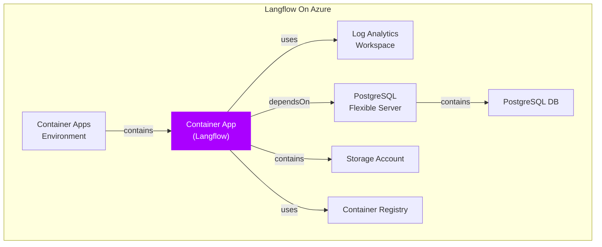

# Variables
RESOURCE_GROUP="connectorzzz-langflow-rg"

# Create the resource group if it doesn't exist
az group create --name $RESOURCE_GROUP --location "swedencentral"

# Deploy the template
az deployment group create --resource-group $RESOURCE_GROUP --template-file azuredeploy.json --parameters @azuredeploy.parameters.json

