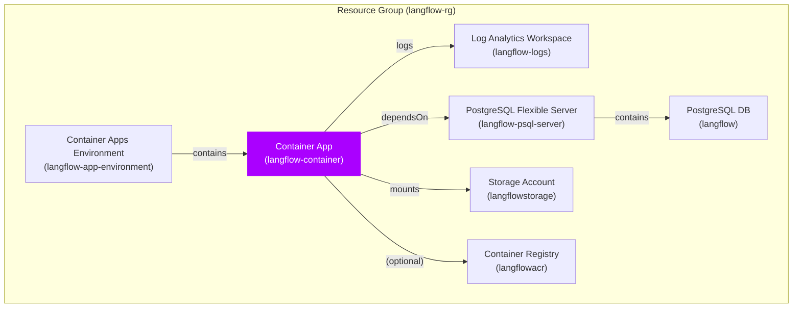

# Deploy Langflow on Azure

**Duration**: Approximately 10 minutes

## Introduction

This tutorial will guide you through deploying Langflow on Azure using Azure Resource Manager (ARM) templates and Bicep. We assume you have an Azure account and basic knowledge of Azure services.

The architecture of the application to be created:



Langflow is deployed using Azure Resource Manager templates or Bicep. The application uses Azure Container Apps to run the Langflow container, with Azure PostgreSQL Flexible Server as the database. Azure Storage Account is used for persistent storage, and Azure Container Registry can optionally be used to store the Docker image. Logging is handled by Azure Log Analytics.


## Deploy on Azure

Use the arm template to deploy Langflow 1.0 on Azure:

[](https://portal.azure.com/#create/Microsoft.Template/uri/https%3A%2F%2Fraw.githubusercontent.com%2Fthaersaidi%2Flangflow%2Fmain%2Fscripts%2Fazure%2Fazuredeploy.json)

## How to set up your environment and deploy Langflow

1. Open [Azure Cloud Shell](https://shell.azure.com/) and choose Bash.

2. Clone the Langflow repository:
   ```bash
   git clone https://github.com/langflow-ai/langflow.git
   cd langflow/scripts/azure
   ```

3. (Optional) If you want to customize the deployment parameters, edit the `azuredeploy.parameters.json` file:
   ```bash
   code azuredeploy.parameters.json
   ```

4. Create a resource group:
   ```bash
   RESOURCE_GROUP="langflow-rga"
   LOCATION="swedencentral"
   az group create --name $RESOURCE_GROUP --location $LOCATION
   ```

5. Deploy Langflow using one of the following methods:

   a. Using ARM template with parameters file:
   ```bash
   az deployment group create --resource-group $RESOURCE_GROUP --template-file azuredeploy.json --parameters @azuredeploy.parameters.json
   ```

   b. Using Bicep file:
   ```bash
   az deployment group create --resource-group $RESOURCE_GROUP --template-file main.bicep --parameters location=$LOCATION containerAppEnvironmentName=langflow-app-environment containerGroupName=langflow-container storageAccountName=langflowstorage postgresServerName=langflow-psql-server postgresAdmin=langflowadmin postgresPassword=YourSecurePassword logAnalyticsWorkspaceName=langflow-logs containerRegistryName=langflowacr
   ```

6. After the deployment is complete, you'll see an output with the URL to access Langflow. It will look something like this:
   ```
   "outputs": {
     "applicationUrl": {
       "type": "String",
       "value": "https://langflow-container.azurecontainerapps.io"
     }
   }
   ```

7. Open this URL in your web browser. You'll be prompted to sign in. Use the default credentials (unless you changed them in the parameters):
   - Username: admin
   - Password: 123456

## Cleanup

To remove all the resources created by this deployment:

1. Delete the resource group:
   ```bash
   az group delete --name $RESOURCE_GROUP --yes --no-wait
   ```

2. If you've made any changes to the Azure Cloud Shell environment that you want to revert, you can reset it by clicking on the "Reset" option in the Cloud Shell menu.

## Azure Deployment Scripts

The `/scripts/azure` directory contains four key files for deploying Langflow on Azure:

1. `azuredeploy.json`: The main ARM template that defines all the resources to be deployed.
2. `azuredeploy.parameters.json`: Contains the parameters used by the ARM template for easy customization.
3. `main.bicep`: The Bicep version of the ARM template, offering a more concise syntax.
4. `README.md`: This file, providing instructions on how to use these deployment scripts.

These scripts offer flexible deployment options, supporting both ARM templates and Bicep, and can be used with or without a separate parameters file.

## Contribution

The Azure deployment scripts in the `/scripts/azure` directory were contributed to simplify and standardize the process of deploying Langflow on Azure. These scripts provide:

1. **Flexibility**: Support for both ARM templates and Bicep, catering to different user preferences.
2. **Customization**: Easy parameter customization through the `azuredeploy.parameters.json` file.
3. **Consistency**: Ensures that all necessary resources are deployed in a consistent manner.
4. **Visualization**: Includes a Mermaid diagram to help users understand the architecture of the deployed resources.

By providing these scripts, we aim to make it easier for users to deploy Langflow on Azure, reducing potential errors and streamlining the setup process.
=======
subgraph AzureDeployment["Langflow On Azure"]
    LogAnalyticsWorkspace["Log Analytics<br/>Workspace"]
    PostgreSQLServer["PostgreSQL <br/>Flexible Server"]
    PostgreSQLDatabase["PostgreSQL DB"]
    ContainerAppEnv["Container Apps<br/>Environment"]
    ContainerGroup["Container App<br/> (Langflow)"]
    StorageAccount["Storage Account"]
    ContainerRegistry["Container Registry"]
end

ContainerGroup -->|uses| LogAnalyticsWorkspace
PostgreSQLServer -->|contains| PostgreSQLDatabase
ContainerGroup -->|dependsOn| PostgreSQLServer
ContainerGroup -->|contains| StorageAccount
ContainerAppEnv -->|contains| ContainerGroup
ContainerGroup -->|uses| ContainerRegistry


%% Individual node styling. Try the visual editor toolbar for easier styling!
    style ContainerGroup color:#FFFFFF, fill:#AA00FF, stroke:#AA00FF

```
