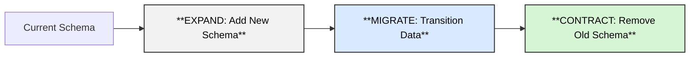

# Database Migration Guidelines: Expand-Contract Pattern

## Overview

This guide outlines our approach to database migrations in a multi-service architecture where multiple services with different versions share the same database. We follow the **Expand-Contract Pattern** to ensure zero-downtime deployments and maintain N-1 version compatibility.

## Table of Contents

1. [Core Principles](#core-principles)
2. [The Expand-Contract Pattern](#the-expand-contract-pattern)
3. [Migration Phases](#migration-phases)
4. [Implementation Guidelines](#implementation-guidelines)
5. [Safety Checks](#safety-checks)
6. [Rollback Procedures](#rollback-procedures)
7. [Best Practices](#best-practices)
8. [Anti-Patterns](#anti-patterns)
9. [Examples](#examples)
10. [Monitoring](#monitoring)

## Core Principles

### N-1 Version Support
- The database schema must support at least two consecutive versions of each service
- Never introduce breaking changes that would prevent older service versions from functioning
- All schema changes must be backward compatible

### Zero-Downtime Deployments
- Database migrations should not require service downtime
- Services should continue operating during and after migration
- Rollback should be possible without data loss

## The Expand-Contract Pattern

The Expand-Contract pattern consists of three phases:


**Diagram Description:**
The Expand-Contract migration pattern consists of three phases:
- **Expand:** Add new schema elements (shown in neutral grey).
- **Migrate:** Transition data and service usage (shown in light blue).
- **Contract:** Remove old schema elements after full adoption (shown in light green).
Each phase flows sequentially: Current Schema → Expand → Migrate → Contract.


### Phase Timeline

Considering a N days Contract cycle

| Phase | Duration | Description |
|-------|----------|-------------|
| **Expand** | Day 1 | Add new schema elements (backward compatible) |
| **Migrate** | Days 2-N | Update services, backfill data, monitor adoption |
| **Contract** | Day N+1 | Remove deprecated schema (only after full adoption) |

## Migration Phases

### Phase 1: EXPAND (Non-Breaking Addition)

**Goal**: Add new schema elements without breaking existing services

```python
def upgrade() -> None:
    """
    EXPAND PHASE: Add new schema elements as nullable/optional
    """
    bind = op.get_bind()
    inspector = sa.inspect(bind)
    columns = [col['name'] for col in inspector.get_columns('table_name')]

    # Always check existence to ensure idempotency
    if 'new_column' not in columns:
        # CRITICAL: Use nullable=True for backward compatibility
        op.add_column('table_name', sa.Column('new_column', sa.String(), nullable=True))

        # Optional: Add index for performance
        op.create_index('ix_table_new_column', 'table_name', ['new_column'])
```

**Service Compatibility**:
- ✅ Old services: Continue working (ignore new column)
- ✅ New services: Can start using new column immediately

### Phase 2: MIGRATE (Data Transition)

**Goal**: Gradually transition all services and data to use new schema

**Database Operations**:
```sql
-- Backfill existing data if needed
UPDATE table_name
SET new_column = old_column
WHERE new_column IS NULL AND old_column IS NOT NULL;

-- Monitor adoption
SELECT
    COUNT(*) FILTER (WHERE new_column IS NOT NULL) as using_new,
    COUNT(*) FILTER (WHERE new_column IS NULL) as not_using_new
FROM table_name
WHERE created_at > NOW() - INTERVAL '1 day';
```

**Service Code Pattern**:
```python
class ServiceAdapter:
    def read_data(self, row):
        """Handle both old and new schema"""
        return {
            'id': row.id,
            # Gracefully handle missing columns
            'new_field': getattr(row, 'new_column', None),
            # Fallback to old column if new doesn't exist
            'data': row.new_column or row.old_column
        }

    def write_data(self, data):
        """Write to both old and new schema during transition"""
        return Model(
            old_column=data,  # Keep writing to old column
            new_column=data   # Also write to new column
        )
```

### Phase 3: CONTRACT (Cleanup)

**Goal**: Remove deprecated schema elements after all services have migrated

**Prerequisites Checklist**:
- [ ] All services deployed with new schema support
- [ ] No queries using old columns in past 30 days
- [ ] Data migration completed and verified
- [ ] Backup of deprecated data created

```python
def upgrade_contract_phase() -> None:
    """
    CONTRACT PHASE: Remove old schema (only after full migration)
    """
    # Verify no services are using old column
    bind = op.get_bind()

    # Safety check: Log usage before removal
    result = bind.execute(sa.text("""
        SELECT COUNT(*) as cnt FROM table_name
        WHERE old_column IS NOT NULL AND new_column IS NULL
    """)).first()

    if result and result.cnt > 0:
        raise Exception(f"Cannot contract: {result.cnt} rows still depend on old_column")

    # Safe to remove
    op.drop_column('table_name', 'old_column')
```

## Implementation Guidelines

### Adding Columns

✅ **DO**:
```python
# Always nullable for new columns
op.add_column('message', sa.Column('context_id', sa.String(), nullable=True))

# Add default value if needed (database-level)
op.add_column('message', sa.Column('status', sa.String(),
              nullable=True, server_default='pending'))
```

❌ **DON'T**:
```python
# Never add required columns directly
op.add_column('message', sa.Column('context_id', sa.String(), nullable=False))
```

### Removing Columns

✅ **DO**:
1. Stop writing to the column (application code)
2. Stop reading from the column (application code)
3. Wait for all services to update (monitor for 30+ days)
4. Remove column in separate migration

❌ **DON'T**:
- Remove columns immediately after adding replacements
- Drop columns that might be in use by any service version

### Renaming Columns

✅ **DO**:
1. Add new column with desired name
2. Copy data from old to new column
3. Update services to use new column
4. Remove old column (after migration period)

❌ **DON'T**:
```python
# Never rename directly - breaks old services
op.alter_column('table_name', 'old_name', new_column_name='new_name')
```

### Changing Column Types

✅ **DO**:
1. Add new column with desired type
2. Migrate data with type conversion
3. Switch services to new column
4. Drop old column after transition

## Safety Checks

### Pre-Migration Checks

```python
def pre_migration_checks():
    """Run before applying migration"""
    bind = op.get_bind()

    # Check table size for performance impact
    result = bind.execute(sa.text(
        "SELECT COUNT(*) as cnt FROM table_name"
    )).first()

    if result.cnt > 1000000:
        print(f"WARNING: Large table ({result.cnt} rows) - migration may be slow")

    # Check for running transactions
    result = bind.execute(sa.text("""
        SELECT COUNT(*) FROM pg_stat_activity
        WHERE state = 'active' AND query_start < NOW() - INTERVAL '5 minutes'
    """)).first()

    if result[0] > 0:
        print(f"WARNING: {result[0]} long-running transactions detected")
```

### Post-Migration Validation

```python
def post_migration_validation():
    """Verify migration succeeded"""
    bind = op.get_bind()
    inspector = sa.inspect(bind)

    # Verify column exists
    columns = [col['name'] for col in inspector.get_columns('table_name')]
    assert 'new_column' in columns, "Migration failed: column not added"

    # Verify data integrity
    result = bind.execute(sa.text("""
        SELECT COUNT(*) FROM table_name
        WHERE new_column IS NOT NULL
    """)).first()

    print(f"Migration complete: {result[0]} rows have new_column populated")
```

## Rollback Procedures

### Safe Rollback Checklist

Before rolling back, verify:
- [ ] No services depend solely on new schema
- [ ] No critical data exists only in new columns
- [ ] Rollback migration has been tested in staging

### Rollback Implementation

```python
def downgrade() -> None:
    """
    Safe rollback with data preservation
    """
    bind = op.get_bind()
    inspector = sa.inspect(bind)

    # Check for data that would be lost
    result = bind.execute(sa.text("""
        SELECT COUNT(*) as cnt FROM table_name
        WHERE new_column IS NOT NULL
    """)).first()

    if result and result.cnt > 0:
        # Backup data before dropping
        bind.execute(sa.text("""
            CREATE TABLE IF NOT EXISTS table_name_backup AS
            SELECT id, new_column, NOW() as backed_up_at
            FROM table_name WHERE new_column IS NOT NULL
        """))
        print(f"Backed up {result.cnt} rows to table_name_backup")

    # Safe to drop column
    columns = [col['name'] for col in inspector.get_columns('table_name')]
    if 'new_column' in columns:
        op.drop_column('table_name', 'new_column')
```

## Best Practices

### 1. Always Use Idempotent Migrations

```python
# Check existence before adding/dropping
if 'column_name' not in columns:
    op.add_column(...)

if 'column_name' in columns:
    op.drop_column(...)
```

### 2. Document Migration Phases

```python
"""
Migration: Add context_id to message table
Phase: EXPAND
Safe to rollback: YES
Services compatible: All versions
Next phase: MIGRATE after all services deployed

Revision ID: 182e5471b900
"""
```

### 3. Use Feature Flags for Service Transitions

```python
class MessageService:
    def process_message(self, message):
        if feature_flags.is_enabled('use_context_id'):
            # New logic using context_id
            return self._process_with_context(message)
        else:
            # Old logic without context_id
            return self._process_legacy(message)
```

### 4. Monitor Migration Progress

```sql
-- Create monitoring view
CREATE VIEW migration_progress AS
SELECT
    'context_id_adoption' as migration,
    COUNT(*) FILTER (WHERE context_id IS NOT NULL) * 100.0 / COUNT(*) as percentage_complete,
    COUNT(*) as total_records,
    MAX(updated_at) as last_update
FROM message
WHERE created_at > NOW() - INTERVAL '7 days';
```

## Anti-Patterns

### ❌ Breaking Changes Without Migration Path

```python
# DON'T: This breaks existing services
op.alter_column('message', 'content', nullable=False)
```

### ❌ Immediate Schema Contraction

```python
# DON'T: Remove old schema in same migration as adding new
def upgrade():
    op.add_column('table', sa.Column('new_col', ...))
    op.drop_column('table', 'old_col')  # Services still using this!
```

### ❌ Data Type Changes Without Migration

```python
# DON'T: Direct type change can fail or corrupt data
op.alter_column('table', 'amount', type_=sa.Integer())  # Was String
```

### ❌ Assuming Service Deployment Order

```python
# DON'T: Assume all services update simultaneously
if datetime.now() > deployment_date:
    op.drop_column('table', 'old_column')  # Some services might be delayed!
```

## Examples

### Example 1: Adding a New Required Field

```python
# Migration 1: EXPAND (Day 1)
def upgrade_expand():
    op.add_column('user', sa.Column('email_verified', sa.Boolean(),
                  nullable=True, server_default='false'))

# Migration 2: MIGRATE (Day 30, after all services updated)
def upgrade_migrate():
    # Backfill any NULL values
    op.execute("UPDATE user SET email_verified = false WHERE email_verified IS NULL")

# Migration 3: CONTRACT (Day 60, after verification)
def upgrade_contract():
    op.alter_column('user', 'email_verified', nullable=False)
```

### Example 2: Replacing a Column

```python
# Migration 1: Add new column
def upgrade_phase1():
    op.add_column('order', sa.Column('status_code', sa.Integer(), nullable=True))

    # Copy data from old column
    op.execute("""
        UPDATE order SET status_code =
        CASE status_text
            WHEN 'pending' THEN 1
            WHEN 'processing' THEN 2
            WHEN 'complete' THEN 3
            ELSE 0
        END
    """)

# Migration 2: Remove old column (after transition period)
def upgrade_phase2():
    op.drop_column('order', 'status_text')
```

## Monitoring

### Service Version Tracking

```sql
-- Track which services are using new schema
CREATE TABLE service_schema_usage (
    service_name VARCHAR(100),
    schema_version VARCHAR(50),
    last_seen TIMESTAMP DEFAULT NOW(),
    uses_new_schema BOOLEAN DEFAULT FALSE
);

-- Update from application
INSERT INTO service_schema_usage (service_name, schema_version, uses_new_schema)
VALUES ('user-service', 'v2.1.0', true)
ON CONFLICT (service_name)
DO UPDATE SET
    schema_version = EXCLUDED.schema_version,
    last_seen = NOW(),
    uses_new_schema = EXCLUDED.uses_new_schema;
```

### Migration Health Dashboard Queries

```sql
-- Check migration adoption rate
SELECT
    migration_name,
    adopted_services,
    total_services,
    (adopted_services * 100.0 / total_services) as adoption_percentage,
    days_since_deployment
FROM migration_tracking
WHERE is_active = true
ORDER BY days_since_deployment DESC;

```sql
-- Identify services not yet migrated
SELECT
    s.service_name,
    s.version,
    s.last_deployment,
    m.migration_name
FROM services s
CROSS JOIN active_migrations m
WHERE NOT EXISTS (
    SELECT 1 FROM service_migrations sm
    WHERE sm.service_name = s.service_name
    AND sm.migration_name = m.migration_name
);
```

## Conclusion

Following the Expand-Contract pattern ensures:
- ✅ Zero-downtime deployments
- ✅ Safe rollback capabilities
- ✅ N-1 version compatibility
- ✅ Gradual, monitored transitions
- ✅ No data loss during migrations

Remember: **When in doubt, expand first, migrate slowly, and contract only when certain.**

## References

- [Evolutionary Database Design - Martin Fowler](https://martinfowler.com/articles/evodb.html)
- [Zero-Downtime Database Migrations](https://www.brunton-spall.co.uk/post/2014/05/06/database-migrations-done-right/)
- [Alembic Documentation](https://alembic.sqlalchemy.org/)

