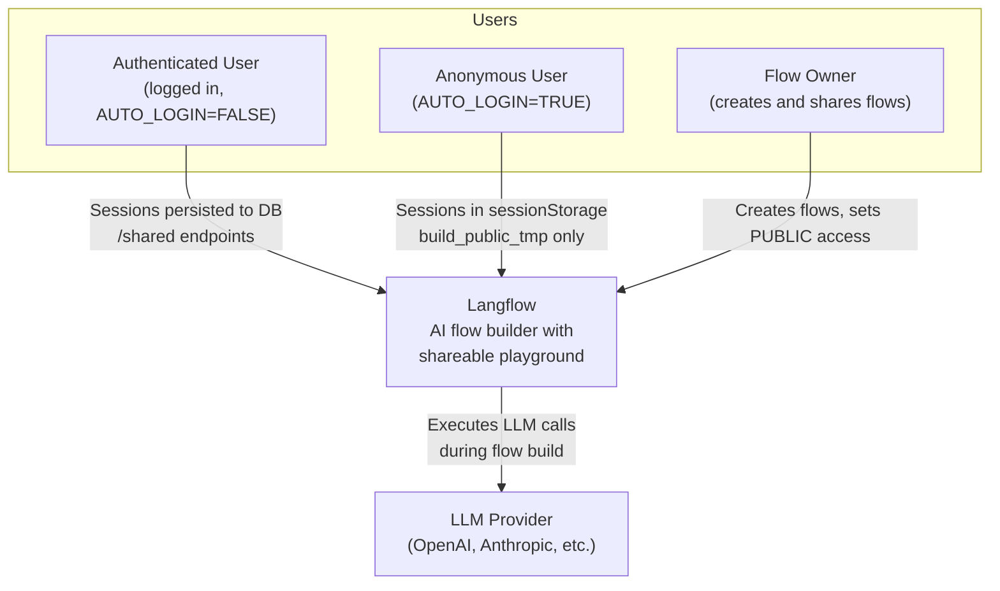
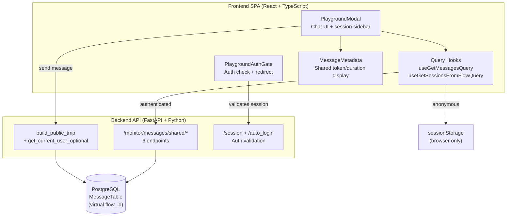
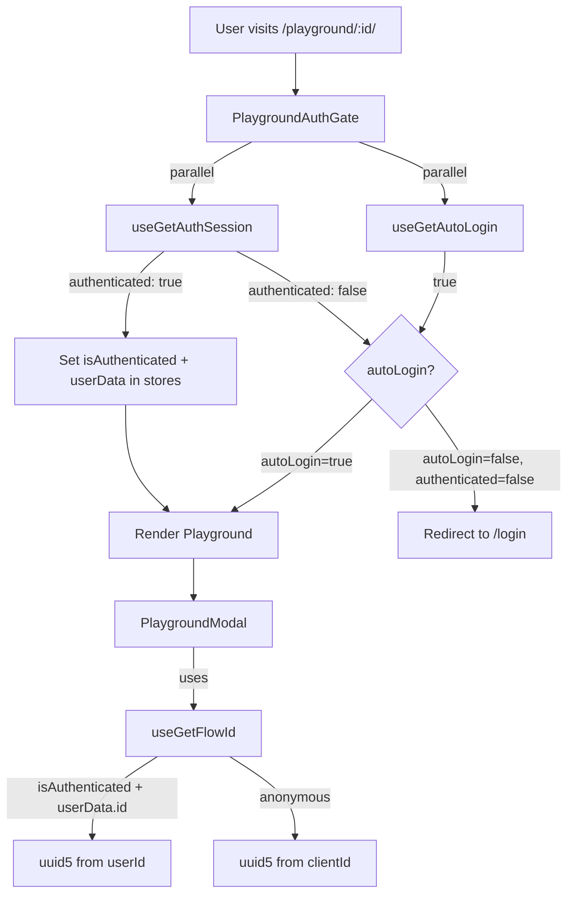
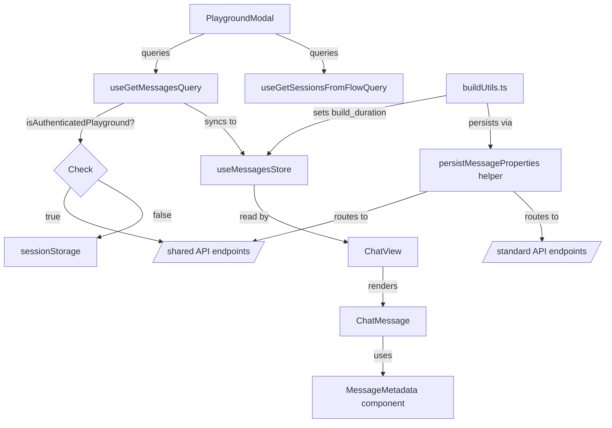
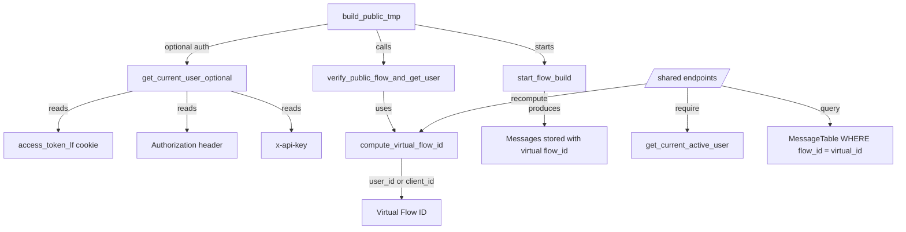

# Feature: Shareable Playground — Auth, Session Persistence & Token Display

> Generated on: 2026-04-06
> Status: Review
> Owner: cristhianzl

---

## Table of Contents
1. [Overview](#1-overview)
2. [Ubiquitous Language Glossary](#2-ubiquitous-language-glossary)
3. [Domain Model](#3-domain-model)
4. [Behavior Specifications](#4-behavior-specifications)
5. [Architecture Decision Records](#5-architecture-decision-records)
6. [Technical Specification](#6-technical-specification)
7. [Observability](#7-observability)
8. [Deployment & Rollback](#8-deployment--rollback)
9. [Architecture Diagrams](#9-architecture-diagrams)

---

## 1. Overview

### Summary
Fixes authentication bypass on the shareable playground (`/playground/:id/`), persists chat sessions to the database for logged-in users, and adds token usage and build duration display to bot messages — aligning the shareable playground experience with the regular playground.

### Business Context
The shareable playground had three critical gaps:

1. **No authentication**: When `AUTO_LOGIN=FALSE`, the playground page bypassed authentication entirely. Any user with the link could access and execute public flows without logging in, causing 401/403 errors on API calls that required auth.
2. **No session persistence**: All messages were stored exclusively in `window.sessionStorage`. Sessions were lost on page refresh, couldn't be recovered across browser tabs, and provided no continuity for logged-in users.
3. **No metadata visibility**: Bot messages showed no token usage or build duration, giving users zero visibility into LLM consumption or response times — unlike the regular playground.

### Behavior Matrix — AUTO_LOGIN=TRUE vs AUTO_LOGIN=FALSE

| Capability | AUTO_LOGIN=TRUE (anonymous) | AUTO_LOGIN=FALSE + not logged in | AUTO_LOGIN=FALSE + logged in |
|------------|---------------------------|----------------------------------|------------------------------|
| **Access** | Immediate (no login) | Redirect to `/login` | Immediate |
| **Message storage** | `sessionStorage` (browser only) | N/A (redirected) | Database (persistent) |
| **Session persistence on refresh** | Lost | N/A | Preserved |
| **Session persistence across tabs** | No (per-tab sessionStorage) | N/A | Yes (shared via DB) |
| **User isolation** | Per client_id cookie | N/A | Per user_id (deterministic UUID v5) |
| **Token usage display** | Yes (in-memory) | N/A | Yes (persisted) |
| **Build duration display** | Tokens only (duration not persisted) | N/A | Yes (tokens + duration, persisted) |
| **Session rename/delete** | sessionStorage operation | N/A | DB operation via `/shared` API |
| **Virtual Flow ID seed** | `client_id` (from cookie) | N/A | `user_id` (from auth) |
| **API endpoints used** | `build_public_tmp` only | N/A | `build_public_tmp` + `/monitor/messages/shared/*` |
| **Build duration on refresh** | Lost (not persisted to DB) | N/A | Preserved (persisted via `/shared` PUT) |

### Known Limitations

- **AUTO_LOGIN=TRUE**: Build duration is displayed during the current session (set in memory) but is NOT persisted to the database. On page refresh, only token counts survive (they are set by the backend during flow execution). This is because the standard `/monitor/messages/{id}` PUT endpoint requires Flow ownership via JOIN, and the virtual `flow_id` doesn't exist in the Flow table. The `/shared` PUT endpoint is only used for authenticated users (`AUTO_LOGIN=FALSE`).
- **AUTO_LOGIN=TRUE**: Sessions are per-tab (`sessionStorage`), so opening the same playground in two tabs creates independent sessions.

### Bounded Context
**Playground Messaging** — Encompasses authentication gating, message storage, retrieval, session management, and metadata display for both the regular flow editor playground and the shareable public playground.

### Related Contexts
| Context | Relationship | Integration Point |
|---------|-------------|-------------------|
| Authentication | Customer-Supplier | `PlaygroundAuthGate` consumes auth state; `get_current_user_optional` resolves user from cookies/tokens |
| Flow Execution | Partnership | `build_public_tmp` produces messages during flow builds; `buildUtils.ts` consumes build events |
| Monitor API | Conformist | New `/shared` endpoints conform to existing monitor API patterns and response types |
| Routing | Customer-Supplier | `routes.tsx` wraps playground route with `PlaygroundAuthGate` |

---

## 2. Ubiquitous Language Glossary

| Term | Definition | Code Reference |
|------|------------|----------------|
| Shareable Playground | The public-facing playground at `/playground/:id/` where users interact with shared flows | `playgroundPage` flag in `useFlowStore` |
| Regular Playground | The playground inside the flow editor, accessible only to the flow owner | `PlaygroundModal` component |
| Playground Auth Gate | A lightweight authentication wrapper that validates user session and controls access to the shareable playground | `PlaygroundAuthGate` component in `playgroundAuthGate/index.tsx` |
| Virtual Flow ID | A deterministic UUID v5 derived from an identifier (user_id or client_id) and the original flow_id, used for message isolation | `compute_virtual_flow_id()` in `flow_utils.py` |
| Source Flow ID | The original database flow ID from the URL (`/playground/:id/`), as opposed to the virtual flow ID | `source_flow_id` query parameter on `/shared` endpoints |
| Authenticated Playground | A shareable playground session where the user is logged in (not auto-login) and `userData.id` is available | `isAuthenticatedPlayground()` helper |
| Auto-Login | Server-side setting (`AUTO_LOGIN`) that allows anonymous access without explicit login. When enabled, users get a superuser session automatically | `autoLogin` in `useAuthStore` |
| Build Duration | The time in milliseconds from build start to ChatOutput completion for a single message segment | `build_duration` in message `properties` |
| Message Properties | A flexible JSON field on each message containing metadata: token usage, build duration, UI hints (icon, colors), feedback state | `Properties` Pydantic model, `chat.properties` in frontend |
| Session ID | A string identifier grouping messages within a flow. Defaults to the virtual flow ID; can be renamed by the user | `session_id` on `MessageTable` |
| Message Metadata | The inline badge showing token count and duration on bot messages, with a tooltip for detailed breakdown | `MessageMetadata` shared component |
| Session Validation | The process of checking if a user has a valid session via the `/session` endpoint using HttpOnly cookies | `useGetAuthSession` hook |

---

## 3. Domain Model

### 3.1 Aggregates

#### Message
- **Root Entity**: `MessageTable` (SQLModel ORM)
- **Key Fields**: `id` (UUID), `flow_id` (UUID, virtual for shared playground), `session_id` (string), `text`, `sender`, `sender_name`, `properties` (JSON), `timestamp`
- **Value Objects**: `Properties` (contains `build_duration`, `usage`, `state`, `icon`, `background_color`, etc.), `Usage` (contains `input_tokens`, `output_tokens`, `total_tokens`)
- **Invariants**:
  - A message must have `session_id`, `sender`, and `sender_name`
  - For shared playground, `flow_id` is always a virtual UUID v5 (never the real flow ID)
  - Messages with a virtual `flow_id` are only accessible to the user whose ID was used to derive that virtual ID

#### Virtual Flow ID
- **Root**: Pure computation (no entity)
- **Formula**: `uuid5(NAMESPACE_DNS, "{identifier}_{flow_id}")`
- **Invariants**:
  - Same identifier + same flow_id always produces the same virtual flow ID (deterministic)
  - Different identifiers always produce different virtual flow IDs (isolated)
  - The virtual flow ID does not exist in the `Flow` table — it exists only as a `flow_id` on `MessageTable` rows

#### Playground Auth State
- **Root**: `PlaygroundAuthGate` component
- **State Machine**: `Loading` -> `Authenticated` | `AutoLogin` | `RedirectToLogin`
- **Invariants**:
  - Children render only after both session check and auto-login check complete
  - `userData` is set in both AuthContext and Zustand store before children render
  - Redirect preserves the original playground URL via `?redirect=` query param

### 3.2 Domain Events

| Event | Trigger | Payload | Consumers |
|-------|---------|---------|-----------|
| `session_validated` | `useGetAuthSession` returns | `{ authenticated, user }` | `PlaygroundAuthGate` (sets auth state) |
| `auto_login_resolved` | `useGetAutoLogin` returns | `{ autoLogin: boolean }` | `PlaygroundAuthGate` (decides access) |
| `add_message` | Flow component produces output | `Message` object with `flow_id`, `session_id`, `text` | `message-event-handler.ts` (React Query cache + Zustand store) |
| `end_vertex` | ChatOutput vertex completes | `VertexBuildData` with `build_data`, `id` | `buildUtils.ts` (sets `build_duration` on last bot message) |
| `build_end` | Entire flow build completes | `flow_id`, `duration` | `buildUtils.ts` (fallback `build_duration` if not set per-vertex) |

---

## 4. Behavior Specifications

### Feature: Shareable Playground Authentication

**As a** platform administrator
**I want** the shareable playground to enforce authentication when AUTO_LOGIN=FALSE
**So that** only authorized users can access and execute public flows

### Background
- Given the application is running with `AUTO_LOGIN=FALSE`

### Scenario: Unauthenticated user is redirected to login
- **Given** the user is not logged in
- **When** the user accesses `/playground/:id/`
- **Then** they are redirected to `/login?redirect=/playground/:id/`

### Scenario: User logs in and is redirected back to playground
- **Given** the user was redirected to `/login?redirect=/playground/:id/`
- **When** the user successfully logs in
- **Then** they are redirected back to `/playground/:id/`
- **And** the playground loads and functions normally

### Scenario: Already authenticated user accesses playground directly
- **Given** the user is already logged in (has valid session cookie)
- **When** the user opens `/playground/:id/` in a new tab
- **Then** the `PlaygroundAuthGate` validates the session
- **And** the playground loads without redirect

### Scenario: Auto-login enabled skips authentication
- **Given** the application has `AUTO_LOGIN=TRUE`
- **When** any user accesses `/playground/:id/`
- **Then** the playground loads without login (existing behavior unchanged)

### Scenario: Loading state shown during auth check
- **Given** the user accesses `/playground/:id/`
- **When** the session and auto-login checks are in progress
- **Then** a loading page is displayed
- **And** the playground does not render until checks complete

---

### Feature: Shareable Playground Session Persistence

**As a** logged-in user on the shareable playground
**I want** my chat sessions to be saved to the database
**So that** I can resume conversations after page refreshes and across browser sessions

### Scenario: Authenticated user sends a message and refreshes
- **Given** the user is logged in and on `/playground/:id/`
- **When** the user sends a message and receives a response
- **And** the user refreshes the page
- **Then** the sessions appear in the sidebar
- **And** clicking a session shows the full conversation history

### Scenario: Authenticated user sees only their own sessions
- **Given** User A and User B are both logged in
- **And** both access the same shared flow `/playground/:id/`
- **When** User A sends messages
- **Then** User A sees their sessions and messages
- **And** User B sees an empty session list for the same flow

### Scenario: Anonymous user retains sessionStorage behavior
- **Given** the application has `AUTO_LOGIN=TRUE`
- **When** a user accesses `/playground/:id/` without explicit login
- **Then** messages are stored in `window.sessionStorage`
- **And** sessions are lost on page refresh (existing behavior unchanged)

### Scenario: Default Session always appears first
- **Given** the user has multiple sessions
- **When** the session list loads
- **Then** the default session (virtual flow ID) appears at the top of the list

### Scenario: Session rename works for authenticated users
- **Given** the user is logged in on the shareable playground
- **When** the user renames a session
- **Then** the new name is persisted to the database
- **And** the new name appears after page refresh

### Scenario: Session delete works for authenticated users
- **Given** the user is logged in on the shareable playground
- **When** the user deletes a session
- **Then** the session and its messages are removed from the database
- **And** the session no longer appears after page refresh

---

### Feature: Token Usage & Build Duration Display

**As a** user on the shareable playground
**I want** to see token usage and response time on bot messages
**So that** I can monitor LLM consumption and performance

### Scenario: Token usage and duration display on bot messages
- **Given** the user sends a message on the shareable playground
- **When** the AI responds
- **Then** the bot message shows token count (e.g., "49") and duration (e.g., "1.8s") inline
- **And** hovering shows a tooltip with Last run, Duration, Input tokens, Output tokens

### Scenario: Build duration persists after refresh
- **Given** the user sent a message and `build_duration` was recorded
- **When** the user refreshes the page
- **Then** the bot message still shows the duration from the database

### Scenario: Token display with no duration available
- **Given** a bot message has token usage but no `build_duration`
- **When** the message renders
- **Then** only the token count is displayed (no duration, no pipe separator)

---

### Feature: Edge Cases & Error Handling

### Scenario: Invalid order_by parameter is rejected
- **Given** a user calls `GET /monitor/messages/shared?order_by=__class__`
- **When** the backend processes the request
- **Then** it returns `400 Bad Request` with "Invalid order_by field"

### Scenario: Session deletion in playground mode uses sessionStorage for anonymous users
- **Given** `AUTO_LOGIN=TRUE` and the user is on the shareable playground
- **When** the user deletes a session
- **Then** the deletion operates on `sessionStorage` (no API call)
- **And** no 401/403 errors occur

### Scenario: Race condition during auth resolution
- **Given** `autoLogin` is still `null` (query not resolved) but `isAuthenticated` is `true`
- **When** `isAuthenticatedPlayground()` is evaluated
- **Then** it returns `false` (anonymous mode) to avoid UUID mismatch
- **And** once `autoLogin` resolves to `false`, the authenticated path activates

---

## 5. Architecture Decision Records

### ADR-001: Create PlaygroundAuthGate Instead of Modifying ProtectedRoute

**Status**: Accepted

#### Context
The `/playground/:id/` route existed outside the `AppInitPage` (which initializes auth) and `ProtectedRoute` (which enforces login). Adding it to `ProtectedRoute` would require modifying the global route structure, potentially breaking other routes.

#### Decision
Create a lightweight `PlaygroundAuthGate` component that wraps only the playground route. It independently validates the session via `useGetAuthSession` and checks auto-login via `useGetAutoLogin`, then decides: render children, redirect to login, or show loading.

#### Consequences

**Benefits:**
- Isolated change — no modification to global routing or auth infrastructure
- Handles the unique playground requirements (auto-login bypass, redirect with playground URL)
- Sets `userData` in both AuthContext and Zustand store for downstream hooks

**Trade-offs:**
- Dual auth state (AuthContext + Zustand) — both must be kept in sync

---

### ADR-002: Use Virtual Flow ID for Ownership Instead of New Database Column

**Status**: Accepted

#### Context
Messages in the shareable playground need to be scoped per user. Adding a `user_id` column to `MessageTable` would require an Alembic migration.

#### Decision
Use the existing `flow_id` column with a deterministic virtual UUID v5 (`uuid5(NAMESPACE_DNS, "{user_id}_{flow_id}")`) as the implicit ownership marker. No new columns, no migrations.

#### Consequences

**Benefits:**
- Zero database migrations
- No schema changes to `MessageTable`
- Backward compatible — existing messages and endpoints unaffected
- Virtual flow ID is computationally infeasible to guess

**Trade-offs:**
- Virtual `flow_id` doesn't exist in `Flow` table — requires separate `/shared` endpoints
- If user ID changes, messages become inaccessible

---

### ADR-003: Separate `/shared` Endpoints Instead of Modifying Existing Monitor Endpoints

**Status**: Accepted

#### Context
Existing monitor endpoints enforce ownership via `JOIN Flow WHERE Flow.user_id = current_user.id`. Virtual flow IDs don't exist in the `Flow` table.

#### Decision
Create parallel endpoints under `/monitor/messages/shared/*` that query by `flow_id` directly (no Flow JOIN). Existing endpoints remain unchanged.

#### Consequences

**Benefits:**
- Zero risk to existing endpoints
- Clear separation: owned-flow messages vs. shared-flow messages

**Trade-offs:**
- 6 new endpoints that partially mirror existing ones

---

### ADR-004: Shared `MessageMetadata` Component for Both Playgrounds

**Status**: Accepted

#### Context
Both playgrounds displayed token usage and build duration with identical tooltip content, icons, and formatting — ~130 lines duplicated.

#### Decision
Extract a shared `MessageMetadata` component and `persistMessageProperties` helper. Both playgrounds import the same component.

#### Consequences

**Benefits:**
- Single source of truth for metadata display
- `buildUtils.ts` no longer knows about playground types or API routing
- ~130 lines of duplicated code removed

**Trade-offs:**
- Shared component must be generic enough for both contexts

---

### ADR-005: Race Condition Guard with `autoLogin === false`

**Status**: Accepted

#### Context
When `autoLogin` is `null` (unresolved), `!null === true` caused a brief window where the frontend computed a user-ID-based UUID while the backend used client-ID-based, resulting in UUID mismatch.

#### Decision
Use strict equality `autoLogin === false` instead of `!autoLogin`. Treat `null` (unresolved) as anonymous.

#### Consequences

**Benefits:**
- Eliminates UUID mismatch race condition
- Safe fallback to sessionStorage during auth resolution

---

## 6. Technical Specification

### 6.1 Dependencies

| Type | Name | Purpose |
|------|------|---------|
| Database | `MessageTable` (`message` table) | Stores messages with virtual `flow_id` for shared playground |
| Auth Service | `get_current_user_for_sse` | Resolves user from cookies/API keys inside `get_current_user_optional` |
| Auth Hook | `useGetAuthSession` | Validates session via `/session` endpoint |
| Auth Hook | `useGetAutoLogin` | Checks auto-login setting via `/auto_login` endpoint |
| Store | `useMessagesStore` (Zustand) | Frontend in-memory message store; synced from API for authenticated playground |
| Store | `useAuthStore` (Zustand) | Holds `isAuthenticated`, `autoLogin`, `userData` for auth state |
| Library | `uuid` (Python + JavaScript) | UUID v5 generation for virtual flow IDs |

### 6.2 API Contracts

#### GET /api/v1/monitor/messages/shared/sessions

**Purpose**: List session IDs for a shared flow, scoped to the authenticated user.

**Query Parameters**:
```
source_flow_id: UUID (required) — The original public flow ID from the URL
```

**Response (200)**:
```json
["session-1", "Session Apr 06, 17:59:38"]
```

---

#### GET /api/v1/monitor/messages/shared

**Purpose**: Get messages for a shared flow, scoped to the authenticated user.

**Query Parameters**:
```
source_flow_id: UUID (required) — The original public flow ID
session_id: string (optional) — Filter by session
order_by: string (optional, default: "timestamp") — Allowed: timestamp, sender, sender_name, session_id, text
```

**Response (200)**:
```json
[
  {
    "id": "uuid",
    "flow_id": "virtual-uuid",
    "session_id": "Session Apr 06, 17:59:38",
    "text": "Hello!",
    "sender": "User",
    "sender_name": "User",
    "timestamp": "2026-04-06 17:59:38 UTC",
    "properties": {
      "build_duration": 1800,
      "usage": { "total_tokens": 49, "input_tokens": 33, "output_tokens": 16 },
      "state": "complete"
    }
  }
]
```

---

#### PUT /api/v1/monitor/messages/shared/{message_id}

**Purpose**: Update a message on a shared flow (e.g., persist `build_duration`).

**Query Parameters**: `source_flow_id: UUID (required)`

**Request Body**: Partial `MessageUpdate` (e.g., `{ "properties": { "build_duration": 1800 } }`)

**Response (200)**: Updated `MessageRead` object.
**Response (404)**: Message not found or not owned by user.

---

#### DELETE /api/v1/monitor/messages/shared/session/{session_id}

**Purpose**: Delete all messages in a session on a shared flow.

**Query Parameters**: `source_flow_id: UUID (required)`

**Response (204)**: No content (idempotent).

---

#### PATCH /api/v1/monitor/messages/shared/session/{old_session_id}

**Purpose**: Rename a session on a shared flow.

**Query Parameters**: `new_session_id: string (required)`, `source_flow_id: UUID (required)`

**Response (200)**: List of updated `MessageResponse` objects.
**Response (404)**: No messages found.

---

### 6.3 Error Handling

| Error Code | Condition | User Message | Recovery Action |
|------------|-----------|--------------|-----------------|
| 400 | Invalid `order_by` field | "Invalid order_by field: {value}" | Use allowed values |
| 400 | No `client_id` AND no authenticated user | "No client_id cookie found" | Login or ensure cookies enabled |
| 403 | Missing/invalid authentication on shared endpoints | Standard 403 | Login and retry |
| 403 | Flow is not public | "Flow is not public" | Verify flow access_type |
| 404 | Message not found or not owned | "Message not found" | Verify source_flow_id |
| 404 | No messages in session (rename) | "No messages found with the given session ID" | Verify session exists |

---

## 7. Observability

### 7.1 Key Metrics

| Metric | Type | Description | Alert Threshold |
|--------|------|-------------|-----------------|
| `shared_messages_fetched` | Counter | Messages fetched via `/shared` endpoints | N/A (informational) |
| `shared_sessions_count` | Gauge | Active sessions per user per flow | > 100 per user |
| `build_duration_persist_failures` | Counter | Failed `build_duration` PUT requests | > 10 per minute |
| `playground_auth_redirects` | Counter | Users redirected to login from playground | N/A (informational) |

### 7.2 Important Logs

| Log Level | Event | Fields | When |
|-----------|-------|--------|------|
| WARN | `Failed to persist build_duration (shared)` | `messageId`, `error` | PUT to shared endpoint fails |
| WARN | `Failed to persist build_duration` | `messageId`, `error` | PUT to standard endpoint fails |
| WARN | `Public flow validation failed` | Exception message | Invalid flow data in `build_public_tmp` |
| ERROR | `Error building public flow` | Exception details | Unexpected build error |

### 7.3 Dashboards
- Monitor API response times for `/shared` endpoints via existing API metrics
- Track 404 rates on shared endpoints to detect ownership mismatches
- Track auth redirect rate on playground pages

---

## 8. Deployment & Rollback

### 8.1 Feature Flags

| Flag | Purpose | Default | Rollout Strategy |
|------|---------|---------|------------------|
| N/A | Controlled by `AUTO_LOGIN` setting and user authentication state | N/A | Full rollout with code deploy |

### 8.2 Database Migrations
- **None required** — uses existing `MessageTable` columns with virtual flow IDs.

### 8.3 Rollback Plan
1. Revert the PR — all changes are backward compatible
2. Messages stored with virtual flow IDs remain in DB but become inaccessible (harmless)
3. Anonymous/auto-login behavior is unaffected
4. Regular playground is completely unaffected
5. The auth gate removal restores the pre-fix state (playground accessible without login)

### 8.4 Smoke Tests

**Authentication:**
- [ ] `AUTO_LOGIN=FALSE` + not logged in: redirected to `/login?redirect=/playground/:id/`
- [ ] `AUTO_LOGIN=FALSE` + logged in: playground loads normally
- [ ] `AUTO_LOGIN=TRUE`: playground works without login (no regression)
- [ ] After login redirect, user lands back on the correct playground URL

**Session Persistence:**
- [ ] Logged-in user: send message, refresh, messages persist
- [ ] Two different users on same shared flow: each sees only their own sessions
- [ ] Anonymous user: messages in sessionStorage only, lost on refresh

**Session Management:**
- [ ] Sessions load correctly on page open
- [ ] Default Session appears first in sidebar
- [ ] Rename session works, persists after refresh
- [ ] Delete session works, persists after refresh

**Token Usage & Duration:**
- [ ] Bot messages show token count and duration (e.g., "49 | 1.8s")
- [ ] Tooltip shows Last run, Duration, Input tokens, Output tokens
- [ ] Build duration persists after page refresh

**Regression:**
- [ ] Regular playground (flow editor): send message, "Finished in" shows, no regressions
- [ ] Message streaming still works in both playgrounds
- [ ] No 401/403 errors during normal playground usage

---

## 9. Architecture Diagrams

### 9.1 Context Diagram (Level 1)



### 9.2 Container Diagram (Level 2)



### 9.3 Component Diagram (Level 3) — Auth Flow



### 9.4 Component Diagram (Level 3) — Message Flow



### 9.5 Component Diagram (Level 3) — Backend


